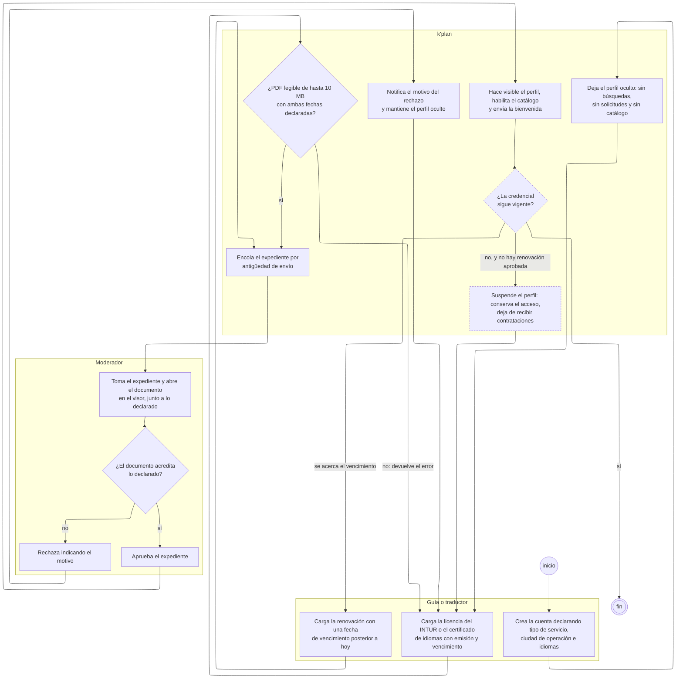

---
hide:
  - toc
icon: lucide/file-check
---

# Acreditación del prestador

De la cuenta creada al perfil contratable. Es el flujo que decide quién existe
para el turista: un guía sin acreditación aprobada no aparece en búsquedas, no
recibe solicitudes y no puede ser contratado ([RF-P-03][rf-p-03]).

El diagrama tiene una sola salida y tres formas de volver atrás. Esa asimetría no
es un descuido del dibujo: es lo que significa que la verificación sea manual y
que un rechazo obligue a subsanar en vez de reintentar.

## Quién ejecuta cada paso

| Partición          | Pasos | Qué le corresponde                                                |
| ------------------ | :---: | ----------------------------------------------------------------- |
| Guía o traductor   |   3   | Declarar, documentar y renovar antes de que venza                 |
| `k'plan`           |   7   | Validar el archivo, encolar, notificar y vigilar el vencimiento    |
| Moderador          |   4   | Contrastar el documento con lo declarado y resolver               |
| Proceso programado |   —   | Ejecuta los dos pasos punteados de la partición del sistema       |

El proceso programado no tiene partición propia. Sus dos pasos —comprobar la
vigencia y suspender— ocurren dentro del sistema y sin que nadie los pida, y por
eso van punteados en lugar de en una cuarta columna que estaría casi vacía.

## Las tres decisiones

**¿PDF legible de hasta 10 MB con ambas fechas?** Es la única validación
automática del flujo ([RF-S-13][rf-s-13]). Comprueba el continente, nunca el
contenido: que el archivo se abra no dice nada sobre si la licencia es auténtica.

**¿El documento acredita lo declarado?** Es la decisión humana y la razón de ser
del flujo entero. Ninguna combinación de datos declarados la sustituye
([RF-P-03][rf-p-03]).

**¿La credencial sigue vigente?** Corre después de la aprobación y para siempre.
Tiene tres salidas porque hay tres situaciones distintas: vigente y sin
vencimiento cercano, vigente pero por vencer, y vencida sin renovación aprobada.

## Por qué el rechazo devuelve a «cargar» y no a la cola

Rechazar es terminal **para ese expediente**. Subsanar no lo reabre: el prestador
carga un documento nuevo y eso genera otra verificación, de modo que el historial
conserva cuántas veces se intentó y por qué se rechazó cada vez
([verificación](../estados/verificacion.md)). Por eso la flecha de `notifica el
motivo` vuelve a `carga la licencia` y no a `encola el expediente`.

El motivo es obligatorio. Sin él la transición no ocurre, porque un rechazo sin
causa explicada obliga a reintentar a ciegas ([RF-B-04][rf-b-04]).

## Renovar no interrumpe, vencer sí

Son las dos salidas que más se confunden y su diferencia es de tiempo, no de
acción. Si el prestador carga la renovación **antes** del vencimiento, el
expediente nuevo entra en cola y el perfil sigue activo mientras la credencial
anterior conserve vigencia ([RF-P-04][rf-p-04]): la flecha va a `encola el
expediente` sin pasar por `deja el perfil oculto`.

Si la fecha llega sin renovación aprobada, la suspensión es automática
([RF-P-05][rf-p-05]). El prestador conserva el acceso para resolver su
documentación y atender los servicios ya comprometidos, pero deja de recibir
contrataciones nuevas. Es lo que impide que una credencial vencida siga recibiendo
reservas porque nadie abrió el portal ese día.

## El mismo flujo para las organizaciones

Un comercio, una alcaldía y una institución cultural recorren este diagrama con
dos cambios: la partición del prestador pasa a ser la del operador que registra
la organización, y el documento cargado es el que acredita su representación o su
existencia legal ([RF-B-05][rf-b-05]). Lo que no cambia es el ciclo, y por eso no
hay un segundo diagrama.

Lo que sí cambia es la severidad. Aprobar una alcaldía falsa entrega el sello de
contenido oficial de una ciudad entera, así que su revisión no se resuelve solo
con los datos del formulario ([RF-A-11][rf-a-11]).

[rf-a-11]: ../../requerimientos/funcionales/portal-alcaldias.md#rf-a-11
[rf-b-04]: ../../requerimientos/funcionales/backoffice.md#rf-b-04
[rf-b-05]: ../../requerimientos/funcionales/backoffice.md#rf-b-05
[rf-p-03]: ../../requerimientos/funcionales/app-prestadores.md#rf-p-03
[rf-p-04]: ../../requerimientos/funcionales/app-prestadores.md#rf-p-04
[rf-p-05]: ../../requerimientos/funcionales/app-prestadores.md#rf-p-05
[rf-s-13]: ../../requerimientos/funcionales/plataforma.md#rf-s-13
