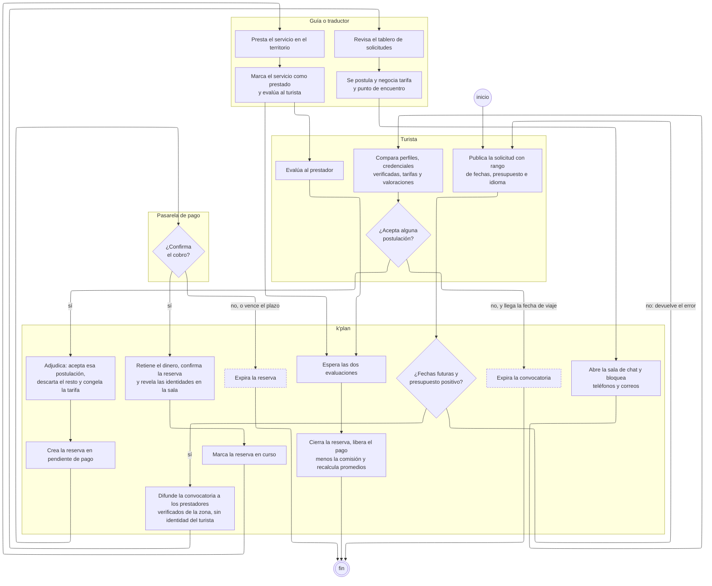

---
hide:
  - toc
icon: lucide/calendar-check
---

# Contratación de acompañamiento

De la solicitud publicada al pago liberado. Es el flujo más largo del sistema y
el único donde intervienen las cuatro particiones: el turista pide, el sistema
media, el prestador presta y la pasarela sostiene el dinero mientras tanto.

El camino dibujado es el de la **convocatoria**. La reserva directa de un
recorrido en catálogo ([RF-T-18][rf-t-18]) salta los cuatro primeros pasos y
entra por «crea la reserva en pendiente de pago»; de ahí en adelante es idéntico.

## Quién ejecuta cada paso

| Partición        | Pasos | Qué le corresponde                                                    |
| ---------------- | :---: | --------------------------------------------------------------------- |
| Turista          |   4   | Publicar lo que necesita, elegir con quién y evaluar al terminar      |
| `k'plan`         |  11   | Validar, difundir sin identidad, adjudicar, congelar precio y liberar |
| Guía o traductor |   4   | Buscar trabajo, postularse, prestar y evaluar                         |
| Pasarela de pago |   1   | Confirmar el cobro. Nada más                                          |

## Las tres decisiones

**¿Fechas futuras y presupuesto positivo?** Es validación de
[RF-T-15][rf-t-15] y devuelve al turista al mismo formulario. Se dibuja porque el
rechazo interrumpe el flujo: sin fechas válidas no hay a quién difundir la
convocatoria.

**¿Acepta alguna postulación?** La salida negativa no es «rechaza»: es que
llegue la fecha de viaje sin que haya aceptado ninguna. Ahí el proceso programado
cierra la convocatoria como `expirada`, y no hace falta un plazo aparte porque la
fecha ya estaba declarada en la convocatoria.

**¿Confirma el cobro?** Es la única decisión que no toma nadie del sistema. Si la
pasarela no confirma, la reserva nunca sale de `pendiente_pago` y termina
`expirada`. El plazo exacto antes de esa expiración
[sigue sin definirse](../estados/reserva.md).

## Dos cosas que ocurren en paralelo

Después de `marca el servicio como prestado`, el flujo se abre en dos: el
prestador ya evaluó al turista en ese mismo paso y el turista todavía tiene que
evaluar al prestador. `Espera las dos evaluaciones` es el punto donde vuelven a
juntarse, y la reserva no llega a `cerrada` hasta que lo hacen
([RF-S-22][rf-s-22], [RF-P-14][rf-p-14]).

El detalle es lo que impide cerrar el servicio con una sola voz. Mientras falte
una de las dos puntuaciones el dinero sigue retenido, que es el único incentivo
real para que la evaluación se emita.

## Lo que el diagrama deja fuera a propósito

La cancelación. Cualquiera de las dos partes puede cancelar mientras la reserva
esté `confirmada`, y con menos de veinticuatro horas de anticipación el motivo es
obligatorio y cuenta en la reputación de quien cancela. Dibujarlo habría exigido
una flecha desde casi cada caja; la tabla completa está en el
[diagrama de estados de la reserva](../estados/reserva.md#quien-puede-cancelar).

Tampoco aparece la contratación simultánea de guía y traductor
([RF-T-30][rf-t-30]). No es una bifurcación de este flujo: es este mismo flujo
recorrido dos veces, con dos convocatorias y dos reservas independientes.

[rf-p-14]: ../../requerimientos/funcionales/app-prestadores.md#rf-p-14
[rf-s-22]: ../../requerimientos/funcionales/plataforma.md#rf-s-22
[rf-t-15]: ../../requerimientos/funcionales/app-turista.md#rf-t-15
[rf-t-18]: ../../requerimientos/funcionales/app-turista.md#rf-t-18
[rf-t-30]: ../../requerimientos/funcionales/app-turista.md#rf-t-30
