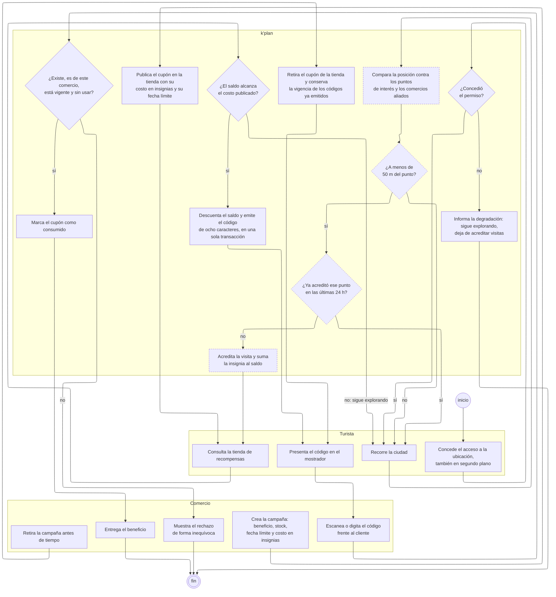

---
hide:
  - toc
icon: lucide/ticket
---

# De la visita al mostrador

Cómo caminar por una ciudad termina en un descuento cobrado en un local. Es el
ciclo que convierte la exploración en un beneficio tangible, y el único donde el
sistema le entrega dinero —en forma de descuento— a alguien que no pagó nada.

Une dos cosas que suelen documentarse aparte: cómo se gana una insignia y cómo
se gasta. Separarlas oculta lo que hace que el mecanismo funcione, que es que el
comercio financie el premio a cambio de visibilidad ([RF-C-07][rf-c-07]).

## Quién ejecuta cada paso

| Partición | Pasos | Qué le corresponde                                              |
| --------- | :---: | --------------------------------------------------------------- |
| Turista   |   4   | Conceder ubicación, caminar, canjear y presentar el código      |
| `k'plan`  |  12   | Evaluar geocercas, acreditar, descontar, emitir y validar       |
| Comercio  |   5   | Financiar la campaña y resolver la validación frente al cliente |

Los cuatro pasos punteados —comparar posiciones, medir la distancia, comprobar
las veinticuatro horas y acreditar— los ejecuta el proceso programado contra la
posición que reporta el dispositivo. El turista no pide nada: camina.

## Las cinco decisiones

**¿Concedió el permiso?** Sin acceso a la ubicación en segundo plano no hay
avisos por cercanía ni acreditación de visitas. La aplicación sigue sirviendo
para explorar, planificar y contratar, y el sistema **informa** esa degradación en
lugar de fallar en silencio ([RF-S-14][rf-s-14]).

**¿A menos de 50 m del punto?** Es el umbral de [RF-S-15][rf-s-15]. Por debajo se
acredita; por encima el turista sigue caminando y la comparación se repite.

**¿Ya acreditó ese punto en las últimas 24 h?** Es lo que hace que la insignia
mida exploración y no permanencia: sentarse toda la tarde en el mismo café
acredita una visita, no una por hora.

**¿El saldo alcanza el costo publicado?** Si no alcanza, la única salida es
seguir explorando. No hay forma de comprar insignias, y esa ausencia es
deliberada: el saldo es la prueba de haber recorrido.

**¿Existe, es de este comercio, está vigente y sin usar?** Son cuatro
comprobaciones en un solo rombo porque el comercio las vive como una sola: el
resultado se muestra de forma inequívoca y en segundos, frente al cliente
([RF-C-10][rf-c-10]).

## El descuento y el código son inseparables

`Descuenta el saldo y emite el código` es un solo paso, no dos encadenados. No
existe un estado intermedio en el que se haya cobrado el saldo sin entregar el
código ([RF-T-21][rf-t-21]): si la emisión falla, el saldo no se movió.

Es la única caja del diagrama donde la atomicidad es parte del enunciado del
paso, y por eso no se parte en dos aunque describa dos efectos.

## Retirar una campaña corta la emisión, nunca lo ya emitido

La flecha de `retira la campaña antes de tiempo` no va al final: va a `presenta el
código en el mostrador`. El cupón desaparece de la tienda de inmediato, pero
quien ya canjeó sus insignias conserva el derecho a reclamar el beneficio hasta
la fecha límite original de la campaña ([RF-C-08][rf-c-08],
[RF-T-22][rf-t-22]).

Dibujado de otra forma, el diagrama diría que retirar invalida los códigos
entregados, que es exactamente lo contrario de lo que exigen los dos requisitos.

## Lo que el comercio mide con esto

La distancia entre cupones obtenidos y cupones consumidos es el indicador de
[RF-C-09][rf-c-09], y en el diagrama es la distancia entre `emite el código` y
`marca el cupón como consumido`. Todo lo que se pierde entre esas dos cajas es
alguien que canjeó sus insignias y nunca entró al local.

[rf-c-07]: ../../requerimientos/funcionales/portal-comercios.md#rf-c-07
[rf-c-08]: ../../requerimientos/funcionales/portal-comercios.md#rf-c-08
[rf-c-09]: ../../requerimientos/funcionales/portal-comercios.md#rf-c-09
[rf-c-10]: ../../requerimientos/funcionales/portal-comercios.md#rf-c-10
[rf-s-14]: ../../requerimientos/funcionales/plataforma.md#rf-s-14
[rf-s-15]: ../../requerimientos/funcionales/plataforma.md#rf-s-15
[rf-t-21]: ../../requerimientos/funcionales/app-turista.md#rf-t-21
[rf-t-22]: ../../requerimientos/funcionales/app-turista.md#rf-t-22
