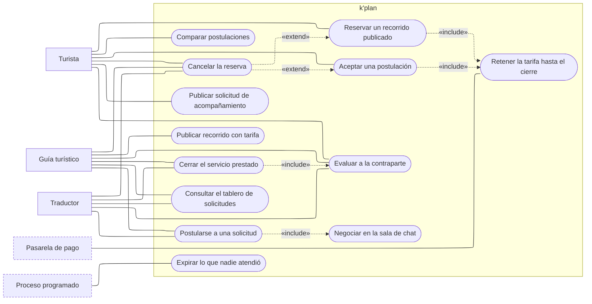

---
hide:
  - toc
icon: lucide/handshake
---

# Contratación de acompañamiento

Cómo un turista termina acompañado por alguien a quien pagó. Hay dos caminos
hacia la misma reserva y conviene no confundirlos: la **convocatoria**, donde el
turista publica lo que necesita y los prestadores se postulan, y la **reserva
directa**, donde el turista toma un recorrido que el guía ya tenía en catálogo.

El traductor solo alcanza el primero. No tiene catálogo propio
([RF-P-19][rf-p-19]) y por eso ninguna línea suya llega a «reservar un recorrido
publicado»: su único camino de trabajo es postularse.

## Qué exige cada caso de uso

| Caso de uso                    | Quién lo inicia      | Precondición                                       | Requisito                     |
| ------------------------------ | -------------------- | -------------------------------------------------- | ----------------------------- |
| Publicar solicitud             | Turista              | Fechas futuras y presupuesto positivo               | [RF-T-15][rf-t-15]            |
| Publicar recorrido con tarifa  | Guía                 | Credencial aprobada; tarifa > 0 y cupo ≤ 50         | [RF-P-08][rf-p-08]            |
| Consultar el tablero           | Guía, traductor      | Credencial aprobada y coincidencia de zona e idioma | [RF-P-12][rf-p-12]            |
| Postularse                     | Guía, traductor      | Convocatoria en estado `publicada`                  | [RF-P-13][rf-p-13]            |
| Negociar en la sala            | Ambas partes         | Existe una postulación                              | [RF-S-17][rf-s-17]            |
| Comparar postulaciones         | Turista              | Al menos una postulación recibida                   | [RF-T-17][rf-t-17]            |
| Aceptar una postulación        | Turista              | La convocatoria admite postulación                  | [RF-T-15][rf-t-15]            |
| Reservar un recorrido          | Turista              | El recorrido está publicado y con cupo              | [RF-T-18][rf-t-18]            |
| Retener la tarifa              | Pasarela             | Reserva en `pendiente_pago`                         | [Reserva](../estados/reserva.md) |
| Cerrar el servicio prestado    | Guía, traductor      | Reserva en `en_curso`                               | [RF-P-14][rf-p-14]            |
| Evaluar a la contraparte       | Ambas partes         | Servicio marcado como prestado                      | [RF-S-22][rf-s-22]            |
| Cancelar la reserva            | Ambas partes         | Reserva `confirmada`; con menos de 24 h exige motivo | [Reserva](../estados/reserva.md) |
| Expirar lo no atendido         | Proceso programado   | Convocatoria sin adjudicar, o pago sin completar    | [Convocatoria](../estados/convocatoria.md) |

## Lo que las flechas dicen y no se ve a simple vista

**La sala de chat no es opcional.** `Postularse` incluye `negociar`, de modo que
no existe una postulación que no abra sala. Es lo que sostiene
[RF-S-18][rf-s-18]: si toda coordinación ocurre dentro, el sistema puede impedir
que se intercambien teléfonos antes de que la reserva esté confirmada.

**Los dos caminos convergen en la retención.** Tanto `aceptar una postulación`
como `reservar un recorrido publicado` incluyen `retener la tarifa`. No hay un
camino de contratación que deje el dinero fuera de la plataforma, y por eso la
comisión se puede calcular al liberar y no hay que perseguir un cobro posterior.

**Evaluar no es un trámite aparte.** `Cerrar el servicio` incluye `evaluar`, así
que la puntuación es parte del cierre y no una cortesía posterior
([RF-S-22][rf-s-22]). La reserva no llega a `cerrada` mientras falte una de las
dos evaluaciones.

**Cancelar extiende, no reemplaza.** La cancelación se monta sobre una reserva ya
creada por cualquiera de los dos caminos, y por eso salen dos flechas `«extend»`.
El detalle de quién paga qué al cancelar está en el
[diagrama de estados de la reserva](../estados/reserva.md#quien-puede-cancelar).

**El proceso programado no negocia.** Su única línea llega a `expirar`. Cierra la
convocatoria a la que nadie se postuló cuando llega la fecha de viaje, y expira
la reserva cuyo pago no se completó. Ninguna de las dos exige que una persona
abra la aplicación ese día.

## Contratar a dos a la vez

[RF-T-30][rf-t-30] permite contratar un guía y un traductor sobre el mismo
itinerario. En el diagrama eso no es un caso de uso nuevo: es recorrer dos veces
el mismo camino. Dos convocatorias, dos adjudicaciones, dos salas, dos reservas y
dos evaluaciones. Cancelar una no toca la otra, que es exactamente lo que se
obtiene al no modelarlo como un caso especial.

[rf-p-08]: ../../requerimientos/funcionales/app-prestadores.md#rf-p-08
[rf-p-12]: ../../requerimientos/funcionales/app-prestadores.md#rf-p-12
[rf-p-13]: ../../requerimientos/funcionales/app-prestadores.md#rf-p-13
[rf-p-14]: ../../requerimientos/funcionales/app-prestadores.md#rf-p-14
[rf-p-19]: ../../requerimientos/funcionales/app-prestadores.md#rf-p-19
[rf-s-17]: ../../requerimientos/funcionales/plataforma.md#rf-s-17
[rf-s-18]: ../../requerimientos/funcionales/plataforma.md#rf-s-18
[rf-s-22]: ../../requerimientos/funcionales/plataforma.md#rf-s-22
[rf-t-15]: ../../requerimientos/funcionales/app-turista.md#rf-t-15
[rf-t-17]: ../../requerimientos/funcionales/app-turista.md#rf-t-17
[rf-t-18]: ../../requerimientos/funcionales/app-turista.md#rf-t-18
[rf-t-30]: ../../requerimientos/funcionales/app-turista.md#rf-t-30
