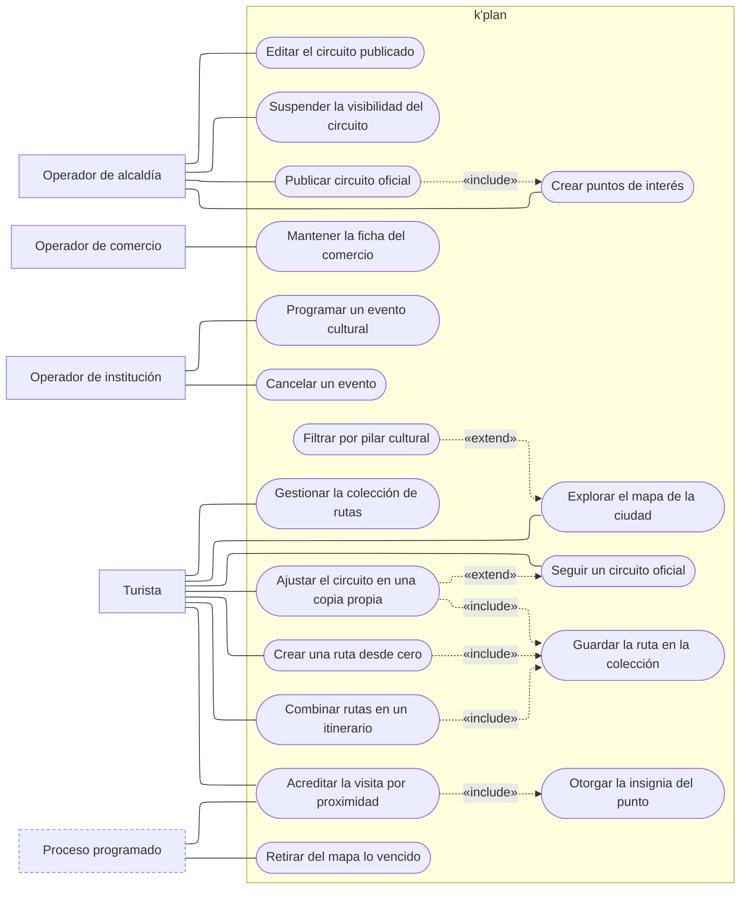

---
hide:
  - toc
icon: lucide/map
---

# Descubrimiento y planificación

De dónde sale el contenido que el turista recorre, y qué puede hacer con él. Es
el corte donde se ve la dependencia que ordena todo el ecosistema: la alcaldía
publica primero, y solo después el turista tiene algo que clonar, el comercio
algo sobre lo que aparecer y el guía algo sobre lo que proponer.

Tres actores producen contenido y ninguno de los tres lo consume. El turista
consume los tres y no produce ninguno: lo que él crea —sus rutas— no existe para
nadie más.

## Qué exige cada caso de uso

| Caso de uso                 | Quién lo inicia         | Precondición                                                                 | Requisito          |
| --------------------------- | ----------------------- | ---------------------------------------------------------------------------- | ------------------ |
| Crear puntos de interés     | Operador de alcaldía    | Organización aprobada; coordenadas en Nicaragua                              | [RF-A-02][rf-a-02] |
| Publicar circuito oficial   | Operador de alcaldía    | Al menos dos paradas geolocalizadas                                          | [RF-A-02][rf-a-02] |
| Editar el circuito          | Operador de alcaldía    | El circuito es de su propia ciudad                                           | [RF-A-05][rf-a-05] |
| Suspender la visibilidad    | Operador de alcaldía    | Circuito publicado                                                           | [RF-A-08][rf-a-08] |
| Mantener la ficha           | Operador de comercio    | Comercio verificado; coordenadas en Nicaragua                                | [RF-C-03][rf-c-03] |
| Programar un evento         | Operador de institución | Institución aprobada; fechas futuras y coherentes                            | [RF-I-01][rf-i-01] |
| Cancelar un evento          | Operador de institución | Evento no finalizado                                                         | [RF-I-05][rf-i-05] |
| Explorar el mapa            | Turista                 | Ciudad seleccionada                                                          | [RF-T-01][rf-t-01] |
| Filtrar por pilar cultural  | Turista                 | Mapa abierto                                                                 | [RF-T-29][rf-t-29] |
| Seguir un circuito oficial  | Turista                 | Circuito visible                                                             | [RF-T-28][rf-t-28] |
| Ajustar en una copia propia | Turista                 | La copia conserva al menos dos paradas                                       | [RF-T-07][rf-t-07] |
| Combinar rutas              | Turista                 | Dos o más rutas propias, de cualquier ciudad                                 | [RF-T-08][rf-t-08] |
| Crear una ruta desde cero   | Turista                 | Al menos dos paradas geolocalizadas                                          | [RF-T-09][rf-t-09] |
| Guardar la ruta             | Turista                 | Ruta válida                                                                  | [RF-T-10][rf-t-10] |
| Gestionar la colección      | Turista                 | Renombrar exige tres caracteres; eliminar exige que no haya servicio vigente | [RF-T-13][rf-t-13] |
| Acreditar la visita         | Turista, proceso        | Permiso de ubicación y distancia menor a 50 m                                | [RF-S-15][rf-s-15] |
| Retirar del mapa lo vencido | Proceso programado      | Fecha de finalización superada                                               | [RF-I-02][rf-i-02] |

## Lo que las flechas dicen y no se ve a simple vista

**El ajuste es una extensión del seguimiento, no un caso paralelo.** El turista
sigue un circuito oficial tal como lo publicó la alcaldía y recibe las
correcciones municipales. En el momento en que agrega, quita o reordena una
parada, el recorrido pasa a ser copia propia y deja de recibirlas
([RF-T-28][rf-t-28]). Por eso `ajustar` extiende a `seguir` en vez de ser otro
óvalo suelto: no hay dos formas de recorrer, hay una que puede bifurcarse.

**Publicar un circuito incluye crear sus puntos.** No existe un circuito sin
paradas geolocalizadas, así que `«include»` y no `«extend»`. La consecuencia
menos evidente está en [RF-A-07][rf-a-07]: borrar después una de esas paradas no
le quita al turista la insignia que ya le otorgó.

**Acreditar una visita siempre otorga la insignia.** Son un solo caso operativo
partido en dos óvalos porque los dispara gente distinta: el turista camina, el
proceso programado evalúa la geocerca. El límite de una acreditación por
establecimiento cada veinticuatro horas ([RF-S-15][rf-s-15]) es lo que hace que
la insignia mida exploración y no permanencia.

**La alcaldía no puede consumir lo que publica.** No sale ninguna línea suya
hacia `explorar` ni hacia `seguir`. Es consecuencia de [RF-S-26][rf-s-26]: una
cuenta ejerce exactamente un papel, y quien opera un portal no viaja como turista
con esa misma cuenta.

**Suspender no destruye copias.** El circuito suspendido desaparece de la
exploración de inmediato, pero las rutas que los turistas ya habían clonado
siguen en sus colecciones ([RF-A-08][rf-a-08], [RF-T-14][rf-t-14]). Es la razón
por la que `coleccion` no tiene ninguna línea que la conecte con la alcaldía.

## Por qué el evento cancelado no desaparece

`Cancelar un evento` y `retirar del mapa lo vencido` parecen el mismo caso y no
lo son. El evento vencido desaparece; el cancelado permanece visible, señalado
como tal, y avisa a quien se había vinculado a él ([RF-I-05][rf-i-05],
[RF-T-06][rf-t-06]). La diferencia es quién queda desinformado si se elige mal:
nadie planea asistir a algo que ya pasó, pero mucha gente puede estar en camino a
algo que se canceló esta mañana.

[rf-a-02]: ../../requerimientos/funcionales/portal-alcaldias.md#rf-a-02
[rf-a-05]: ../../requerimientos/funcionales/portal-alcaldias.md#rf-a-05
[rf-a-07]: ../../requerimientos/funcionales/portal-alcaldias.md#rf-a-07
[rf-a-08]: ../../requerimientos/funcionales/portal-alcaldias.md#rf-a-08
[rf-c-03]: ../../requerimientos/funcionales/portal-comercios.md#rf-c-03
[rf-i-01]: ../../requerimientos/funcionales/portal-instituciones.md#rf-i-01
[rf-i-02]: ../../requerimientos/funcionales/portal-instituciones.md#rf-i-02
[rf-i-05]: ../../requerimientos/funcionales/portal-instituciones.md#rf-i-05
[rf-s-15]: ../../requerimientos/funcionales/plataforma.md#rf-s-15
[rf-s-26]: ../../requerimientos/funcionales/plataforma.md#rf-s-26
[rf-t-01]: ../../requerimientos/funcionales/app-turista.md#rf-t-01
[rf-t-06]: ../../requerimientos/funcionales/app-turista.md#rf-t-06
[rf-t-07]: ../../requerimientos/funcionales/app-turista.md#rf-t-07
[rf-t-08]: ../../requerimientos/funcionales/app-turista.md#rf-t-08
[rf-t-09]: ../../requerimientos/funcionales/app-turista.md#rf-t-09
[rf-t-10]: ../../requerimientos/funcionales/app-turista.md#rf-t-10
[rf-t-13]: ../../requerimientos/funcionales/app-turista.md#rf-t-13
[rf-t-14]: ../../requerimientos/funcionales/app-turista.md#rf-t-14
[rf-t-28]: ../../requerimientos/funcionales/app-turista.md#rf-t-28
[rf-t-29]: ../../requerimientos/funcionales/app-turista.md#rf-t-29
