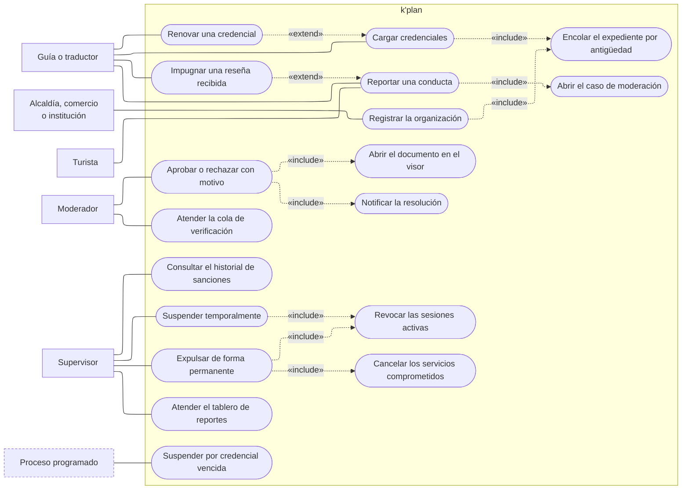

---
hide:
  - toc
icon: lucide/shield-check
---

# Verificación y moderación

Quién decide que un prestador existe, y quién lo saca del sistema. Son las dos
funciones que sostienen la confianza del ecosistema y ninguna se automatiza:
detrás de cada óvalo del moderador y del supervisor hay una persona mirando un
documento o un reporte.

El corte junta dos cosas que suelen documentarse aparte porque comparten
frontera. Verificar decide si alguien entra; sancionar decide si sigue dentro. Lo
único que las diferencia en el diagrama es el actor que las inicia.

## Qué exige cada caso de uso

| Caso de uso                     | Quién lo inicia         | Precondición                                        | Requisito           |
| ------------------------------- | ----------------------- | --------------------------------------------------- | ------------------- |
| Cargar credenciales             | Guía, traductor         | PDF legible de hasta 10 MB con emisión y vencimiento | [RF-S-13][rf-s-13]  |
| Renovar una credencial          | Guía, traductor         | Nueva fecha de vencimiento posterior a hoy           | [RF-P-04][rf-p-04]  |
| Registrar la organización       | Alcaldía, comercio, institución | Documento que acredita representación o existencia legal | [RF-B-05][rf-b-05] |
| Encolar el expediente           | —                       | Documento cargado y válido                           | [RF-B-01][rf-b-01]  |
| Atender la cola                 | Moderador               | Cola ordenada por antigüedad de envío                | [RF-B-01][rf-b-01]  |
| Abrir el documento en el visor  | Moderador               | Expediente tomado                                    | [RF-B-02][rf-b-02]  |
| Aprobar o rechazar con motivo   | Moderador               | El motivo es obligatorio al rechazar                 | [RF-B-04][rf-b-04]  |
| Suspender por credencial vencida | Proceso programado     | Vencimiento alcanzado sin renovación aprobada        | [RF-P-05][rf-p-05]  |
| Reportar una conducta           | Turista, prestador      | Categoría del reporte declarada                      | [RF-B-06][rf-b-06]  |
| Impugnar una reseña             | Guía, traductor         | Reseña recibida; no se notifica al autor              | [RF-S-25][rf-s-25]  |
| Abrir el caso de moderación     | —                       | Reporte o impugnación con su material de respaldo    | [RF-S-25][rf-s-25]  |
| Atender el tablero de reportes  | Supervisor              | Caso abierto con su material de respaldo             | [RF-B-06][rf-b-06]  |
| Suspender temporalmente         | Supervisor              | Infracción leve verificada; motivo interno obligatorio | [RF-B-07][rf-b-07] |
| Expulsar de forma permanente    | Supervisor              | Confirmación adicional y razón detallada             | [RF-B-08][rf-b-08]  |
| Cancelar servicios comprometidos | Supervisor             | Servicios futuros acordados por el expulsado         | [RF-B-09][rf-b-09]  |
| Consultar el historial          | Supervisor              | Ninguna                                              | [RF-B-10][rf-b-10]  |

## Lo que las flechas dicen y no se ve a simple vista

**Cargar credenciales y registrar una organización desembocan en la misma cola.**
Es una sola mecánica para cuatro objetos mutuamente excluyentes: la acreditación
de un prestador y el registro de un comercio, una alcaldía o una institución
([RF-B-05][rf-b-05]). Lo que cambia entre ellos es el documento exigido y la
severidad de la revisión, no el ciclo, y por eso comparten óvalo en vez de
duplicarlo cuatro veces.

**Resolver incluye notificar.** Un rechazo sin causa comunicada obliga a
reintentar a ciegas ([RF-B-04][rf-b-04]), así que la notificación no es un efecto
posterior sino parte de la resolución. La aprobación también notifica: es la que
dispara la bienvenida y con ella la visibilidad del perfil.

**Impugnar extiende a reportar.** Una impugnación es un reporte con un objeto
particular —una reseña— y abre el mismo caso, que llega al mismo tablero. La diferencia que sí importa
está en [RF-S-25][rf-s-25]: la marca no oculta la reseña y el autor no se entera
mientras no exista resolución.

**Las dos sanciones incluyen revocar la sesión.** Suspender y expulsar surten
efecto en el dispositivo donde el infractor ya estaba dentro
([RF-S-07][rf-s-07]); no esperan a que la credencial expire por su cuenta. Solo
la expulsión incluye además cancelar los servicios comprometidos, y la
contraparte recibe la cancelación sin conocer la sanción que la originó
([RF-B-09][rf-b-09]).

**Nadie se aprueba a sí mismo.** No hay ninguna línea del prestador hacia
`resolver`, ni del supervisor hacia `reportar`. La verificación es manual y
humana, y ninguna combinación de datos declarados sustituye la revisión del
documento ([RF-P-03][rf-p-03]).

## Una línea que el diagrama todavía no puede dibujar

La [ficha de actores](../../actores/index.md#pendiente-de-definicion) deja
abierto si el supervisor también resuelve la cola de verificación. Aquí se dibuja
como no: `resolver` cuelga solo del moderador. Si en la práctica resulta que sí,
el cambio es asignar dos roles a la misma persona y no agregar una línea al
diagrama.

Queda abierto por el mismo motivo quién da de alta a una alcaldía y a una
institución cultural. El diagrama asume el formulario público de
[RF-A-11][rf-a-11] y [RF-I-07][rf-i-07]; si el alta llega a hacerse desde el
backoffice, el actor de `registrar la organización` cambia y el resto del
diagrama no se mueve.

[rf-a-11]: ../../requerimientos/funcionales/portal-alcaldias.md#rf-a-11
[rf-b-01]: ../../requerimientos/funcionales/backoffice.md#rf-b-01
[rf-b-02]: ../../requerimientos/funcionales/backoffice.md#rf-b-02
[rf-b-04]: ../../requerimientos/funcionales/backoffice.md#rf-b-04
[rf-b-05]: ../../requerimientos/funcionales/backoffice.md#rf-b-05
[rf-b-06]: ../../requerimientos/funcionales/backoffice.md#rf-b-06
[rf-b-07]: ../../requerimientos/funcionales/backoffice.md#rf-b-07
[rf-b-08]: ../../requerimientos/funcionales/backoffice.md#rf-b-08
[rf-b-09]: ../../requerimientos/funcionales/backoffice.md#rf-b-09
[rf-b-10]: ../../requerimientos/funcionales/backoffice.md#rf-b-10
[rf-i-07]: ../../requerimientos/funcionales/portal-instituciones.md#rf-i-07
[rf-p-03]: ../../requerimientos/funcionales/app-prestadores.md#rf-p-03
[rf-p-04]: ../../requerimientos/funcionales/app-prestadores.md#rf-p-04
[rf-p-05]: ../../requerimientos/funcionales/app-prestadores.md#rf-p-05
[rf-s-07]: ../../requerimientos/funcionales/plataforma.md#rf-s-07
[rf-s-13]: ../../requerimientos/funcionales/plataforma.md#rf-s-13
[rf-s-25]: ../../requerimientos/funcionales/plataforma.md#rf-s-25
