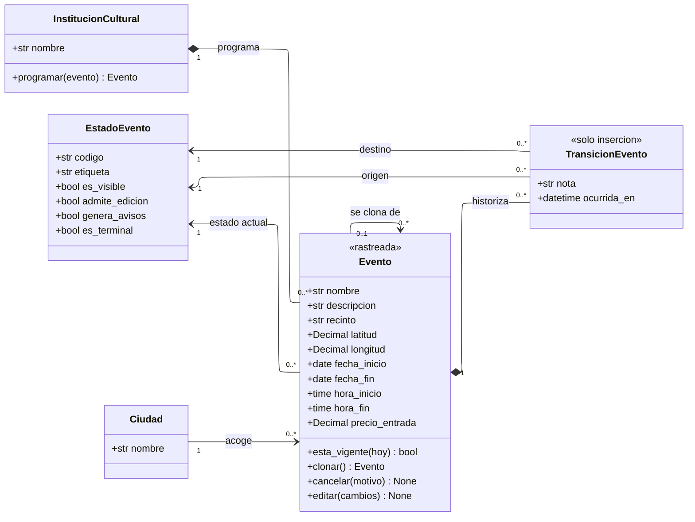

---
hide:
  - toc
icon: lucide/drama
---

# Agenda cultural

Una sola clase con ciclo de vida y una asociación consigo misma. Lo que el
diagrama de clases agrega es que la clonación deja de ser una llave foránea y
pasa a ser una operación con una postcondición: el clon nace sin fechas.

## Qué agrega sobre el ER

**`clonar()` copia y vacía en la misma operación.** Conserva descripción,
ubicación y precio, y deja las fechas sin asignar: el evento clonado no existe
hasta que se le den fechas válidas y se guarde como registro independiente
([RF-I-06][rf-i-06]). La asociación `se clona de` que queda es trazabilidad, no
dependencia: cancelar el original no cancela la función del domingo siguiente.

**`esta_vigente()` recibe el día y no lee ninguna bandera.** La vigencia la
gobierna el propio rango de fechas del evento, así que nadie tiene que
despublicar nada ([RF-I-02][rf-i-02]). El proceso programado lo retira del mapa
cuando la fecha de fin queda atrás, y esa retirada no cambia el estado: cambia lo
que la operación responde.

**`genera_avisos` es un atributo del estado, no del evento.** Cancelar deja de
emitir avisos por cercanía, para no atraer visitantes a un recinto donde ya no
ocurrirá nada ([RF-I-05][rf-i-05]). Ponerlo en `EstadoEvento` es lo que evita que
la regla quede repartida en condicionales por el código
([D-11](../../modelo-dominio/decisiones.md#d-11)).

**`cancelar()` y la ausencia de `eliminar()`.** No hay operación de borrado
porque un evento cancelado no se borra ni se oculta: permanece visible, señalado
como tal, para que quien ya lo tenía visto entienda qué pasó en lugar de
encontrarse con que desapareció ([RF-I-05][rf-i-05], [RF-T-06][rf-t-06]).

**`editar()` no siempre está disponible.** La institución corrige descripción,
horario y precio mientras el evento no haya finalizado
([RF-I-04][rf-i-04]), y quien lo decide es `EstadoEvento.admite_edicion`. La
operación existe en la clase; el estado dice si se puede llamar.

## Institución y ciudad no son la misma cosa

`InstitucionCultural` compone sus eventos y `Ciudad` solo los asocia. La razón es
que no siempre coinciden: un teatro puede llevar una función a otra Ciudad
Creativa, y el evento cuelga de quien lo programa y ocurre donde ocurre.

Si la ciudad compusiera al evento, un evento fuera de la ciudad de su institución
no tendría dónde vivir, y la agenda de Granada mostraría funciones que allí no
pasan.

[rf-i-02]: ../../requerimientos/funcionales/portal-instituciones.md#rf-i-02
[rf-i-04]: ../../requerimientos/funcionales/portal-instituciones.md#rf-i-04
[rf-i-05]: ../../requerimientos/funcionales/portal-instituciones.md#rf-i-05
[rf-i-06]: ../../requerimientos/funcionales/portal-instituciones.md#rf-i-06
[rf-t-06]: ../../requerimientos/funcionales/app-turista.md#rf-t-06
