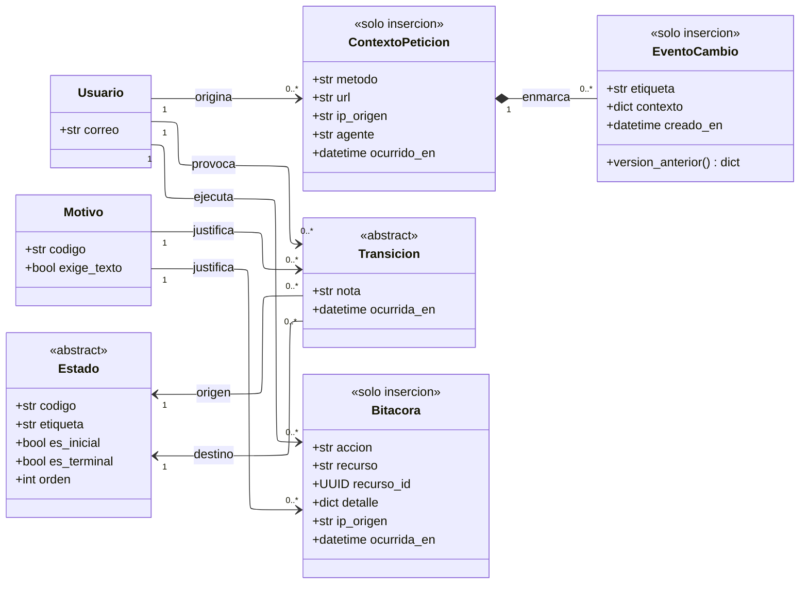

---
hide:
  - toc
icon: lucide/scroll-text
---

# Auditoría

`Estado` y `Transicion` no son dos clases: son dos plantillas que se instancian
una vez por cada entidad con ciclo de vida. Este módulo las declara en su forma
abstracta y muestra qué agrega cada especialización.

## Qué agrega sobre el ER

**Las cuatro clases son de solo inserción y ninguna tiene operaciones de
escritura.** No es que falten: es que no existen. Un evento de auditoría que se
puede corregir no sirve para auditar nada, y por eso el estereotipo va antes que
cualquier atributo.

**`EventoCambio` cuelga de `ContextoPeticion` por composición.** Sin el contexto,
el historial responde qué cambió pero no quién ni desde dónde, que es justamente
lo que hay que responder cuando alguien disputa una sanción o una reseña
([D-32](../../modelo-dominio/decisiones.md#d-32)). Que sea composición dice que un
evento sin contexto no debería poder existir.

**`Estado` y `Transicion` abstractas son la forma correcta de un patrón que se
repite once veces.** Cada especialización agrega sus propios atributos booleanos
—las preguntas que el sistema hace sobre el estado— en lugar de repartir esas
preguntas en condicionales por el código
([D-11](../../modelo-dominio/decisiones.md#d-11)).

**El estado actual vive en la entidad, no se deriva del historial.** Es la única
denormalización del módulo y es deliberada: las consultas frecuentes no pueden
pagar una agregación sobre las transiciones
([D-13](../../modelo-dominio/decisiones.md#d-13)). El historial responde cómo se
llegó; la entidad responde dónde está.

## Las once instancias del patrón

| Especialización de `Estado` | Lo que agrega                                   |
| --------------------------- | ----------------------------------------------- |
| `EstadoUsuario`             | `permite_operar`, `revoca_sesion`               |
| `EstadoPrestador`           | `es_visible`, `acepta_reservas`                 |
| `EstadoAcreditacion`        | `acredita`                                      |
| `EstadoCircuito`            | `es_visible`, `admite_edicion`                  |
| `EstadoConvocatoria`        | `admite_postulacion`                            |
| `EstadoReserva`             | `admite_cancelacion`, `retiene_fondos`          |
| `EstadoCampania`            | `admite_canje`                                  |
| `EstadoCupon`               | `admite_validacion`                             |
| `EstadoEvento`              | `es_visible`, `admite_edicion`, `genera_avisos` |
| `EstadoVerificacion`        | `en_bandeja`                                    |
| `EstadoAviso`               | `cuenta_para_limite`, `admite_reintento`        |

Las cinco columnas heredadas —`codigo`, `etiqueta`, `es_inicial`, `es_terminal`,
`orden`— no se repiten en ninguna. Los diagramas de cada módulo las omiten por la
misma razón, y el
[diagrama de estados](../estados/index.md) es donde se ve el grafo que estas
clases sostienen.

## Los tres regímenes, contados

| Estereotipo          | Clases | Ejemplos                                                     |
| -------------------- | :----: | ------------------------------------------------------------ |
| `<<solo insercion>>` |   18   | Movimientos, visitas, transiciones, avisos, bitácora         |
| `<<rastreada>>`      |   18   | Usuario, perfiles, comercios, circuitos, eventos, recorridos |
| `<<protegida>>`      |   2    | `Reserva` y `Cupon`                                          |

Las dos clases protegidas son las que congelan un valor económico: la tarifa de
la reserva y el beneficio del cupón. Ninguna de las dos se puede reescribir
aunque el resto de la fila sí, y un disparador es quien lo impide
([D-31](../../modelo-dominio/decisiones.md#d-31)).

Ninguna clase admite vaciado masivo. Un disparador lo impide en la tabla base de
la que heredan todas, que es la contraparte física de la clase `Entidad` del
[índice](index.md#patrones-transversales).
