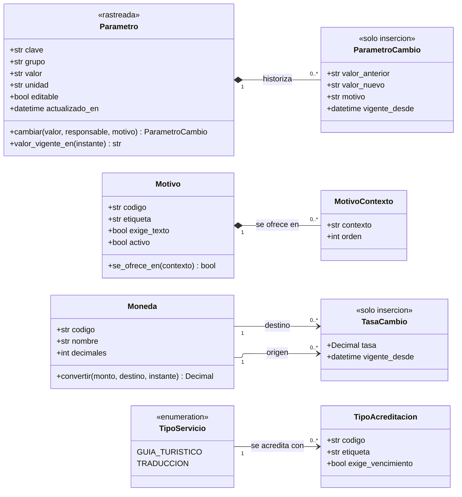

---
hide:
  - toc
icon: lucide/list-tree
---

# Catálogos y parámetros

Los valores que el sistema conoce de antemano. Como clases, la pregunta deja de
ser qué columnas tienen y pasa a ser cuáles están cerradas: un `PilarCultural`
nuevo no existe sin cambiar el marco del turismo creativo, mientras que un
`Motivo` nuevo se agrega un martes cualquiera.

## Qué agrega sobre el ER

**`convertir()` es una operación de `Moneda` y no una consulta suelta.** Recibe
el instante porque la tasa es histórica: convertir hoy y convertir la semana
pasada dan resultados distintos sobre el mismo monto. De dónde sale la tasa y en
qué momento se congela para una transacción sigue sin definirse, y por eso la
operación declara el parámetro que hará falta cuando se decida.

**`valor_vigente_en()` es lo que justifica `ParametroCambio`.** Subir el radio de
la geocerca de quinientos a ochocientos metros cambia el resultado de cálculos ya
hechos. Sin la operación —y sin el historial que la sostiene— no se puede
responder con qué radio se disparó el aviso de la semana pasada.

**Los dos rombos son composición.** Un `ParametroCambio` sin su parámetro no
significa nada, y un `MotivoContexto` sin su motivo tampoco. En cambio
`TasaCambio` cuelga de dos monedas por asociación simple: la moneda es catálogo
referenciado por operación y no se borra mientras exista una cotización que la
use.

**Solo `TipoServicio` se dibuja como enumeración.** El piloto lo cierra en dos
valores y la distinción entre guía y traductor gobierna qué puede publicar cada
uno. Los demás catálogos —`Ciudad`, `Pais`, `Idioma`, `TipoNegocio`,
`TipoBeneficio`, `TipoAviso`— siguen siendo clases con tabla, porque agregar un
valor no debe exigir desplegar nada.

## Los parámetros como configuración, no como constantes

| Parámetro                             | Valor de partida | Quién lo lee                      |
| ------------------------------------- | ---------------- | --------------------------------- |
| Radio de la geocerca                  | 500 m            | `Geocerca`                        |
| Distancia para acreditar una visita   | 50 m             | `VisitaAcreditada`                |
| Espera entre visitas al mismo local   | 24 h             | `VisitaAcreditada`                |
| Avisos promocionales por hora         | 3                | `AvisoEmitido`                    |
| Intentos fallidos antes de bloquear   | 5                | `BloqueoAcceso`                   |
| Ventana para corregir una reseña      | 24 h             | `Resena`                          |
| Cuarentena al cambiar cuenta bancaria | 24 h             | `CuentaBancariaCambio`            |
| Retiro mínimo acumulado               | 20 USD           | `SolicitudRetiro`                 |
| Comisión de la plataforma             | sin definir      | `Comision`                        |

Ninguna de esas clases guarda el umbral como atributo. Lo consulta, y por eso
cambiarlo no obliga a migrar filas ya escritas: solo cambia lo que se evalúe de
ahí en adelante.
