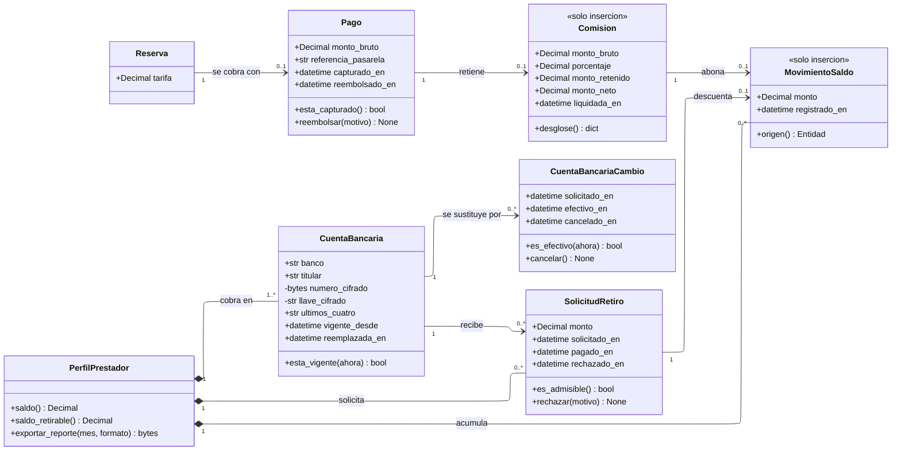

---
hide:
  - toc
icon: lucide/wallet
---

# Finanzas

El saldo del prestador sigue el mismo principio que las insignias: es la suma de
un libro, no una columna. Lo que este módulo agrega es que la comisión se guarda
con su resta completa, porque el prestador tiene que poder verificarla y no solo
leer el resultado.

## Qué agrega sobre el ER

**`Comision` guarda cuatro montos y ninguno es derivable de los otros en el
futuro.** Bruto, porcentaje, retenido y neto quedan congelados al liquidar. El
prestador debe poder verificar la resta, no solo el resultado
([RF-P-16][rf-p-16]), y cambiar el porcentaje después no altera nada ya liquidado.
`desglose()` es la operación que arma esa vista.

**`CuentaBancaria` no se actualiza: se reemplaza.** La multiplicidad `1..*` con
`vigente_desde` y `reemplazada_en` dice que el prestador acumula cuentas y solo
una está vigente. Modelarlo como actualización en el sitio obligaría a
sobrescribir el dato anterior, y entonces no habría a qué revertir si el cambio
resulta fraudulento ([D-10](../../modelo-dominio/decisiones.md#d-10)).

**`CuentaBancariaCambio.es_efectivo(ahora)` es la cuarentena de veinticuatro
horas.** La cuenta nueva no surte efecto de inmediato: la anterior sigue siendo
la activa hasta que vence el plazo, de modo que un acceso no autorizado no pueda
desviar un retiro en la misma sesión en que cambia la cuenta
([RF-P-07][rf-p-07]).

**Dos miembros privados y la razón es la misma que en identidad.** `numero_cifrado`
y `llave_cifrado` se guardan cifrados en la aplicación, no en claro ni delegados
al cifrado de disco: un volcado de la base no debe bastar para desviar un retiro
([D-09](../../modelo-dominio/decisiones.md#d-09)). `ultimos_cuatro` es público
porque es lo único que la interfaz necesita mostrar.

**`saldo()` y `saldo_retirable()` no son la misma operación.** La primera suma el
libro; la segunda además comprueba el mínimo acumulado de veinte dólares y que no
haya otra solicitud en proceso ([RF-P-18][rf-p-18]). Separarlas evita que el
portal muestre un saldo que no se puede pedir.

**`es_admisible()` concentra las tres condiciones del retiro.** Monto mayor que
cero, monto que no exceda el saldo disponible y ninguna solicitud en curso.
Mientras una esté en proceso, el portal impide iniciar otra.

## Todo saldo es explicable movimiento por movimiento

| Operación             | `monto`  | `origen()`        |
| --------------------- | :------: | ----------------- |
| Liquidar una comisión | positivo | `Comision`        |
| Pagar un retiro       | negativo | `SolicitudRetiro` |

`MovimientoSaldo` es la segunda instancia del patrón `Movimiento`, idéntica en
forma a `MovimientoInsignia`: solo inserción, con signo y con referencia al hecho
que la originó ([D-24](../../modelo-dominio/decisiones.md#d-24)).

!!! warning "Dos valores sin definir"

    El porcentaje de comisión aplicable no está fijado
    ([RF-P-16][rf-p-16]), así que `Comision.porcentaje` existe como atributo sin
    valor de partida.

    El momento exacto en que se captura el pago tampoco
    ([RF-T-27][rf-t-27]), y de esa definición depende el ciclo de vida completo
    de `Pago` y de `Reserva`. Por eso `Pago` es la única clase del módulo sin
    catálogo de estados: no se puede escribir hasta que se decida.

[rf-p-07]: ../../requerimientos/funcionales/app-prestadores.md#rf-p-07
[rf-p-16]: ../../requerimientos/funcionales/app-prestadores.md#rf-p-16
[rf-p-18]: ../../requerimientos/funcionales/app-prestadores.md#rf-p-18
[rf-t-27]: ../../requerimientos/funcionales/app-turista.md#rf-t-27
