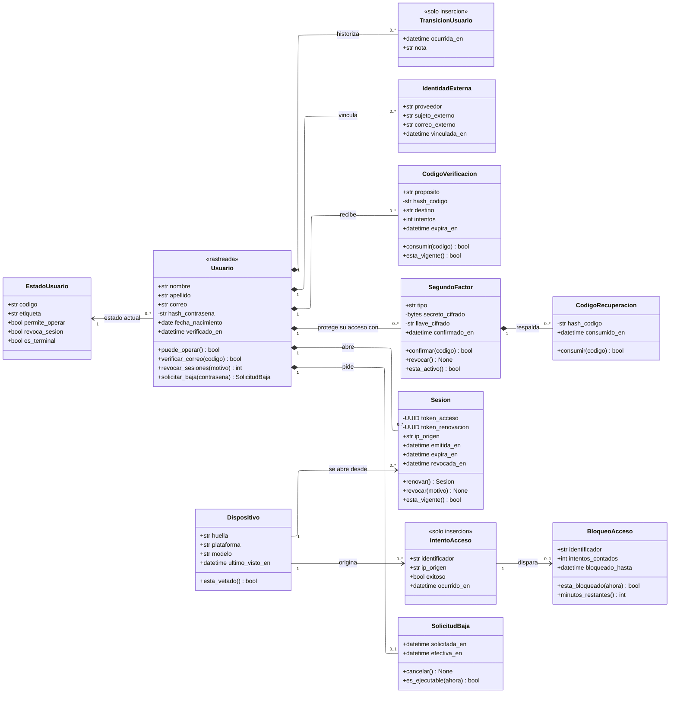

---
hide:
  - toc
icon: lucide/key-round
---

# Identidad y acceso

Una sola clase `Usuario` para turistas, prestadores, operadores de portal y
personal interno. Lo que los distingue no es la cuenta sino el perfil que tienen
y el rol que se les asignó.

Es el módulo donde la visibilidad de los miembros dice más que su tipo. Todo lo
marcado con `-` es un secreto que no sale de la clase: si aparece en una
respuesta, en un registro o en un volcado, hay un defecto.

## Qué agrega sobre el ER

**`IntentoAcceso` no tiene asociación con `Usuario`, y eso es la garantía.**
Guarda el identificador tal como se tecleó, en un `str` y no en una referencia.
Si apuntara a la cuenta, un correo inexistente no tendría dónde registrarse y el
bloqueo por cinco intentos solo funcionaría para cuentas reales, revelando cuáles
lo son ([D-08](../../modelo-dominio/decisiones.md#d-08)). La ausencia de una
flecha es aquí un requisito de seguridad, no un olvido.

**`Sesion.renovar()` devuelve una `Sesion` nueva y no se puede llamar dos veces.**
La credencial de renovación es de un solo uso: consumirla emite un par nuevo y
revoca el anterior. Presentar la misma credencial una segunda vez falla, que es
lo que convierte un robo en un incidente detectable en lugar de en un acceso
permanente ([D-06](../../modelo-dominio/decisiones.md#d-06)).

**Siete miembros privados y ninguno es casualidad.** Dos huellas de código, la
contraseña, el secreto del segundo factor con su llave y los dos tokens de
sesión. El secreto del
segundo factor se guarda cifrado en la aplicación junto al identificador de la
llave que lo cifró, no en claro ni delegado al cifrado de disco
([D-09](../../modelo-dominio/decisiones.md#d-09)): un volcado de la base no debe
bastar para suplantar un segundo factor.

**`SegundoFactor` es una clase porque tiene operaciones propias.** Confirmar,
revocar y responder si está activo son tres cosas que una columna booleana no
sabe hacer, y modelarlo como bandera impediría rotar un factor sin perder el
anterior ([D-04](../../modelo-dominio/decisiones.md#d-04)).

**`Dispositivo` no cuelga de nadie.** Lo referencian las sesiones y los intentos,
y su operación `esta_vetado()` es lo que sostiene el veto a crear cuentas nuevas
desde el aparato de un expulsado. Sin la clase, la expulsión solo alcanzaría a la
cuenta y crear otra costaría un minuto
([D-07](../../modelo-dominio/decisiones.md#d-07)).

## Las composiciones y la baja de la cuenta

Todo lo que cuelga de `Usuario` es composición: identidades externas, códigos,
factores, sesiones y la solicitud de baja mueren con la cuenta. Es la traducción
directa del `ON DELETE CASCADE` de esas llaves, y es lo que hace ejecutable la
destrucción a los treinta días.

`Dispositivo` es la excepción deliberada. Está unido por asociación simple porque
sobrevive a la cuenta que lo usó: si muriera con ella, expulsar a alguien y
dejarlo borrar su cuenta levantaría el veto.

!!! warning "Una contradicción entre fichas"

    El [ER conceptual de este módulo](../entidad-relacion/conceptual/identidad.md)
    dice que una misma persona puede reservar como turista y operar el mostrador
    de un comercio sin duplicar identidad. El
    [de perfiles](../entidad-relacion/conceptual/perfiles.md) y
    [RF-S-26][rf-s-26] dicen lo contrario: una cuenta ejerce exactamente un
    papel, y hacen falta dos cuentas con correos distintos para ejercer dos.

    Aquí se modela la segunda lectura, que es la que tiene requerimiento detrás.
    La primera frase del conceptual es la que hay que corregir.

[rf-s-26]: ../../requerimientos/funcionales/plataforma.md#rf-s-26
