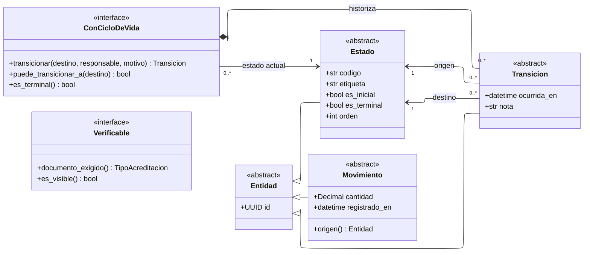

---
hide:
  - toc
icon: lucide/boxes
---

# Diagramas de clases

Los mismos módulos de los [diagramas entidad-relación](../entidad-relacion/index.md),
leídos como objetos en lugar de como tablas. Un archivo por módulo, espejo exacto
del conceptual y del físico, para que las tres vistas se puedan comparar fila por
fila.

El diagrama de clases no reemplaza al ER: agrega lo que una tabla no sabe
expresar. Una llave foránea no distingue entre «esta parte muere con su todo» y
«esta referencia es trazabilidad»; una columna `bool` no dice quién puede
cambiarla; y `numeric(12,2)` no dice que ese valor se calcula sumando un libro de
movimientos.

---

## Cómo se traduce el ER a clases

Las cuatro reglas son mecánicas. Aplicadas al revés reconstruyen el modelo
físico, que es lo que garantiza que las dos vistas no se separen.

| En el modelo físico                | En el diagrama de clases                     |
| ---------------------------------- | -------------------------------------------- |
| Tabla                              | Clase                                        |
| Columna de dato                    | Atributo, con el tipo del programa           |
| Columna `<algo>_id` de llave       | Asociación con su rol y su multiplicidad     |
| Tabla intermedia sin datos propios | Asociación de varios a varios, sin clase     |
| Tabla intermedia con datos propios | Clase de asociación                          |
| Catálogo `estado_<entidad>`        | Especialización de `Estado`                  |
| Catálogo `tipo_<algo>`             | `<<enumeration>>` cuando el piloto lo cierra |

Las columnas `_id` desaparecen. Es la diferencia más visible entre las dos
vistas y también la más útil: `reserva.perfil_prestador_id` no dice nada sobre
qué puede hacer una reserva con su prestador, mientras que una asociación
navegable con multiplicidad `1` sí.

### De `ON DELETE` a rombo

El tipo de rombo no se elige por intuición. Sale directo de la
[regla de llaves foráneas](../../modelo-dominio/convenciones.md#llaves-foraneas):

| `ON DELETE` | Relación UML              | Se lee                                             |
| ----------- | ------------------------- | -------------------------------------------------- |
| `CASCADE`   | Composición (rombo lleno) | La parte no existe sin el todo y muere con él      |
| `RESTRICT`  | Asociación simple         | El referenciado no se borra mientras lo usen       |
| `SET NULL`  | Agregación (rombo hueco)  | La parte sobrevive; la referencia era trazabilidad |

`CircuitoOficial *-- CircuitoParada` es composición porque borrar el circuito
borra sus paradas. `CircuitoParada --> PuntoInteres` es asociación simple porque
el punto sigue en el mapa y sigue otorgando insignias
([D-18](../../modelo-dominio/decisiones.md#d-18)).

### De tipo de columna a tipo de programa

| Tipo físico       | Tipo de la clase | Por qué cambia                                     |
| ----------------- | ---------------- | -------------------------------------------------- |
| `uuid`            | `UUID`           | —                                                  |
| `varchar`, `text` | `str`            | El límite es restricción, no tipo                  |
| `citext`          | `str`            | La insensibilidad vive en la comparación           |
| `numeric(12,2)`   | `Decimal`        | Nunca coma flotante                                |
| `timestamptz`     | `datetime`       | Con zona; el almacenamiento es en tiempo universal |
| `date`            | `date`           | Sin hora, por decisión del negocio                 |
| `bytea`           | `bytes`          | Cifrado en la aplicación                           |
| `jsonb`           | `dict`           | —                                                  |
| `inet`            | `str`            | —                                                  |

---

## Patrones transversales

Tres formas se repiten en casi todos los módulos. Se declaran una vez aquí y los
archivos de módulo solo las especializan.

**`Estado` y `Transicion` no son dos clases: son dos plantillas.** Se instancian
una vez por cada entidad con ciclo de vida, y cada instancia agrega sus propios
atributos booleanos: `EstadoUsuario.revoca_sesion`,
`EstadoReserva.admite_cancelacion`, `EstadoCircuito.es_visible`. Es
[D-11](../../modelo-dominio/decisiones.md#d-11) escrito como herencia en lugar de
como convención de nombres.

**`Movimiento` es el patrón del libro.** `MovimientoInsignia` y
`MovimientoSaldo` son la misma forma: fila de solo inserción, con signo y con
referencia al hecho que la originó. El saldo nunca es un atributo; siempre es una
operación que suma el libro
([D-24](../../modelo-dominio/decisiones.md#d-24)).

**`Verificable` es una interfaz y no una superclase.** La implementan la
acreditación de un prestador y las tres organizaciones, que no comparten ni una
columna: por eso son cuatro tablas y una sola cola de trabajo. Modelarlas como
herencia obligaría a una tabla común que
[D-12](../../modelo-dominio/decisiones.md#d-12) descarta explícitamente.

---

## Los dieciséis módulos

| #   | Módulo                                          | Clases | Lo que agrega sobre su ER                                    |
| --- | ----------------------------------------------- | :----: | ------------------------------------------------------------ |
| M1  | [Catálogos y parámetros](catalogos.md)          |   8    | Qué enumeraciones están cerradas y cuáles no                 |
| M2  | [Identidad y acceso](identidad.md)              |   12   | Qué es privado y qué se cifra en la aplicación               |
| M3  | [Roles y permisos](roles.md)                    |   9    | El ámbito tipado como interfaz, no como tres llaves          |
| M4  | [Perfiles y acreditaciones](perfiles.md)        |   10   | `Perfil` abstracto y la exclusión entre sus dos hijos        |
| M5  | [Territorio y circuitos](territorio.md)         |   9    | Qué muere con el circuito y qué sobrevive                    |
| M6  | [Itinerarios](itinerarios.md)                   |   6    | Seguir y derivar como dos asociaciones distintas             |
| M7  | [Organizaciones y comercios](organizaciones.md) |   10   | `Organizacion` abstracta sin tabla propia                    |
| M8  | [Agenda cultural](agenda.md)                    |   5    | La clonación como operación, no como llave                   |
| M9  | [Servicios y reservas](servicios.md)            |   11   | Los dos orígenes de la reserva como asociaciones excluyentes |
| M10 | [Mensajería](mensajeria.md)                     |   7    | El archivado por participante                                |
| M11 | [Reputación](reputacion.md)                     |   6    | La visibilidad como operación derivada del receptor          |
| M12 | [Insignias y cupones](insignias.md)             |   10   | El saldo como operación sobre el libro                       |
| M13 | [Finanzas](finanzas.md)                         |   8    | La comisión con su resta verificable                         |
| M14 | [Moderación y sanciones](moderacion.md)         |   12   | Los cuatro verificables tras una sola interfaz               |
| M15 | [Notificaciones](notificaciones.md)             |   10   | La ventana deslizante como operación                         |
| M16 | [Auditoría](auditoria.md)                       |   7    | Los tres regímenes como estereotipos                         |

---

## Estereotipos de auditoría

Cada clase lleva el régimen que declara su tabla
([D-31](../../modelo-dominio/decisiones.md#d-31)). En los diagramas aparece como
anotación, y es lo que dice de antemano qué operaciones **no** existen.

| Estereotipo          | Qué permite                                   | Qué no tiene            |
| -------------------- | --------------------------------------------- | ----------------------- |
| `<<solo insercion>>` | Insertar                                      | Ni `editar` ni `borrar` |
| `<<rastreada>>`      | Todo, con historial completo de versiones     | —                       |
| `<<protegida>>`      | Todo salvo columnas congeladas por disparador | `editar` parcial        |

Una clase `<<solo insercion>>` sin operaciones de escritura no está incompleta:
está diciendo que un movimiento de insignias no se corrige, se compensa con otro
movimiento.

Cada clase lleva una sola anotación. Cuando tiene estereotipo estructural
—`<<abstract>>`, `<<interface>>`, `<<enumeration>>`— se muestra ese, porque el
régimen de auditoría de una clase sin tabla no significa nada. Las clases que
aparecen sin anotación vienen de otro módulo y se dibujan reducidas: su ficha
completa está en el suyo.

---

## Convenciones de escritura

Los nombres de clase van en mayúscula inicial, como en el modelo conceptual. Los
atributos y las operaciones van en minúscula con guion bajo, como las columnas
del modelo físico y como el código que las va a implementar.

| Marca          | Significa                                              |
| -------------- | ------------------------------------------------------ |
| `+`            | Visible desde fuera del módulo                         |
| `#`            | Visible para las clases del módulo                     |
| `-`            | Privado: cifrado, o secreto que nunca sale de la clase |
| `operacion()*` | Abstracta: la implementa cada especialización          |
| `operacion()$` | De clase: no necesita instancia                        |

Un valor calculado se escribe como operación y no como atributo. `saldo()` es una
suma sobre el libro; `promedio_valoracion` es un atributo porque está
materializado a propósito
([D-23](../../modelo-dominio/decisiones.md#d-23)), y esa diferencia es
exactamente lo que el diagrama tiene que dejar ver.
