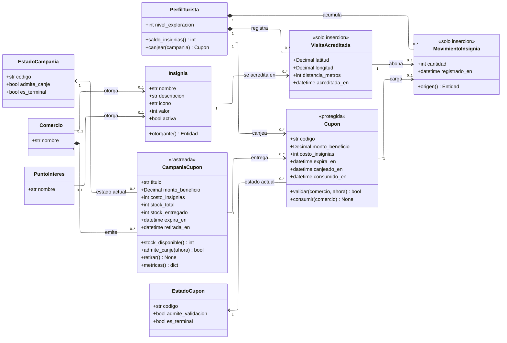

---
hide:
  - toc
icon: lucide/award
---

# Insignias y cupones

El saldo de insignias no es un atributo: es una operación que suma un libro de
movimientos. Es la diferencia más importante entre este diagrama y el ER, y la
que impide que dos canjes simultáneos dejen el saldo en negativo.

## Qué agrega sobre el ER

**`saldo_insignias()` es operación y no hay atributo `saldo` en ninguna clase.**
Con una columna, dos canjes simultáneos del mismo turista podrían leer el mismo
valor, ambos superar la comprobación de suficiencia y dejarlo en negativo. Con el
libro, el segundo ve el movimiento del primero
([D-24](../../modelo-dominio/decisiones.md#d-24)).

**`canjear()` es atómica por enunciado.** Descuenta el saldo y emite el código en
la misma operación: no existe un estado en el que se haya cobrado el saldo sin
entregar el código ([RF-T-21][rf-t-21]). Partirla en dos operaciones habría
dejado ese estado alcanzable.

**`CampaniaCupon --> Cupon` es asociación y no composición.** Es la traducción
exacta de [RF-C-08][rf-c-08]: `retirar()` corta la emisión y nunca lo ya emitido.
Si fuera composición, retirar la campaña borraría los cupones entregados, que es
lo contrario de lo que exige el requisito.

**`Cupon` copia `monto_beneficio`, `costo_insignias` y `expira_en`.** Los tres
están también en la campaña y no es redundancia: el cupón guarda su beneficio en
el momento del canje en vez de consultarlo, para que retirar la campaña no cambie
el valor de lo ya entregado
([D-25](../../modelo-dominio/decisiones.md#d-25)). El estereotipo
`<<protegida>>` dice que un disparador congela esas columnas.

**`codigo` es público y eso es una decisión, no un descuido.** El turista debe
verlo en su billetera y dictarlo en el mostrador, así que el sistema tiene que
poder mostrarlo. El riesgo se acota por otra vía —un solo uso, vigencia acotada y
pertenencia a un único comercio—, de modo que un código filtrado no vale nada
fuera de su contexto ([D-26](../../modelo-dominio/decisiones.md#d-26)).

**`VisitaAcreditada` no tiene ninguna operación de escritura.** El registro de
proximidad no se corrige ni se borra: es lo que justifica el movimiento de
insignias que lo acompaña, y la regla de una visita por establecimiento cada
veinticuatro horas se resuelve contra esa misma clase
([D-27](../../modelo-dominio/decisiones.md#d-27)).

## Las dos formas de mover el libro

| Operación                      | `cantidad` | `origen()`         |
| ------------------------------ | :--------: | ------------------ |
| Acreditar una visita           |  positiva  | `VisitaAcreditada` |
| Canjear insignias por un cupón |  negativa  | `Cupon`            |

`MovimientoInsignia.origen()` devuelve uno u otro, nunca los dos ni ninguno. Es
la misma forma de referencia excluyente que usa `Reserva.origen()`, y es lo que
hace que todo saldo sea explicable movimiento por movimiento.

`Insignia.otorgante()` sigue el mismo patrón hacia arriba: una insignia la otorga
un punto de interés o un comercio aliado, y por eso las dos asociaciones llevan
`0..1` en el extremo de la insignia.

## Lo que mide el comercio

`metricas()` desglosa, por campaña, cuántos cupones siguen disponibles, cuántos
fueron obtenidos mediante canje y cuántos llegaron a consumirse en el local. La
distancia entre obtenidos y consumidos es el indicador que permite evaluar si la
promoción atrajo visitas reales ([RF-C-09][rf-c-09]).

En el diagrama esa distancia es la que hay entre `canjeado_en` y `consumido_en`
en la misma clase.

[rf-c-08]: ../../requerimientos/funcionales/portal-comercios.md#rf-c-08
[rf-c-09]: ../../requerimientos/funcionales/portal-comercios.md#rf-c-09
[rf-t-21]: ../../requerimientos/funcionales/app-turista.md#rf-t-21
