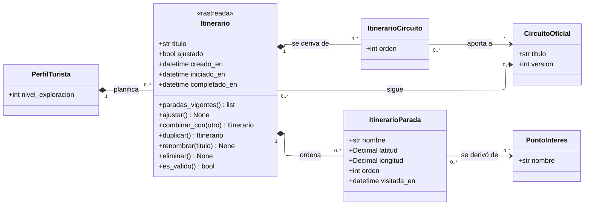

---
hide:
  - toc
icon: lucide/route
---

# Itinerarios

Hay dos relaciones distintas entre un itinerario y un circuito, y confundirlas
rompe el modelo. Como clases quedan separadas por su forma: **seguir** es una
asociación simple hacia el circuito vigente, **derivar** es una clase de
asociación que registra de dónde salió.

## Qué agrega sobre el ER

**`ajustar()` es una transición de un solo sentido y no un cambio de estado.**
`ajustado` es una bandera, no un estado: agregar, quitar o reordenar una parada
convierte al itinerario en copia congelada, y a partir de ahí deja de recibir las
correcciones municipales. La transición ocurre una sola vez y no se revierte
([D-33](../../modelo-dominio/decisiones.md#d-33)).

**`paradas_vigentes()` es la operación que resuelve la ambigüedad.** Mientras el
itinerario sigue un circuito, devuelve las paradas de la versión vigente del
circuito; una vez ajustado, devuelve las propias. Sin la operación, cada consulta
tendría que preguntar por `ajustado` y elegir la fuente, y bastaría una que lo
olvidara para que un turista viera el circuito de otro.

**La referencia de `ItinerarioParada` a `PuntoInteres` es `0..1` y es
trazabilidad.** Cada parada guarda su propio nombre y sus propias coordenadas. Si
la referencia fuera la única fuente, retirar un punto oficial dejaría un hueco en
el itinerario que alguien lleva abierto a mitad de recorrido
([D-16](../../modelo-dominio/decisiones.md#d-16)). El precio es una
denormalización deliberada.

**`es_valido()` no está en la multiplicidad, y es a propósito.** Un itinerario
válido conserva al menos dos paradas geolocalizadas
([RF-T-07][rf-t-07], [RF-T-09][rf-t-09]), pero el que sigue un circuito tal cual
tiene cero `ItinerarioParada` y es perfectamente válido: sus paradas están en el
circuito. La regla depende del modo, así que es operación y no cardinalidad.

**`eliminar()` puede fallar y por eso es operación.** La eliminación se rechaza
mientras la ruta esté vinculada a un servicio contratado que no haya concluido ni
sido cancelado ([RF-T-13][rf-t-13]), porque la ruta es el objeto sobre el que se
acordó el servicio.

## Los cuatro modos, leídos en el diagrama

| Modo                | `sigue` | `ItinerarioCircuito` | `ItinerarioParada` | `ajustado` |
| ------------------- | :-----: | :------------------: | :----------------: | :--------: |
| Seguir tal cual     |   una   |       una fila       |      ninguna       |     no     |
| Ajustar un circuito | ninguna |       una fila       |       varias       |   **sí**   |
| Combinar ciudades   | ninguna |     varias filas     |       varias       |   **sí**   |
| Armar desde cero    | ninguna |       ninguna        |       varias       |     no     |

De ahí salen las tres cifras que la alcaldía mide por separado
([RF-A-10][rf-a-10]): **iniciaron** son los que siguen el circuito, **modificaron**
los que ya tienen paradas propias, y **completaron** los que registraron visita en
todas ellas.

La última fila es la que explica por qué `ajustado` no se puede deducir de las
paradas. Una ruta armada desde cero tiene paradas propias y nunca ajustó nada:
no venía de ningún circuito del que apartarse.

[rf-a-10]: ../../requerimientos/funcionales/portal-alcaldias.md#rf-a-10
[rf-t-07]: ../../requerimientos/funcionales/app-turista.md#rf-t-07
[rf-t-09]: ../../requerimientos/funcionales/app-turista.md#rf-t-09
[rf-t-13]: ../../requerimientos/funcionales/app-turista.md#rf-t-13
