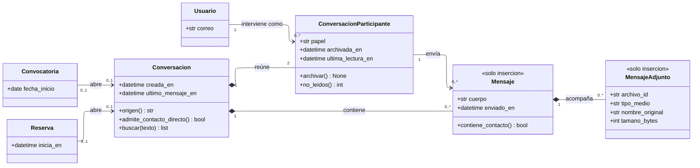

---
hide:
  - toc
icon: lucide/messages-square
---

# Mensajería

La conversación nunca existe por sí sola: nace de una convocatoria o de una
reserva. Lo que el diagrama de clases hace explícito es por qué el mensaje
apunta al participante y no al usuario.

## Qué agrega sobre el ER

**`archivar()` está en el participante y no en la conversación.** Es la razón
entera de que `ConversacionParticipante` sea una clase. Si la operación viviera
en `Conversacion`, que el turista archivara sacaría el hilo también de la bandeja
del prestador ([RF-S-21][rf-s-21],
[D-21](../../modelo-dominio/decisiones.md#d-21)). En ningún caso destruye el
historial.

**`Mensaje` apunta al participante y no al usuario.** Así el historial conserva
en qué papel intervino cada quien aunque después cambien sus perfiles. Un mensaje
enviado como turista sigue leyéndose como enviado por un turista, incluso si esa
cuenta pasa después a otra cosa.

**`admite_contacto_directo()` es la puerta de [RF-S-18][rf-s-18].** Mientras la
reserva no esté confirmada, el envío de teléfonos y correos se bloquea antes de
insertar la fila, y se le informa el motivo al remitente. La operación pertenece a
la conversación porque la respuesta depende del objeto que la originó, no del
mensaje que se está escribiendo.

**`contiene_contacto()` es del mensaje y se evalúa antes de existir.** Es la
comprobación que `admite_contacto_directo()` habilita o no. Las dos juntas son lo
que impide que la negociación se desplace fuera del sistema.

**La multiplicidad `2` no es adorno.** Una sala reúne exactamente a dos
participantes: el turista y el prestador elegido. No hay salas grupales, y por eso
`no_leidos()` puede resolverse contra una sola contraparte.

**`Mensaje` y `MensajeAdjunto` son de solo inserción.** No hay `editar()` ni
`borrar()` porque el historial permanece asociado al servicio, de modo que lo
acordado siga siendo consultable cuando surge una discrepancia posterior
([RF-S-17][rf-s-17]). Un mensaje corregible no sirve para resolver una disputa.

## Los dos orígenes y ninguno opcional

`Convocatoria` y `Reserva` apuntan a `Conversacion` con `0..1` en ambos extremos
y son excluyentes: la sala tiene un origen o el otro, nunca los dos ni ninguno.
`origen()` responde cuál, con la misma forma que
[`Reserva.origen()`](servicios.md).

Es lo que ata cada acuerdo al servicio que lo motivó. Una sala sin origen sería
un hilo suelto, y ahí es donde una discrepancia posterior deja de poder
resolverse.

[rf-s-17]: ../../requerimientos/funcionales/plataforma.md#rf-s-17
[rf-s-18]: ../../requerimientos/funcionales/plataforma.md#rf-s-18
[rf-s-21]: ../../requerimientos/funcionales/plataforma.md#rf-s-21
