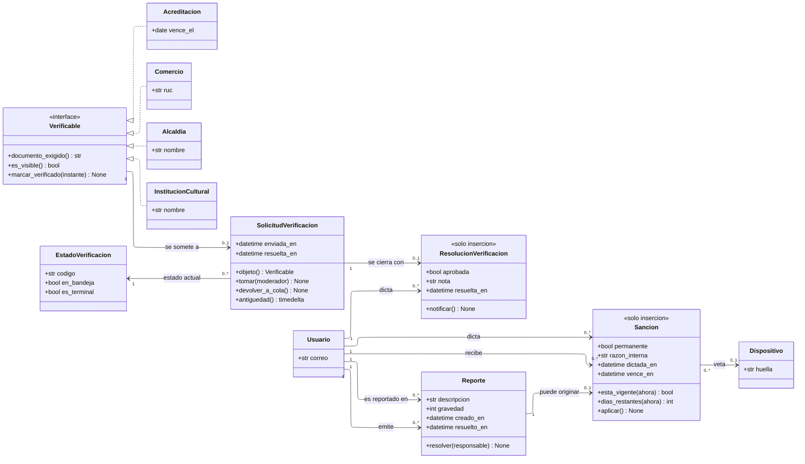

---
hide:
  - toc
icon: lucide/gavel
---

# Moderación y sanciones

Una sola cola de trabajo para cuatro objetos que no comparten ni una columna.
`Verificable` es la interfaz que lo hace posible sin obligar a la tabla común que
el modelo descarta.

## Qué agrega sobre el ER

**`Verificable` es interfaz y no superclase, y la diferencia importa.**
`Organizacion` sí es superclase de las tres organizaciones
([Organizaciones](organizaciones.md)), pero `Acreditacion` no es una
organización: es el documento de una persona. Lo único que las cuatro comparten
es que pasan por esta cola, y eso es exactamente lo que una interfaz expresa sin
inventar parentesco.

**`objeto()` reemplaza cuatro llaves excluyentes.** En el modelo físico,
`solicitud_verificacion` lleva `acreditacion_id`, `comercio_id`, `alcaldia_id` e
`institucion_cultural_id`, y a lo sumo una está presente. La operación devuelve
el verificable que sea, y el resto del módulo no vuelve a preguntar cuál.

**`antiguedad()` es el criterio de atención y por eso es operación.** La cola se
ordena por antigüedad de envío, de modo que ninguna solicitud quede
indefinidamente al final por falta de un criterio explícito
([RF-B-01][rf-b-01]).

**`ResolucionVerificacion` es de solo inserción y por eso no hay `reabrir()`.**
Rechazar es terminal para ese expediente: subsanar no lo reabre, el solicitante
carga un documento nuevo y eso genera otra solicitud. Así el historial conserva
cuántas veces se intentó y por qué se rechazó cada vez.

**`Sancion` es la causa y el estado de la cuenta es su consecuencia.**
`aplicar()` cambia el estado del usuario, revoca sus sesiones y, si es
permanente, cancela los servicios futuros que tuviera acordados
([RF-B-09][rf-b-09]). Sin la clase no habría historial de reincidencia y una
segunda suspensión borraría el rastro de la primera
([D-14](../../modelo-dominio/decisiones.md#d-14)).

**La asociación con `Dispositivo` es `0..1` y solo la usa la expulsión.** Cuando
la sanción es permanente, referencia el aparato desde el que operaba el
infractor, que es lo que sostiene el veto a crear cuentas nuevas desde el mismo
dispositivo ([RF-B-08][rf-b-08]). Una suspensión temporal deja esa asociación
vacía.

## Qué exige cada verificable

| Verificable           | Documento                                   | Consecuencia de aprobar mal                |
| --------------------- | ------------------------------------------- | ------------------------------------------ |
| `Acreditacion`        | Licencia del INTUR o certificado de idiomas | Un guía sin credencial atendiendo turistas |
| `Comercio`            | RUC y datos del formulario                  | Una ficha falsa en el mapa                 |
| `InstitucionCultural` | Documento de existencia legal               | Eventos inventados en la agenda            |
| `Alcaldia`            | Documento de representación                 | El sello oficial de una ciudad entera      |

`documento_exigido()` es lo que devuelve la segunda columna, y es abstracta
justamente porque la cuarta fila no se resuelve igual que las otras tres
([RF-A-11][rf-a-11]).

!!! warning "Un caso sin resolver"

    La resolución de una credencial vencida no cancela por sí sola las reservas
    comprometidas del prestador; la expulsión permanente sí, y abre los
    reembolsos que correspondan. Qué ocurre en el primer caso sigue sin definirse,
    y por eso `Sancion.aplicar()` no puede especificarse del todo todavía.

[rf-a-11]: ../../requerimientos/funcionales/portal-alcaldias.md#rf-a-11
[rf-b-01]: ../../requerimientos/funcionales/backoffice.md#rf-b-01
[rf-b-08]: ../../requerimientos/funcionales/backoffice.md#rf-b-08
[rf-b-09]: ../../requerimientos/funcionales/backoffice.md#rf-b-09
