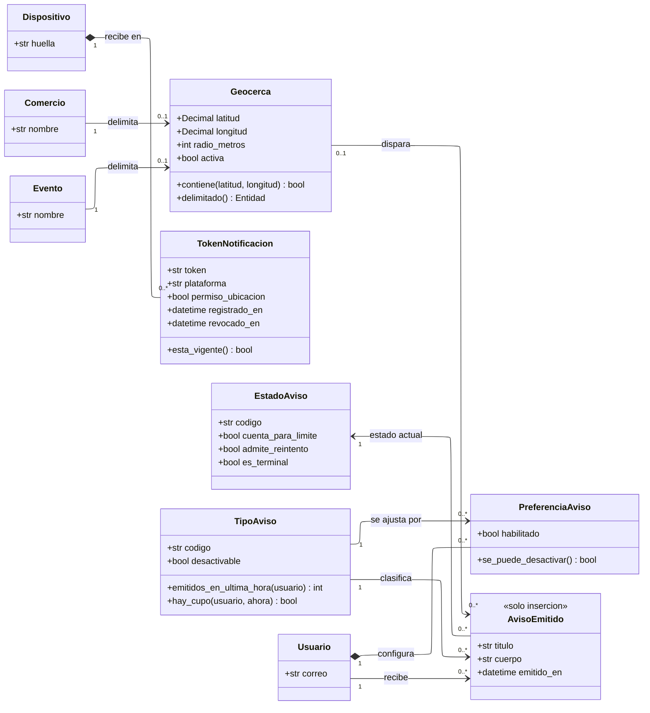

---
hide:
  - toc
icon: lucide/bell
---

# Notificaciones

El límite de tres avisos promocionales por hora es una ventana deslizante y no un
cupo que se reinicia. Como clase eso es una operación que cuenta filas de los
últimos sesenta minutos, no un contador que alguien pone a cero.

## Qué agrega sobre el ER

**`hay_cupo(usuario, ahora)` es la ventana deslizante escrita como pregunta.** Un
contador por hora dejaría pasar seis avisos entre las 10:59 y las 11:01. Cada
envío deja su fila con el instante, y el límite se evalúa contando las de los
últimos sesenta minutos ([D-28](../../modelo-dominio/decisiones.md#d-28),
[RF-S-16][rf-s-16]). La operación recibe el instante justamente porque la
respuesta se mueve con el reloj.

**`cuenta_para_limite` está en el estado y no en el aviso.** Un aviso que falló
al entregarse no debe gastar el cupo del usuario. Ponerlo en `EstadoAviso`
permite que el reintento no penalice, y agregar un estado nuevo es insertar una
fila y no repartir condicionales.

**`se_puede_desactivar()` lee el catálogo, no la preferencia.** Las categorías
transaccionales no pueden desactivarse, y esa condición vive en `TipoAviso` y no
repartida por el código. El límite promocional tampoco alcanza a lo derivado de
algo que el turista ya contrató o siguió, como la cancelación de un evento al que
se había vinculado.

**`Geocerca` es una clase aparte para que el radio no viva en el comercio.** El
radio de partida es de quinientos metros y vive en `Parametro`; separarlo permite
cambiarlo por defecto sin tocar comercios ni eventos. `delimitado()` devuelve
cuál de los dos la motiva, con la misma forma de referencia excluyente que usan
`Reserva.origen()` y `Insignia.otorgante()`.

**`TokenNotificacion.permiso_ubicacion` es lo que hace visible la degradación.**
Sin acceso a la ubicación en segundo plano la aplicación sigue siendo utilizable
para explorar, planificar y contratar, pero deja de emitir avisos y de acreditar
visitas; el sistema informa esa degradación en lugar de fallar en silencio
([RF-S-14][rf-s-14]).

## Por qué `AvisoEmitido` es de solo inserción

No hay `editar()` ni `borrar()` porque la fila es la evidencia sobre la que se
mide la presión de notificaciones. Borrar un aviso emitido liberaría cupo
retroactivamente, y el límite dejaría de significar algo.

Es el mismo régimen que `VisitaAcreditada` y por la misma razón: el hecho
registrado es lo que justifica la decisión posterior.

| Tipo de aviso   | `desactivable` | Cuenta para el límite |
| --------------- | :------------: | :-------------------: |
| Proximidad      |    **sí**      |         no            |
| Promocional     |    **sí**      |       **sí**          |
| Transaccional   |      no        |         no            |

[rf-s-14]: ../../requerimientos/funcionales/plataforma.md#rf-s-14
[rf-s-16]: ../../requerimientos/funcionales/plataforma.md#rf-s-16
