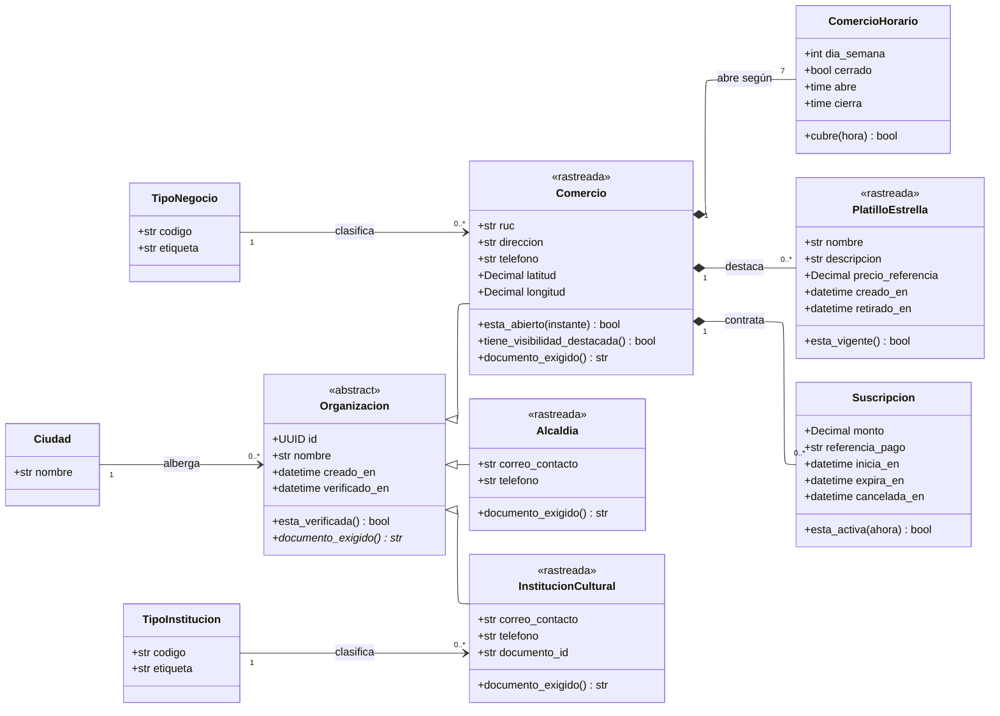

---
hide:
  - toc
icon: lucide/store
---

# Organizaciones y comercios

Alcaldía, comercio e institución cultural no comparten casi nada, y por eso son
tres tablas y no una con banderas. Lo que sí comparten es un momento: ninguna
existe para el turista antes de que un moderador la apruebe.

`Organizacion` recoge exactamente eso y nada más. Es abstracta, no tiene tabla, y
su única razón de ser es que las tres pasan por la misma cola.

## Qué agrega sobre el ER

**`Organizacion` es abstracta y deliberadamente pobre.** Tiene nombre, fecha de
alta, fecha de verificación y una operación abstracta que responde qué documento
se le exige. Si tuviera más, sería la tabla común que
[D-12](../../modelo-dominio/decisiones.md#d-12) descarta: la prueba es que
agregar un tipo nuevo obligaría a agregar columnas que solo aplican a ese tipo.
El RUC solo aplica al comercio y la potestad de publicar solo a la alcaldía.

**`documento_exigido()` es abstracta porque la severidad cambia.** Las tres
llegan a la misma cola con la misma mecánica de aprobación o rechazo motivado,
pero lo que se exige no es lo mismo: aprobar una alcaldía falsa entrega el sello
de contenido oficial de una ciudad entera
([RF-B-05][rf-b-05], [RF-A-11][rf-a-11]).

**`esta_abierto()` es la operación que justifica siete filas de horario.**
`ComercioHorario` es una fila por día y no una cadena en una columna: es lo que
permite resolver si el local está abierto en este instante sin interpretar texto
([RF-C-04][rf-c-04]). La multiplicidad `7` lo dice sin necesidad de prosa, y la
fila con `cerrado` es cómo se expresa un domingo sin abrir.

**`Suscripcion` cuelga por composición pero su ausencia es el estado normal.** El
registro básico es gratuito de forma permanente ([RF-C-02][rf-c-02]): un comercio
sin suscripción no está incompleto. Al vencer, `tiene_visibilidad_destacada()`
devuelve falso y el comercio vuelve a visibilidad estándar sin perder ficha,
campañas ni métricas ([RF-C-12][rf-c-12]).

**`PlatilloEstrella` admite varias filas y solo una vigente.** Se conservan los
anteriores, con un índice único parcial que garantiza uno solo por comercio, y
`esta_vigente()` es la operación que lo lee. Modelarlo como columna del comercio
habría perdido el histórico cada vez que cambia el menú, que es con frecuencia.

## La verificación vista desde aquí

`verificado_en` es un atributo de `Organizacion` y no de cada hija porque el
hecho es el mismo para las tres. Lo que decide **cuándo** se llena está en
[Moderación](moderacion.md): la resolución del expediente es la única vía.

Mientras sea nulo, `esta_verificada()` devuelve falso y la organización no existe
para el turista: el comercio no aparece en el mapa, la institución no puede
programar eventos y la alcaldía no puede publicar circuitos. La nulidad **es** la
información, tal como declaran las
[convenciones](../../modelo-dominio/convenciones.md#nulabilidad).

[rf-a-11]: ../../requerimientos/funcionales/portal-alcaldias.md#rf-a-11
[rf-b-05]: ../../requerimientos/funcionales/backoffice.md#rf-b-05
[rf-c-02]: ../../requerimientos/funcionales/portal-comercios.md#rf-c-02
[rf-c-04]: ../../requerimientos/funcionales/portal-comercios.md#rf-c-04
[rf-c-12]: ../../requerimientos/funcionales/portal-comercios.md#rf-c-12
