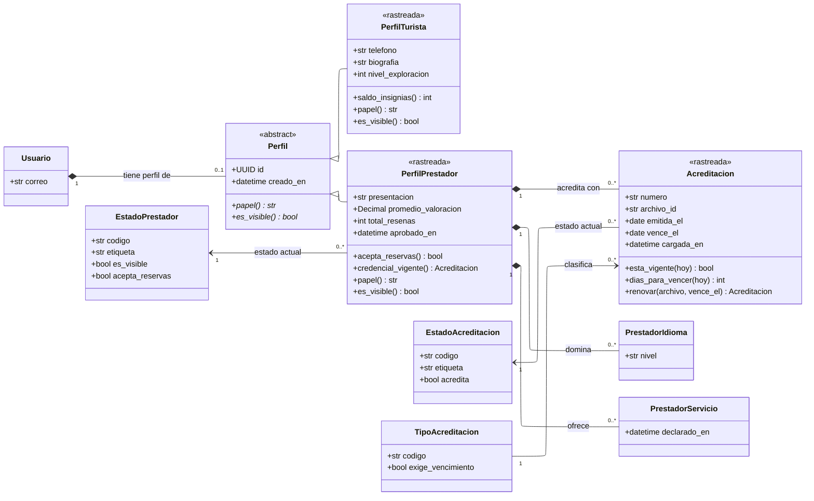

---
hide:
  - toc
icon: lucide/id-card
---

# Perfiles y acreditaciones

Los datos de cada papel no se solapan, así que cada papel es una clase propia.
Lo que el ER no puede decir y el diagrama de clases sí es que las dos comparten
una superclase que no tiene tabla: `Perfil` existe como concepto y se realiza
como dos tablas, una por hijo concreto.

## Qué agrega sobre el ER

**`Perfil` es abstracta y no tiene tabla.** La generalización se realiza como una
tabla por hijo concreto, que es exactamente lo que hay en el modelo físico:
`perfil_turista` y `perfil_prestador`, sin tabla común. Guardar los dos en
`usuario` dejaría la mitad de las columnas sin sentido para cada persona
([D-01](../../modelo-dominio/decisiones.md#d-01)), y una tabla `perfil` común no
tendría ni una columna que llenar.

**La multiplicidad `0..1` hacia `Perfil` es la regla de un solo papel.** No es
`0..1` por cada hijo: es `0..1` sobre la superclase entera. Un usuario tiene
perfil de turista, perfil de prestador o ninguno, nunca los dos
([RF-S-26][rf-s-26]). Es lo que descarta de raíz que alguien se postule a su
propia convocatoria, y un disparador lo impone en la base.

**`saldo_insignias()` es operación y `promedio_valoracion` es atributo.** La
diferencia es deliberada. El saldo se suma del libro de movimientos porque una
columna dejaría que dos canjes simultáneos leyeran el mismo valor
([D-24](../../modelo-dominio/decisiones.md#d-24)). El promedio, en cambio, está
materializado a propósito: se consulta en cada listado y en cada tablero, y
recalcularlo por agregación sería el cálculo más caro del sistema
([D-23](../../modelo-dominio/decisiones.md#d-23)).

**`credencial_vigente()` es lo que decide si el prestador existe.** El perfil
sigue activo mientras alguna acreditación esté vigente y aprobada, y pasa a
suspensión automática cuando la última vence sin reemplazo aprobado
([RF-P-05][rf-p-05]). La operación devuelve la acreditación concreta, no un
booleano, porque el portal tiene que mostrar cuál y hasta cuándo.

**`renovar()` devuelve una acreditación nueva, no modifica la anterior.** Cargar
el documento nuevo no interrumpe la actividad: entra en revisión mientras la
credencial anterior conserva vigencia ([RF-P-04][rf-p-04]). Si la operación
mutara la fila existente, aprobar la renovación y rechazarla dejarían el mismo
rastro.

## Las dos relaciones de varios a varios

`PrestadorIdioma` y `PrestadorServicio` se dibujan como clases y no como
asociaciones directas porque la primera lleva `nivel` y la segunda deja fecha.
Una tabla intermedia sin datos propios sí se colapsaría en una relación de varios
a varios sin clase, tal como declara el
[índice](index.md#como-se-traduce-el-er-a-clases).

`PrestadorServicio` es además la que decide quién puede publicar catálogo: un
disparador comprueba que quien inserta un `Recorrido` ofrezca el tipo de servicio
de guía ([RF-P-19][rf-p-19]).

[rf-p-04]: ../../requerimientos/funcionales/app-prestadores.md#rf-p-04
[rf-p-05]: ../../requerimientos/funcionales/app-prestadores.md#rf-p-05
[rf-p-19]: ../../requerimientos/funcionales/app-prestadores.md#rf-p-19
[rf-s-26]: ../../requerimientos/funcionales/plataforma.md#rf-s-26
