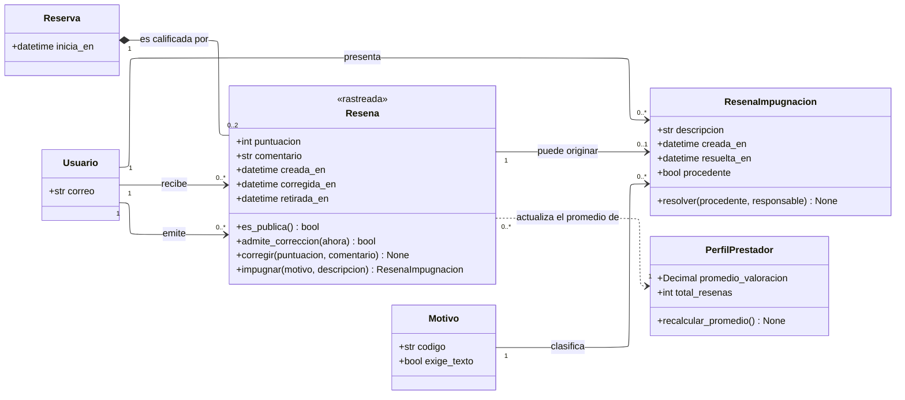

---
hide:
  - toc
icon: lucide/star
---

# Reputación

Una sola clase de reseña con emisor y receptor explícitos. La visibilidad no es
un atributo configurable: es una operación que consulta el papel de quien la
recibió.

## Qué agrega sobre el ER

**`es_publica()` es operación y no columna, y esa es la decisión completa.** La
reseña sobre un prestador es pública porque sostiene la decisión de contratación;
la del turista circula solo entre prestadores porque sirve de advertencia y no de
castigo público ([RF-S-23][rf-s-23]). Si fuera un atributo, alguien podría
escribirlo, y la asimetría dejaría de ser una garantía para pasar a ser una
preferencia.

**`0..2` es el índice único dibujado.** Una reserva admite a lo sumo dos reseñas,
una por sentido, garantizado con un índice único sobre reserva y emisor. En el ER
esa restricción no se veía; aquí es la multiplicidad.

**`admite_correccion(ahora)` recibe el instante porque la ventana se cierra
sola.** El autor modifica puntuación y texto durante las veinticuatro horas
siguientes a la publicación; pasado el plazo la reseña queda inmutable para él y
solo puede retirarse mediante moderación ([RF-S-24][rf-s-24]). El umbral vive en
`Parametro` y no en la clase.

**`recalcular_promedio()` está en `PerfilPrestador` y la flecha es una
dependencia.** Cada corrección recalcula el promedio del evaluado, y el recálculo
ocurre desde la propia base cada vez que una reseña se inserta o se corrige, no
desde la aplicación, para que ninguna vía de escritura pueda dejarlo obsoleto
([D-23](../../modelo-dominio/decisiones.md#d-23)). Por eso la relación se dibuja
punteada: no es estructura, es efecto.

**`impugnar()` devuelve un caso y no oculta nada.** La marca no retira la reseña:
abre una disputa que el equipo de moderación resuelve, y el autor no es
notificado mientras no exista resolución ([RF-S-25][rf-s-25]). `retirada_en` solo
se llena por esa vía, nunca por decisión de quien la recibió.

## Por qué una sola clase y no dos

Dos clases —una pública y otra privada— habrían duplicado la ventana de
corrección, la impugnación y el recálculo del promedio, con el riesgo de que las
dos copias divergieran
([D-22](../../modelo-dominio/decisiones.md#d-22)).

El precio de la decisión es que `Usuario` aparece tres veces en el diagrama:
emite, recibe y presenta impugnaciones. Es el costo de tener la dirección
explícita, y es más barato que mantener dos ciclos de vida sincronizados.

| Quién recibe | `es_publica()` | Quién la ve                               |
| ------------ | :------------: | ----------------------------------------- |
| Prestador    |     **sí**     | Cualquiera que explore su perfil          |
| Turista      |       no       | Solo prestadores a los que él les escribe |

!!! warning "Un umbral sin definir"

    [RF-S-22][rf-s-22] deja abierta la condición bajo la cual el comentario pasa
    a ser obligatorio. La puntuación sí lo es siempre: el servicio no se da por
    cerrado en el flujo operativo mientras falte.

[rf-s-22]: ../../requerimientos/funcionales/plataforma.md#rf-s-22
[rf-s-23]: ../../requerimientos/funcionales/plataforma.md#rf-s-23
[rf-s-24]: ../../requerimientos/funcionales/plataforma.md#rf-s-24
[rf-s-25]: ../../requerimientos/funcionales/plataforma.md#rf-s-25
