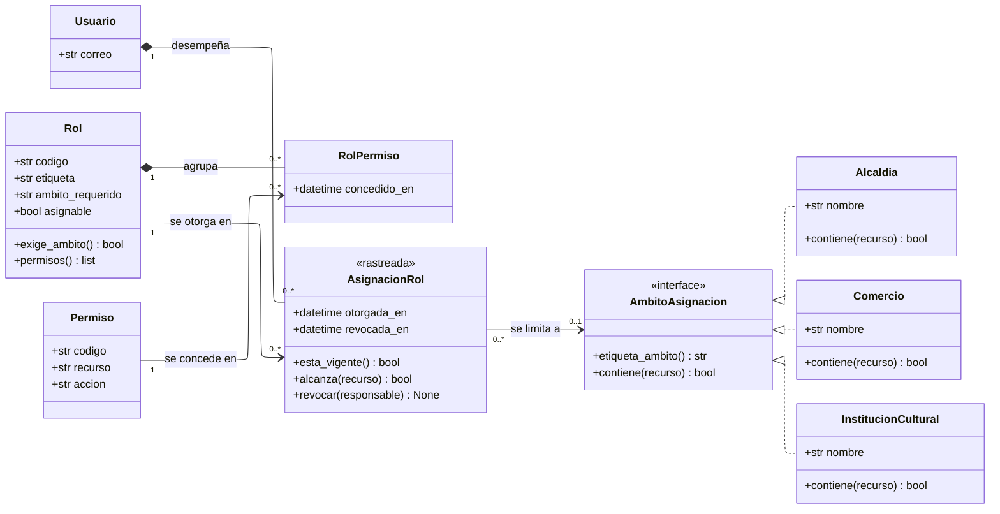

---
hide:
  - toc
icon: lucide/shield-check
---

# Roles y permisos

Saber que alguien tiene el rol de operador de circuitos no basta: hay que saber
de qué ciudad. El diagrama de clases resuelve como interfaz lo que el modelo
físico resuelve con tres llaves foráneas excluyentes.

## Qué agrega sobre el ER

**Una asociación en lugar de tres llaves excluyentes.** En el modelo físico,
`asignacion_rol` lleva `alcaldia_id`, `comercio_id` e `institucion_id`, y una
restricción garantiza que a lo sumo una esté presente. Como clases eso es una
sola asociación con multiplicidad `0..1` hacia `AmbitoAsignacion`, y las tres
organizaciones la implementan. La restricción no desaparece: sigue siendo lo que
la base impone, y la interfaz es cómo se lee.

**`0..1` y no `1` porque el ámbito global existe.** Turista, prestador, moderador
y supervisor no se limitan a ninguna organización, y esa ausencia de ámbito **es**
el alcance global. No hay una fila «global» en ningún catálogo: hay una
asociación vacía.

**`RolPermiso` es clase de asociación y no una tabla intermedia muda.** Guarda
`concedido_en`, así que tiene un dato propio y no se puede colapsar en una
relación de varios a varios. `AsignacionRol` es el mismo caso llevado más lejos:
tiene fecha de otorgamiento, de revocación y responsable.

**No hay ninguna asociación entre `Usuario` y `Permiso`.** Es la decisión
completa: un permiso concedido de forma individual es invisible al revisar el rol
y sobrevive a su revocación, así que retirar un acceso dejaría de ser una sola
operación auditable ([D-03](../../modelo-dominio/decisiones.md#d-03)). Si algún
día aparece esa flecha, la garantía se perdió.

**`alcanza()` es donde vive [RF-A-03][rf-a-03].** Preguntar si una asignación
alcanza un recurso delega en el ámbito, y el ámbito responde por sí mismo. La
alternativa —filtrar por ciudad en cada consulta— depende de que ninguna se
olvide, y basta una omisión para que Granada reescriba el circuito de León
([D-02](../../modelo-dominio/decisiones.md#d-02)).

## Los siete roles y su ámbito

| Rol                   | `ambito_requerido`    | Qué habilita                                      |
| --------------------- | --------------------- | ------------------------------------------------- |
| `Turista`             | ninguno               | Explorar, planificar, contratar y canjear         |
| `Prestador`           | ninguno               | Publicar recorridos, postularse y cobrar          |
| `OperadorAlcaldia`    | `Alcaldia`            | Publicar y editar los circuitos de su ciudad      |
| `OperadorComercio`    | `Comercio`            | Editar la ficha, emitir campañas, validar cupones |
| `OperadorInstitucion` | `InstitucionCultural` | Programar y cancelar eventos                      |
| `Moderador`           | ninguno               | Resolver la cola de verificación                  |
| `Supervisor`          | ninguno               | Sancionar usuarios y resolver reportes            |

`ambito_requerido` no es decorativo: `exige_ambito()` lo lee y rechaza una
asignación de `OperadorComercio` sin comercio. Es la comprobación que impide
crear un operador que pueda editar cualquier ficha.

[rf-a-03]: ../../requerimientos/funcionales/portal-alcaldias.md#rf-a-03
