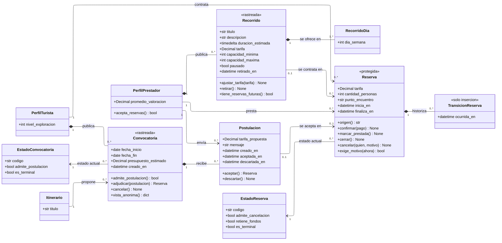

---
hide:
  - toc
icon: lucide/handshake
---

# Servicios y reservas

La reserva nace por dos caminos y es una sola clase, porque todo lo posterior
—chat, cierre, evaluación mutua, pago y comisión— es idéntico. El diagrama de
clases muestra los dos orígenes como dos asociaciones excluyentes y el resto del
ciclo como operaciones que no distinguen de dónde vino.

## Qué agrega sobre el ER

**`origen()` es la operación que reemplaza a dos llaves excluyentes.** Una
reserva viene de una postulación aceptada o de un recorrido del catálogo, nunca
de ambos ([D-19](../../modelo-dominio/decisiones.md#d-19)). En el modelo físico
eso son dos columnas y una restricción; aquí es una operación que responde por
cuál de los dos caminos llegó, y el resto del ciclo no vuelve a preguntarlo.

**`tarifa` está en `Reserva` y no se lee de `Recorrido`.** Es el atributo
duplicado más importante del modelo. Se congela al crear la reserva porque un
ajuste posterior del prestador no puede cambiar retroactivamente lo que el
turista aceptó pagar ([D-20](../../modelo-dominio/decisiones.md#d-20),
[RF-P-10][rf-p-10]). El estereotipo `<<protegida>>` dice el resto: un disparador
impide reescribirla.

**`ajustar_tarifa()` en `Recorrido` no toca ninguna reserva.** La operación
existe y es libre; lo que no existe es propagación. Es la contraparte de la línea
anterior y por eso las dos clases llevan tarifa sin que sea redundancia.

**`retirar()` puede fallar, y `tiene_reservas_futuras()` es por qué.** El retiro
se bloquea mientras existan reservas pagadas para fechas futuras: primero hay que
cancelarlas, y esa cancelación es una decisión explícita del prestador y no un
efecto colateral del retiro ([RF-P-11][rf-p-11]).

**`vista_anonima()` es una operación y no una vista de base de datos.** La
convocatoria circula sin la identidad del turista, y los datos personales
aparecen al abrirse la sala con el prestador elegido
([RF-T-16][rf-t-16]). Modelarlo como operación deja explícito que el tablero
nunca recibe el objeto completo.

**`exige_motivo(ahora)` es la regla de las veinticuatro horas.** Cancelar es
libre para ambas partes hasta veinticuatro horas antes; después el motivo es
obligatorio y cuenta en la reputación de quien cancela. La operación recibe el
instante porque la respuesta cambia con el reloj, no con el estado.

## Quién puede publicar catálogo

| Camino al trabajo                            | Guía | Traductor |
| -------------------------------------------- | :--: | :-------: |
| Publicar recorrido y recibir reserva directa |  ●   |           |
| Postularse a una solicitud del turista       |  ●   |     ●     |

La composición `PerfilPrestador *-- Recorrido` no distingue el tipo de servicio,
así que la restricción no vive en el diagrama: un disparador comprueba que quien
inserta un `Recorrido` ofrezca el tipo de servicio de guía
([RF-P-19][rf-p-19]). Sin esa comprobación la regla viviría solo en la interfaz,
y una carga masiva la saltaría sin que nadie lo note.

`1..*` en `RecorridoDia` sí se puede dibujar: un recorrido sin ningún día
disponible no se puede reservar, así que no tiene sentido publicarlo.

## Una convocatoria adjudicada produce una reserva

`adjudicar()` devuelve una `Reserva` y, en la misma transacción, pasa la
postulación aceptada a `aceptada` y el resto a `descartada`. Contratar guía y
traductor a la vez son dos convocatorias, nunca una adjudicación doble
([RF-T-30][rf-t-30]).

Por eso `Postulacion --> Reserva` es `0..1` en los dos extremos, y no `0..*` en
ninguno.

[rf-p-10]: ../../requerimientos/funcionales/app-prestadores.md#rf-p-10
[rf-p-11]: ../../requerimientos/funcionales/app-prestadores.md#rf-p-11
[rf-p-19]: ../../requerimientos/funcionales/app-prestadores.md#rf-p-19
[rf-t-16]: ../../requerimientos/funcionales/app-turista.md#rf-t-16
[rf-t-30]: ../../requerimientos/funcionales/app-turista.md#rf-t-30
