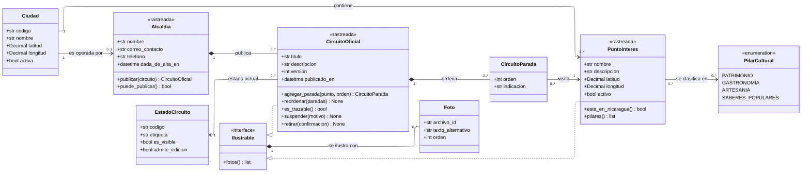

---
hide:
  - toc
icon: lucide/map
---

# Territorio y circuitos

La ciudad es territorio y la alcaldía es autoridad. Como clases, la distinción se
ve en los rombos: la parada muere con su circuito, pero el punto de interés
sobrevive a los circuitos que lo usaron.

## Qué agrega sobre el ER

**`2..*` es la regla de validez dibujada.** Un circuito debe conservar al menos
dos paradas geolocalizadas para poder trazarse, y una edición que dejaría menos
se rechaza antes de guardarse ([RF-A-05][rf-a-05]). En el ER esa condición era
prosa; aquí es la multiplicidad, y `es_trazable()` es quien la comprueba.

**Un rombo lleno y una flecha simple sobre la misma parada.** `CircuitoOficial`
compone sus paradas —borrar el circuito las borra— pero `CircuitoParada` solo
asocia al punto. Retirar un punto de un circuito no lo elimina del territorio ni
cancela las insignias que ya otorgó
([D-18](../../modelo-dominio/decisiones.md#d-18),
[RF-A-07][rf-a-07]). Son las dos mitades de la misma regla y en el ER se veían
iguales.

**`version` es un atributo con propósito, no un contador.** Se incrementa con
cada edición de la geometría para que la aplicación detecte que debe redibujar
sin exigir reinstalar ni vaciar datos locales
([RF-A-06][rf-a-06], [D-15](../../modelo-dominio/decisiones.md#d-15)). No hay
clase de versiones: el historial completo lo conserva la auditoría.

**`suspender()` y `retirar()` son operaciones distintas y no dos valores.**
Suspender saca el circuito de la exploración de forma inmediata y es reversible;
retirar es permanente y exige que el operador teclee el nombre exacto, por eso la
operación recibe `confirmacion` ([RF-A-08][rf-a-08], [RF-A-09][rf-a-09]).

**`Ilustrable` reemplaza cuatro llaves excluyentes.** En el modelo físico, `foto`
lleva `punto_interes_id`, `circuito_id`, `comercio_id` y `evento_id`, y a lo sumo
una está presente. Como interfaz, la composición se declara una vez y cada clase
que ilustra la implementa. Es el mismo patrón que el ámbito de un rol.

## Por qué `Ciudad` no compone nada

`Ciudad --> PuntoInteres` es asociación y no composición aunque la llave sea
`RESTRICT`. La ciudad es catálogo referenciado por operación: no se borra
mientras exista un punto que la use, así que la pregunta «¿qué pasa con los
puntos si borro la ciudad?» no llega a plantearse.

La relación con `Alcaldia` es `0..1` porque el catálogo de las diez Ciudades
Creativas está completo desde el primer día, pero su incorporación a la
plataforma es progresiva. Una ciudad sin alcaldía es una ciudad que todavía no
firmó, no un error.

[rf-a-05]: ../../requerimientos/funcionales/portal-alcaldias.md#rf-a-05
[rf-a-06]: ../../requerimientos/funcionales/portal-alcaldias.md#rf-a-06
[rf-a-07]: ../../requerimientos/funcionales/portal-alcaldias.md#rf-a-07
[rf-a-08]: ../../requerimientos/funcionales/portal-alcaldias.md#rf-a-08
[rf-a-09]: ../../requerimientos/funcionales/portal-alcaldias.md#rf-a-09
