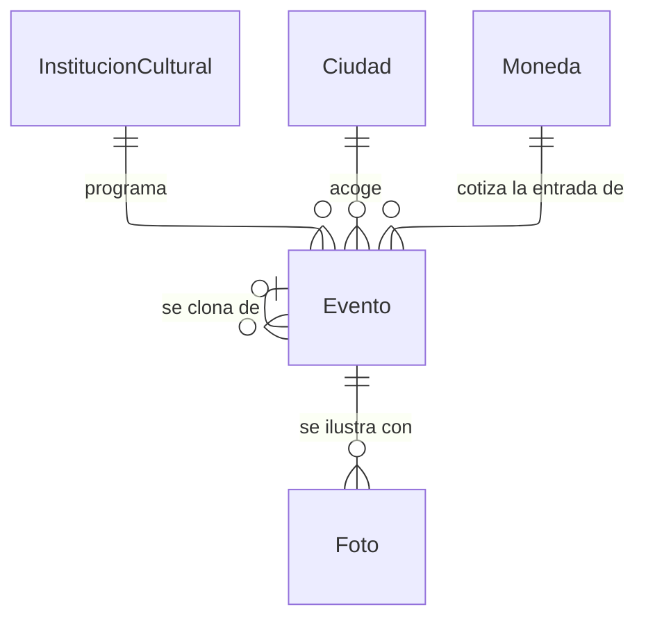

---
hide:
  - toc
icon: lucide/drama
---

# Agenda cultural

El evento cuelga de la institución que lo programa y de la ciudad donde ocurre,
que no siempre coinciden: un teatro puede llevar una función a otra Ciudad
Creativa. Su vigencia la gobierna su propio rango de fechas, así que nadie tiene
que despublicarlo: desaparece del mapa cuando su fecha de fin queda atrás.

La relación del evento consigo mismo sostiene la programación recurrente. Clonar
copia descripción, recinto y precio dejando las fechas vacías, y el clon es un
registro independiente desde que se guarda: cancelar el original no cancela la
función del domingo siguiente.

Un evento cancelado no se borra ni se oculta: cambia de estado y deja de generar
avisos por cercanía, para que quien ya lo tenía visto entienda qué pasó en lugar
de encontrarse con que desapareció.
