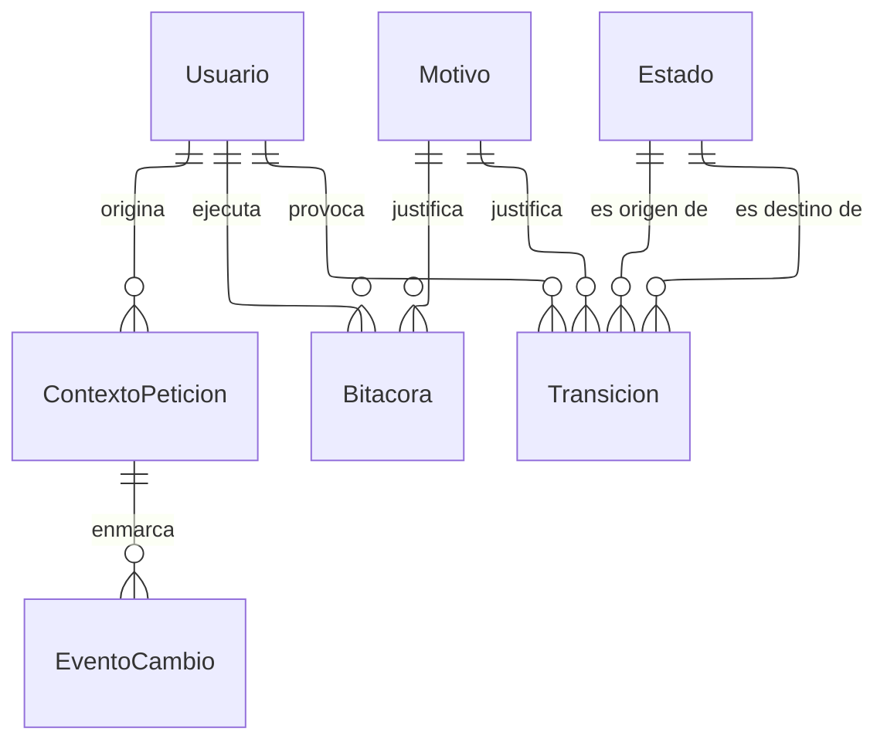

---
hide:
  - toc
icon: lucide/scroll-text
---

# Auditoría

Cada tabla rastreada tiene su propia tabla de eventos paralela, que conserva la
versión anterior completa de la fila junto a `ContextoPeticion`: quién la
provocó, desde qué dirección y sobre qué recurso. Sin el contexto, el historial
responde qué cambió pero no quién ni por qué, que es justamente lo que hay que
responder cuando alguien disputa una sanción o una reseña.

`Transicion` y `Estado` no son dos tablas sino dos patrones: se instancian una
vez por cada entidad con ciclo de vida. El estado actual vive como referencia en
la propia entidad, porque las consultas frecuentes no pueden pagar una agregación
sobre el historial.

Cada tabla del modelo declara a cuál de los tres regímenes pertenece.

| Régimen           | Qué permite                                   | Tablas                                                                                        |
| ----------------- | --------------------------------------------- | --------------------------------------------------------------------------------------------- |
| De solo inserción | Insertar. No actualizar ni eliminar           | Movimientos, visitas acreditadas, transiciones, intentos de acceso, avisos emitidos, bitácora |
| Mutable rastreada | Todo, con historial completo de versiones     | Usuario, perfiles, comercios, circuitos, eventos, recorridos                                  |
| Mutable protegida | Todo salvo columnas congeladas por disparador | Reserva y cupón, cuya tarifa y beneficio no se reescriben                                     |

Ninguna tabla admite vaciado masivo: un disparador lo impide en la tabla base de
la que heredan todas.
