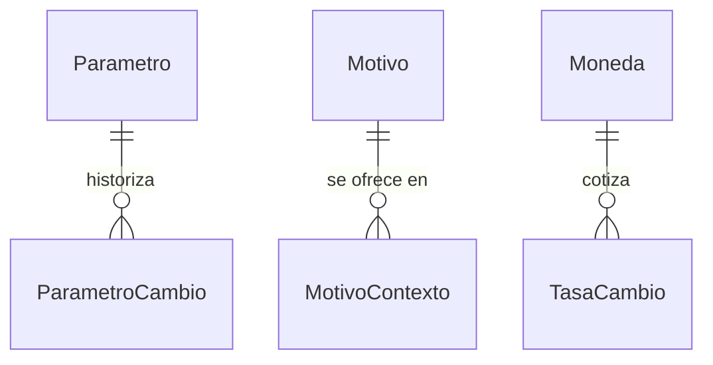

---
hide:
  - toc
icon: lucide/list-tree
---

# Catálogos y parámetros

Los valores que el sistema conoce de antemano. Están en tablas y no en el código
para que agregar un tipo de negocio o subir el radio de un aviso no exija
desplegar nada.

## Listas cerradas

Se referencian desde otros módulos y no tienen estructura propia: son listas.

| Catálogo            | Qué enumera                                 | Valores del piloto                                                                                     |
| ------------------- | ------------------------------------------- | ------------------------------------------------------------------------------------------------------ |
| `ciudad`            | Las Ciudades Creativas de la Red Nacional   | Estelí, León, Nagarote, Managua, Masaya, Granada, San Juan de Oriente, Juigalpa, Matagalpa, Bluefields |
| `pais`              | Nacionalidad que declara el turista         | Catálogo internacional completo                                                                        |
| `idioma`            | Idiomas de la interfaz y de los prestadores | Español; el resto sin definir                                                                          |
| `moneda`            | Monedas de tarifas y cobros                 | Córdoba, dólar                                                                                         |
| `tipo_negocio`      | Giro del comercio                           | Restaurante, cafetería, panadería, artesanía, otro                                                     |
| `tipo_servicio`     | Qué ofrece un prestador                     | Guía turístico, traducción                                                                             |
| `tipo_acreditacion` | Credencial que acredita a un prestador      | Licencia del INTUR, certificado de idiomas                                                             |
| `tipo_beneficio`    | Forma del descuento de un cupón             | Porcentaje, monto fijo, producto                                                                       |
| `tipo_aviso`        | Para qué sirve una notificación             | Proximidad, promocional, transaccional                                                                 |
| `pilar_cultural`    | Los pilares del turismo creativo            | Patrimonio, gastronomía, artesanía, saberes populares                                                  |

`ciudad` vive aquí aunque lleve coordenadas: en el piloto son diez y no se crean
desde la aplicación.

## Parámetros operativos

Umbrales que gobiernan el comportamiento del sistema. Cada uno tiene un valor de
partida y el requerimiento que lo fija.

| Parámetro                               | Valor       | Origen             |
| --------------------------------------- | ----------- | ------------------ |
| Radio de la geocerca                    | 500 m       | [RF-S-16][rf-s-16] |
| Avisos promocionales por hora           | 3           | [RF-S-16][rf-s-16] |
| Distancia para acreditar una visita     | 50 m        | [RF-S-15][rf-s-15] |
| Espera entre visitas al mismo local     | 24 h        | [RF-S-15][rf-s-15] |
| Intentos fallidos antes de bloquear     | 5           | [RF-S-06][rf-s-06] |
| Duración del bloqueo                    | 15 min      | [RF-S-06][rf-s-06] |
| Vigencia de la credencial de acceso     | 3 h         | [RF-S-07][rf-s-07] |
| Vigencia de la credencial de renovación | 1 día       | [RF-S-07][rf-s-07] |
| Ventana para corregir una reseña        | 24 h        | [RF-S-24][rf-s-24] |
| Cuarentena al cambiar cuenta bancaria   | 24 h        | [RF-P-07][rf-p-07] |
| Retiro mínimo acumulado                 | 20 USD      | [RF-P-18][rf-p-18] |
| Días entre la baja y el borrado         | 30          | [RF-S-11][rf-s-11] |
| Capacidad máxima de un recorrido        | 50 personas | [RF-P-08][rf-p-08] |
| Comisión de la plataforma               | sin definir | n/a                |

## Lo que no es una lista

Tres cosas de este módulo sí tienen estructura, y son las únicas que aparecen en
el diagrama.

**`ParametroCambio`** existe porque subir el radio de la geocerca de 500 a 800
metros cambia el resultado de cálculos ya hechos. Sin el historial no se puede
responder con qué radio se disparó el aviso de la semana pasada.

**`MotivoContexto`** evita tres catálogos de motivos casi iguales. Hay un solo
`Motivo`, y esta tabla decide cuáles se ofrecen al rechazar una credencial,
cuáles al reportar a un usuario y cuáles al cancelar una reserva.

**`TasaCambio`** existe porque las tarifas se expresan en córdobas y en dólares.
De dónde sale la tasa y en qué momento se congela para una transacción sigue sin
definirse.

[rf-p-07]: ../../../requerimientos/funcionales/app-prestadores.md#rf-p-07
[rf-p-08]: ../../../requerimientos/funcionales/app-prestadores.md#rf-p-08
[rf-p-18]: ../../../requerimientos/funcionales/app-prestadores.md#rf-p-18
[rf-s-06]: ../../../requerimientos/funcionales/plataforma.md#rf-s-06
[rf-s-07]: ../../../requerimientos/funcionales/plataforma.md#rf-s-07
[rf-s-11]: ../../../requerimientos/funcionales/plataforma.md#rf-s-11
[rf-s-15]: ../../../requerimientos/funcionales/plataforma.md#rf-s-15
[rf-s-16]: ../../../requerimientos/funcionales/plataforma.md#rf-s-16
[rf-s-24]: ../../../requerimientos/funcionales/plataforma.md#rf-s-24
