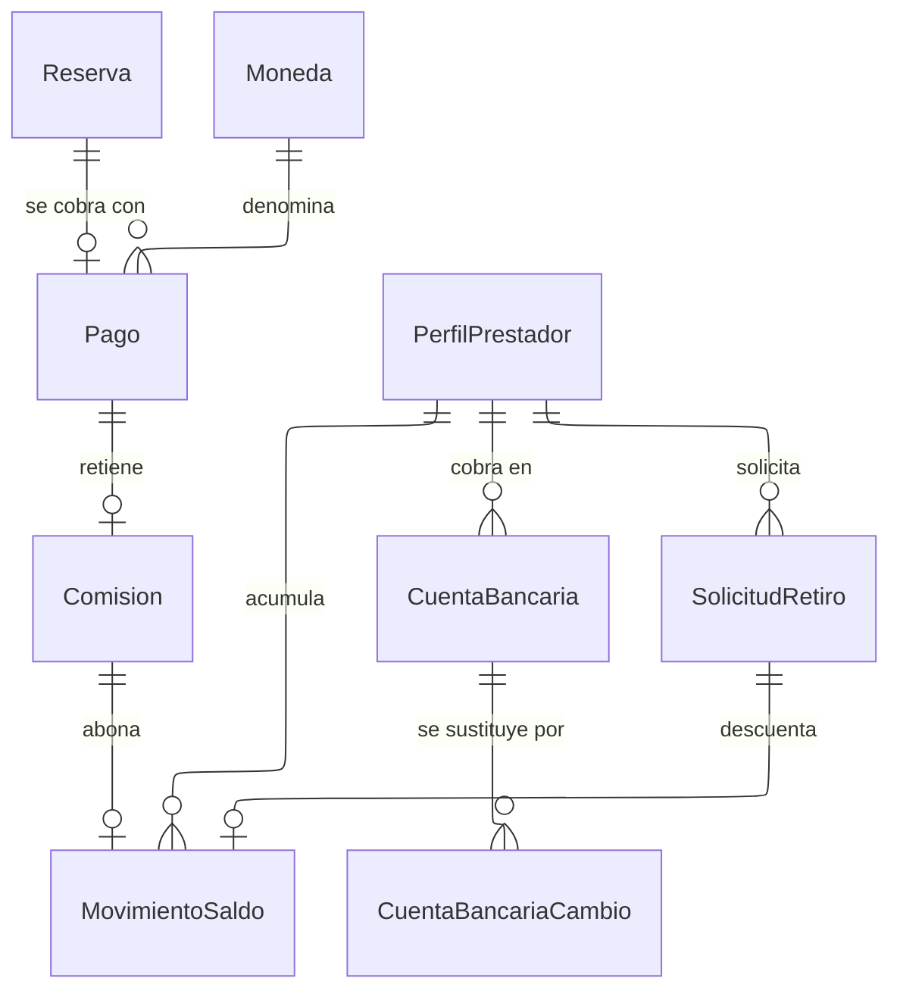

---
hide:
  - toc
icon: lucide/wallet
---

# Finanzas

El saldo del prestador sigue el mismo principio que las insignias: es la suma de
`MovimientoSaldo`, no una columna. Cada movimiento nace de un hecho concreto —una
comisión liquidada o un retiro solicitado— y guarda su referencia, de modo que
todo saldo es explicable movimiento por movimiento.

`CuentaBancaria` no se actualiza en el sitio. `CuentaBancariaCambio` guarda la
cuenta nueva con su fecha de solicitud y de efectividad, y la anterior sigue
siendo la activa durante veinticuatro horas. Si fuera una actualización, un
acceso no autorizado podría desviar un retiro en la misma sesión en que cambia la
cuenta, y no habría a qué revertir.

`Comision` es una entidad y no un porcentaje aplicado al vuelo, porque el
prestador tiene que poder verificar la resta y no solo el resultado: la fila
guarda el porcentaje vigente al liquidar, el monto retenido y el bruto del que
salió. Cambiar el porcentaje después no altera nada ya liquidado.

El momento en que se captura el pago sigue sin definirse, y de esa definición
depende el ciclo de vida completo de `Pago` y de `Reserva`.
