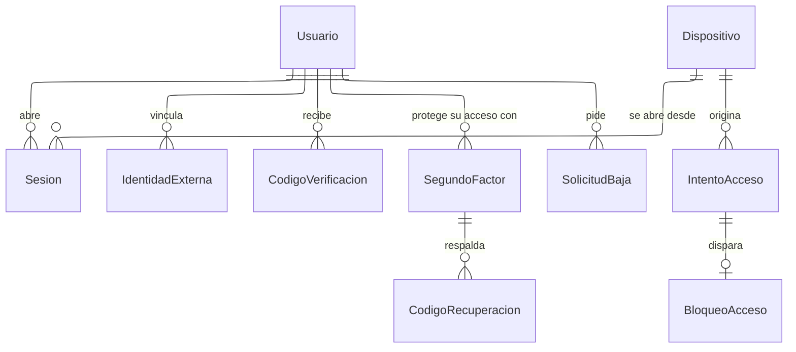

---
hide:
  - toc
icon: lucide/key-round
---

# Identidad y acceso

`Usuario` es una sola entidad para turistas, prestadores, operadores de portal y
personal interno. Lo que los distingue no es la cuenta sino el perfil que tienen
y el rol que se les asignó, de modo que una misma persona puede reservar como
turista y operar el mostrador de un comercio sin duplicar identidad.

`IntentoAcceso` no referencia a `Usuario`: guarda el identificador tal como se
tecleó. Si lo referenciara, un correo inexistente no tendría dónde registrarse y
el bloqueo por cinco intentos solo funcionaría para cuentas reales, revelando
cuáles lo son. `Sesion` es su propio registro de revocación, que es lo que
permite expulsar a un sancionado del dispositivo donde ya estaba dentro.

`SegundoFactor` es una entidad y no una bandera porque una cuenta puede rotar su
factor sin perder el anterior, y porque los códigos de recuperación necesitan
dónde colgar. `SolicitudBaja` sostiene los treinta días entre la petición y la
destrucción de los datos.
