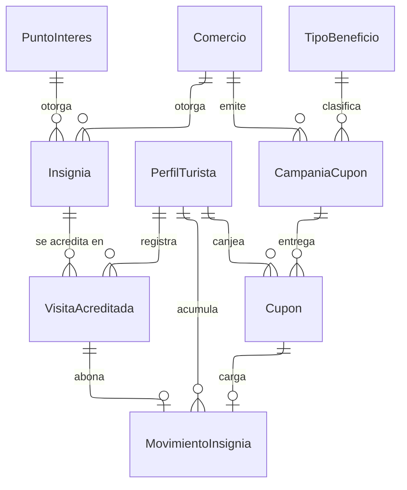

---
hide:
  - toc
icon: lucide/award
---

# Insignias y cupones

El saldo de insignias no es una columna: es la suma de `MovimientoInsignia`, una
tabla de solo inserción con signo, motivo y origen. Con una columna, dos canjes
simultáneos del mismo turista podrían leer el mismo saldo, ambos superar la
comprobación de suficiencia y dejarlo en negativo. Con el libro, el segundo ve el
movimiento del primero.

`Cupon` copia el beneficio, el comercio y la fecha límite en el momento del
canje. Si los leyera de la campaña, retirarla anticipadamente cambiaría el valor
de lo ya entregado; con la copia, el retiro corta la emisión y nunca lo ya
emitido.

`VisitaAcreditada` es un hecho inmutable: no se corrige ni se borra, porque es lo
que justifica el movimiento que la acompaña. La regla de una visita por
establecimiento cada veinticuatro horas se resuelve contra esa misma tabla.

El código del cupón se guarda legible y no cifrado, porque el turista debe verlo
en su billetera y dictarlo en el mostrador. El riesgo se acota por otra vía: un
solo uso, vigencia acotada y pertenencia a un único comercio.
