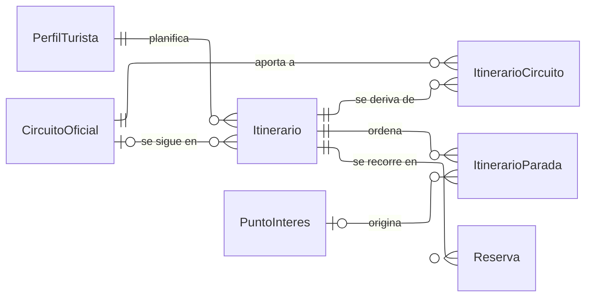

---
hide:
  - toc
icon: lucide/route
---

# Itinerarios

Hay dos relaciones distintas entre un itinerario y un circuito, y confundirlas
rompe el modelo. **Seguir** es una referencia viva: el itinerario no copia nada y
lee las paradas de la versión vigente del circuito, de modo que una corrección
municipal le llega. **Derivar** es trazabilidad de origen: registra de qué
circuitos salió un itinerario que el turista ya ajustó, y admite varios porque se
pueden combinar ciudades.

`ItinerarioParada` solo aparece cuando el turista se aparta del circuito. Desde
ese momento guarda su propio nombre y su propia coordenada, con una referencia
opcional al punto del que salió. Si esa referencia fuera la única fuente, retirar
un punto oficial dejaría un hueco en el itinerario que alguien lleva abierto a
mitad de recorrido.

De aquí salen las tres cifras que la alcaldía mide por separado: **iniciaron** son
los itinerarios que siguen el circuito, **modificaron** los que ya tienen paradas
propias, y **completaron** los que registraron visita en todas ellas.

| Modo                | `sigue circuito` | `ItinerarioCircuito` | `ItinerarioParada` |
| ------------------- | ---------------- | -------------------- | ------------------ |
| Seguir tal cual     | sí               | una fila             | ninguna            |
| Ajustar un circuito | no               | una fila             | sí                 |
| Combinar ciudades   | no               | varias filas         | sí                 |
| Armar desde cero    | no               | ninguna              | sí                 |
