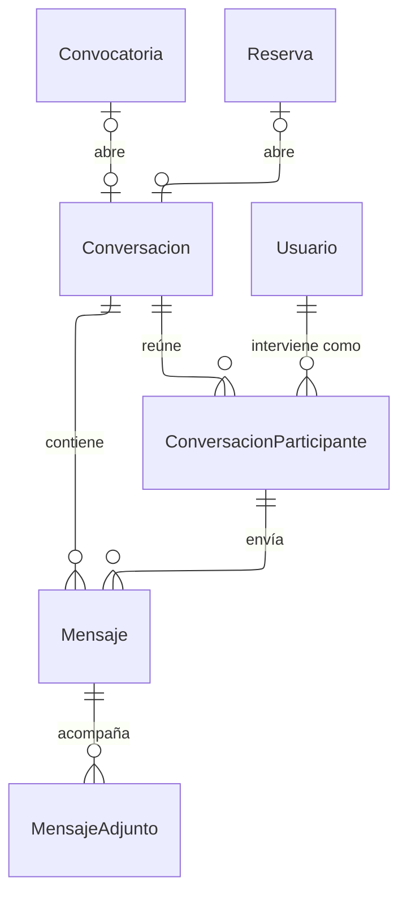

---
hide:
  - toc
icon: lucide/messages-square
---

# Mensajería

La conversación nunca existe por sí sola: nace de una solicitud o de una reserva,
y esas dos referencias son excluyentes. Es lo que ata cada acuerdo al servicio
que lo motivó, de modo que una discrepancia posterior se resuelve consultando lo
que se dijo sobre ese trabajo y no un hilo suelto.

`ConversacionParticipante` existe para que archivar sea independiente por persona. Si la
bandera viviera en la conversación, que el turista archivara sacaría el hilo
también de la bandeja del prestador. Es también donde se registra la última
lectura de cada quien.

El mensaje referencia al participante y no al usuario: así el historial conserva
en qué papel intervino cada quien aunque después cambien sus perfiles. Mientras
la reserva no esté confirmada, el envío de teléfonos y correos se bloquea antes
de insertar la fila.
