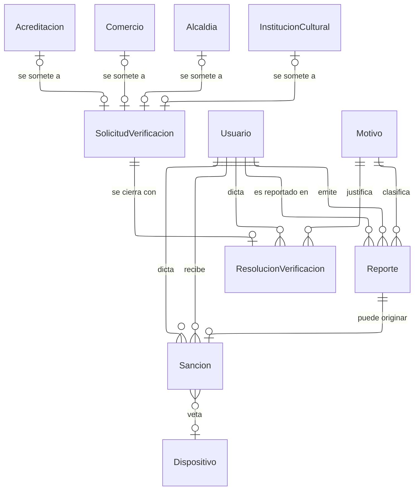

---
hide:
  - toc
icon: lucide/gavel
---

# Moderación y sanciones

`SolicitudVerificacion` es la cola de trabajo del equipo interno y admite cuatro
objetos mutuamente excluyentes: la acreditación de un prestador, o el registro de
un comercio, una alcaldía o una institución cultural. Las cuatro se registran
solas y ninguna existe para el turista antes de la aprobación. `ResolucionVerificacion` la cierra con quién decidió, cuándo y por qué, y el
motivo es obligatorio: un rechazo sin causa explicada obliga a reintentar a
ciegas.

`Sancion` es la causa y el estado de la cuenta es su consecuencia. Sin la tabla
no habría historial de reincidencia y una segunda suspensión borraría el rastro
de la primera. Cuando la sanción es una expulsión permanente, referencia también
el dispositivo desde el que operaba el infractor, que es lo que sostiene el veto
a crear cuentas nuevas desde el mismo aparato.

La resolución de una credencial vencida no cancela por sí sola las reservas
comprometidas del prestador; la expulsión permanente sí, y abre los reembolsos
que correspondan. Qué ocurre en el primer caso sigue sin definirse.
