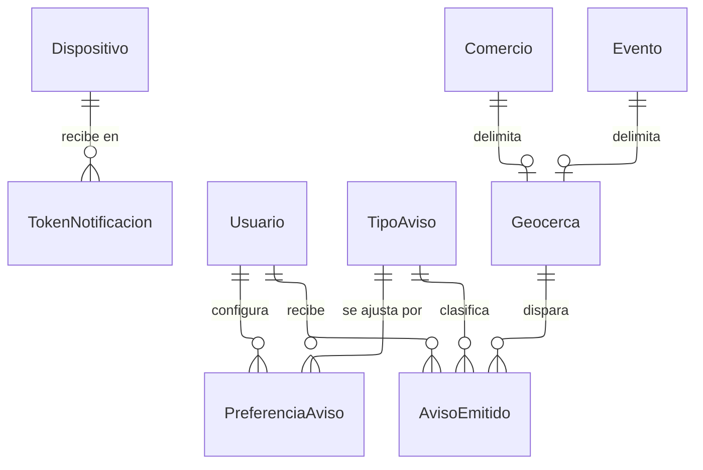

---
hide:
  - toc
icon: lucide/bell
---

# Notificaciones

`AvisoEmitido` existe porque el límite de tres avisos promocionales por hora es
una ventana deslizante y no un cupo que se reinicia. Un contador por hora dejaría
pasar seis avisos entre las 10:59 y las 11:01. Cada envío deja su fila con el
instante, y el límite se evalúa contando las de los últimos sesenta minutos.

`PreferenciaAviso` se ajusta por categoría y no de forma global. Las categorías
transaccionales —la cancelación de un evento al que el turista se vinculó, o el
resultado de una verificación— no pueden desactivarse, y esa condición vive en el
catálogo y no repartida por el código.

`Geocerca` separa el radio de disparo de la entidad que lo motiva, para que
cambiar el radio por defecto no obligue a tocar comercios ni eventos. El radio de
partida es de quinientos metros y vive en `Parametro`.
