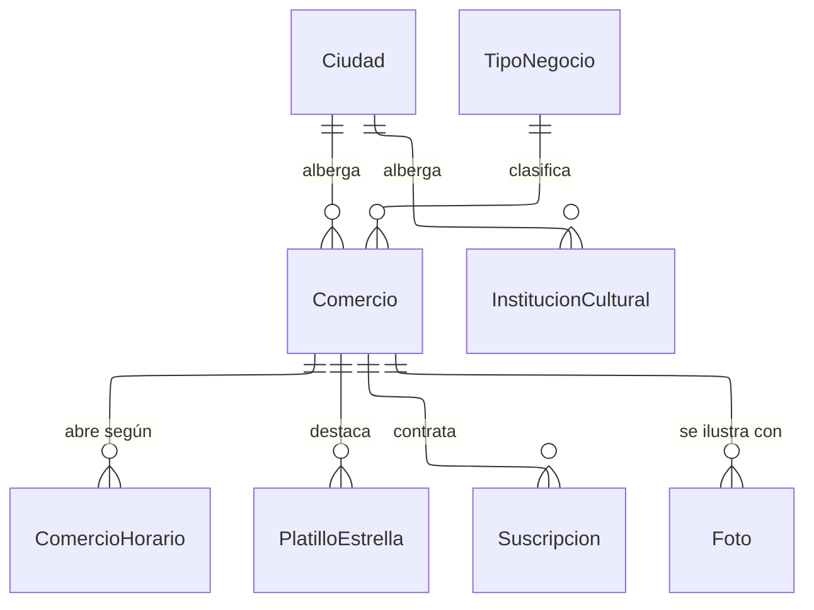

---
hide:
  - toc
icon: lucide/store
---

# Organizaciones y comercios

Alcaldía, comercio e institución cultural no comparten casi nada: el comercio
tiene RUC, horarios y platillo; la alcaldía tiene potestad de publicación; la
institución programa eventos. Por eso son tres tablas y no una con banderas. La
prueba que las separa es que agregar un tipo nuevo obligaría a agregar columnas
que solo aplican a ese tipo.

`Suscripcion` es una entidad aparte del comercio porque el registro básico es
gratuito de forma permanente: la ausencia de suscripción es el estado normal, no
una carencia. Al vencer, el comercio vuelve a visibilidad estándar sin perder
ficha, campañas ni métricas.

`ComercioHorario` es una fila por día y no una cadena en una columna: es lo que
permite que la aplicación resuelva si el local está abierto ahora mismo sin
interpretar texto. `PlatilloEstrella` admite varias filas para conservar los
anteriores, con un índice único parcial que garantiza uno solo vigente por
comercio.
