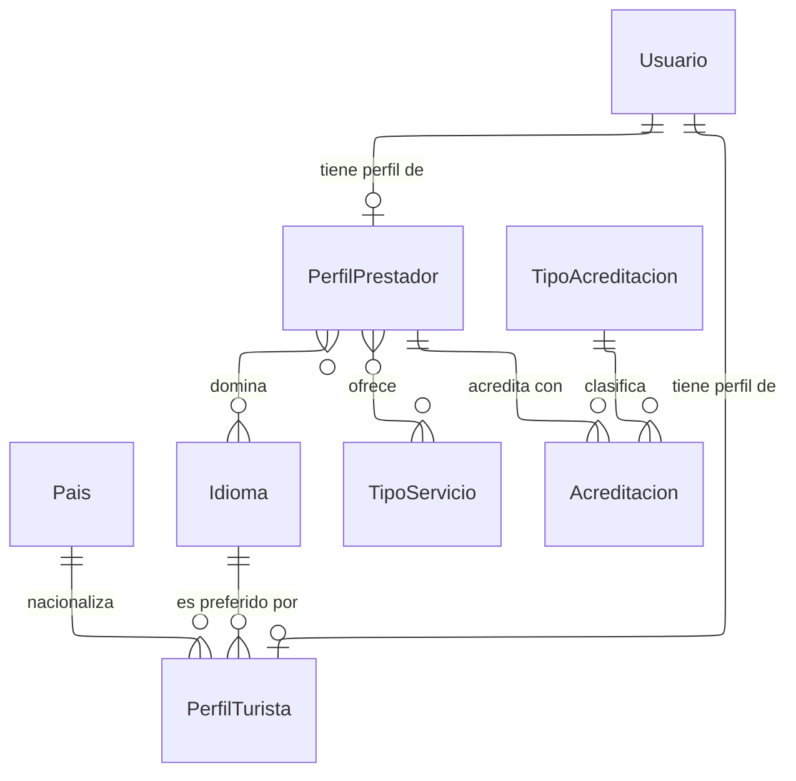

---
hide:
  - toc
icon: lucide/id-card
---

# Perfiles y credenciales

Los datos de cada papel no se solapan: la nacionalidad y el nivel de exploración
solo aplican al turista; las acreditaciones y las tarifas solo al prestador.
Guardarlos en `Usuario` dejaría la mitad de las columnas sin sentido para cada
persona, así que cada papel es una tabla propia.

Una cuenta ejerce **un solo papel**: tiene perfil de turista, perfil de prestador
o ninguno de los dos —el caso de quien opera un comercio o el backoffice—, nunca
los dos a la vez. Un disparador lo impide, y es lo que descarta de raíz que
alguien se postule a su propia convocatoria.

`Acreditacion` es lo que separa a un prestador visible de uno que no existe para el
turista. Guarda el documento, su tipo y sus fechas de emisión y vencimiento: el
perfil sigue activo mientras alguna credencial esté vigente y aprobada, y pasa a
suspensión automática cuando la última vence sin reemplazo aprobado.

Las dos relaciones de varios a varios se resuelven con tabla intermedia: un
prestador domina varios idiomas y ofrece guiado, traducción o ambos. El promedio
de valoración vive en `PerfilPrestador` como dato materializado, porque se
consulta en cada búsqueda y recalcularlo por agregación sería el cálculo más caro
del sistema.
