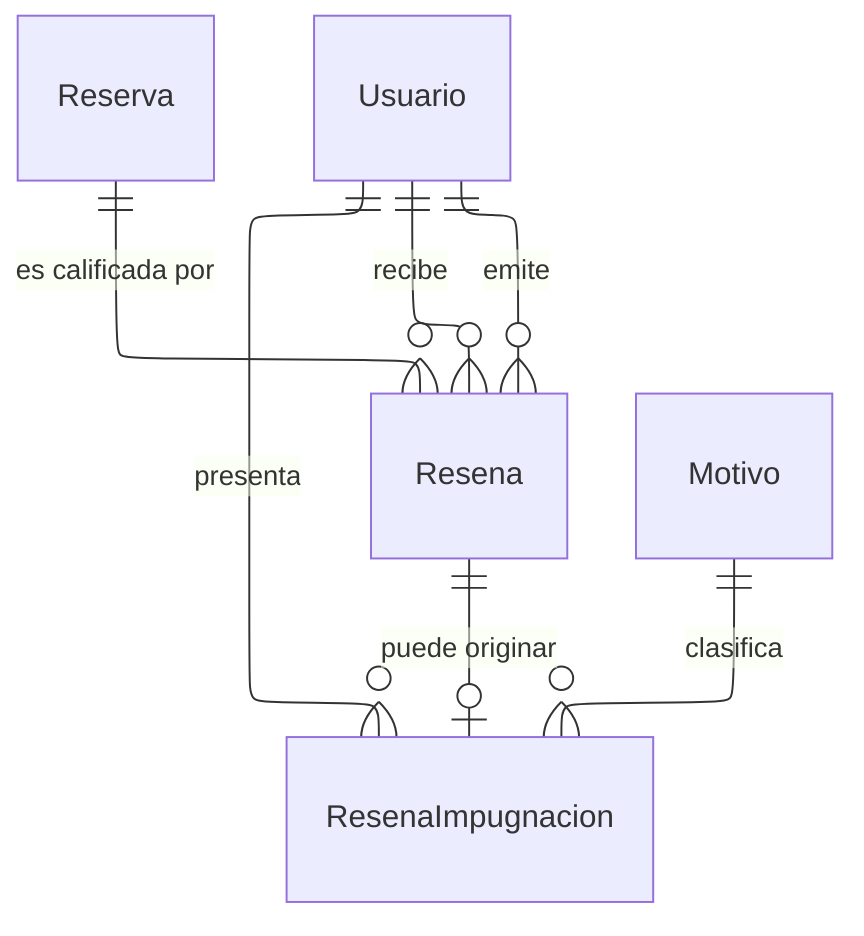

---
hide:
  - toc
icon: lucide/star
---

# Reputación

Una sola tabla de reseña con emisor y receptor explícitos. La visibilidad no es
una columna configurable: se deriva del papel de quien la recibe. La reseña sobre
un prestador es pública porque sostiene la decisión de contratación; la reseña
sobre un turista circula solo entre prestadores porque sirve de advertencia y no
de castigo público.

Dos tablas separadas habrían duplicado la ventana de corrección de veinticuatro
horas, la impugnación y el recálculo del promedio, con el riesgo de que las dos
copias divergieran.

Una reserva admite a lo sumo dos reseñas, una por sentido, garantizado con un
índice único sobre reserva y emisor. El promedio del prestador se mantiene
actualizado desde la propia base cada vez que una reseña se inserta o se corrige,
no desde la aplicación, para que ninguna vía de escritura pueda dejarlo obsoleto.
