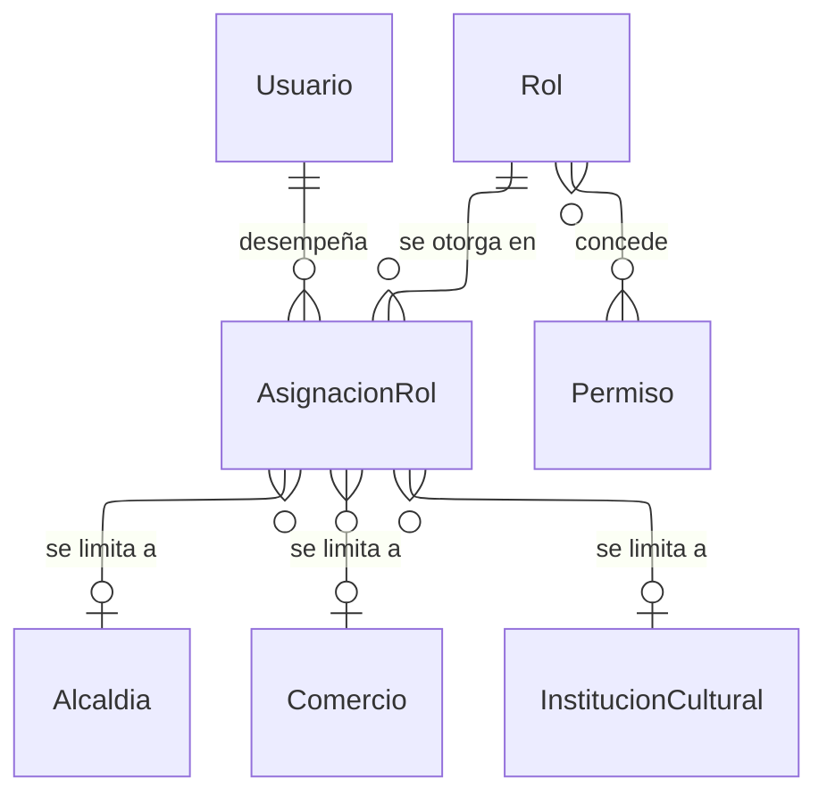

---
hide:
  - toc
icon: lucide/shield-check
---

# Roles y permisos

Saber que alguien tiene el rol de operador de circuitos no basta: hay que saber
de qué ciudad. Por eso el permiso no se otorga a la persona sino al rol, y el rol
se asigna con un ámbito. `AsignacionRol` lleva tres referencias mutuamente
excluyentes —alcaldía, comercio o institución— y ninguna de las tres significa
alcance global, que es el caso del personal interno.

Sin ese ámbito, impedir que Granada reescriba el circuito de León dependería de
que ninguna consulta olvide filtrar por ciudad, y basta una omisión para perder
la garantía entera.

Los permisos nunca se conceden directamente a un usuario. Un permiso individual
es invisible al revisar el rol y sobrevive a su revocación, así que retirar un
acceso dejaría de ser una sola operación auditable.

| Rol | Ámbito | Qué habilita |
| --- | --- | --- |
| `Turista` | Global | Explorar, planificar, contratar y canjear desde la aplicación |
| `Prestador` | Global | Publicar recorridos, postularse y cobrar |
| `OperadorAlcaldia` | Una alcaldía | Publicar y editar los circuitos de su ciudad |
| `OperadorComercio` | Un comercio | Editar la ficha, emitir campañas y validar cupones |
| `OperadorInstitucion` | Una institución | Programar y cancelar eventos |
| `Moderador` | Global | Resolver la cola de verificación |
| `Supervisor` | Global | Sancionar usuarios y resolver reportes |
