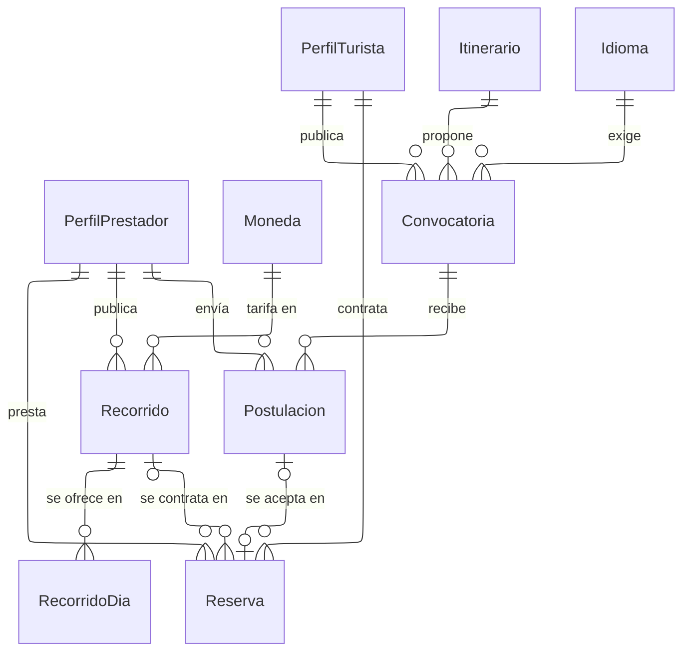

---
hide:
  - toc
icon: lucide/handshake
---

# Servicios y reservas

La reserva nace por dos caminos y es una sola tabla, porque todo lo posterior
—chat, cierre, evaluación mutua, pago y comisión— es idéntico. El turista
publica una solicitud y acepta una postulación, o contrata directamente un
recorrido del catálogo. Las dos referencias son mutuamente excluyentes: una
reserva tiene origen en una o en el otro, nunca en ambos.

`Recorrido` cuelga del prestador, pero no de cualquiera: solo el guía publica
catálogo. El traductor llega al trabajo por un único camino, la postulación, y
por eso la relación entre `PerfilPrestador` y `Recorrido` está condicionada al
tipo de servicio que ese perfil ofrece.

La tarifa se congela en la reserva. Si leyera el precio del recorrido, un ajuste
posterior del prestador cambiaría retroactivamente lo que el turista aceptó
pagar. Ese valor copiado no es redundancia: es la tarifa que se acordó, un hecho
propio de la reserva.

La solicitud circula sin la identidad del turista: los datos personales aparecen
al abrirse la sala de chat con el prestador elegido. `RecorridoDia` es una fila
por día porque la disponibilidad se consulta al filtrar, y una cadena separada
por comas no se puede indexar ni restringir.

| Camino al trabajo | Guía | Traductor |
| --- | :-: | :-: |
| Publicar recorrido y recibir reserva directa | ● | |
| Postularse a una solicitud del turista | ● | ● |

Un disparador comprueba que quien inserta un `Recorrido` ofrezca el tipo de
servicio de guía. Sin esa comprobación la regla viviría solo en la interfaz, y
una carga masiva o una corrección manual la saltaría sin que nadie lo note.
