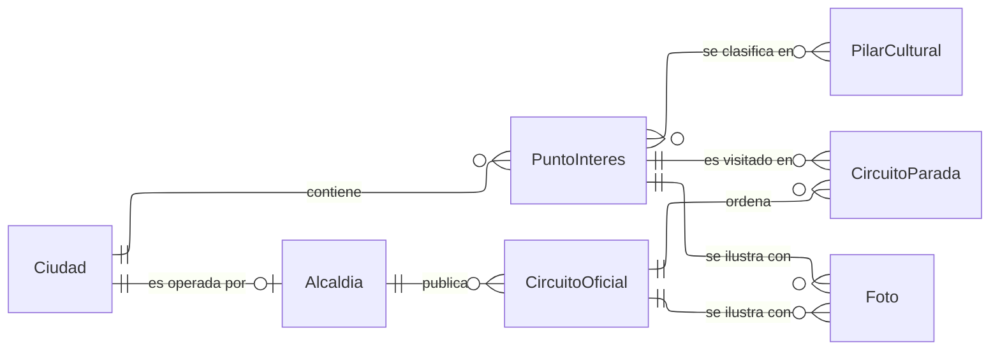

---
hide:
  - toc
icon: lucide/map
---

# Territorio y circuitos

La ciudad es territorio y la alcaldía es autoridad. El circuito lo publica la
alcaldía —es la única que puede—, mientras que el punto de interés solo está
situado en la ciudad. La relación entre ambas admite ninguna alcaldía: el
catálogo de las diez Ciudades Creativas está completo desde el primer día, pero
su incorporación a la plataforma es progresiva.

`PuntoInteres` existe por sí mismo y no como propiedad de un recorrido. Un mismo
lugar aparece en varios circuitos y otorga insignias por su cuenta, así que
retirarlo de uno no lo borra del mapa ni cancela lo que ya acreditó.
`CircuitoParada` es la tabla intermedia que aporta el orden, que no cabría en
ninguna de las dos entidades que une.

`PilarCultural` son los cuatro pilares que articulan los circuitos creativos:
patrimonio, gastronomía, artesanía y saberes populares. La relación es de varios
a varios porque un mismo lugar puede ser dos cosas a la vez —una casona colonial
que además es taller de artesanía— y el turista lo encuentra filtrando por
cualquiera de las dos.

`CircuitoOficial` lleva un número de versión que se incrementa con cada edición
de la geometría. No hay tabla de versiones: el historial completo lo conserva la
auditoría, y el número solo sirve para que la aplicación detecte que debe
redibujar. `Foto` cuelga de una sola entidad por fila mediante referencias
excluyentes, el mismo patrón que usa el ámbito de un rol.
