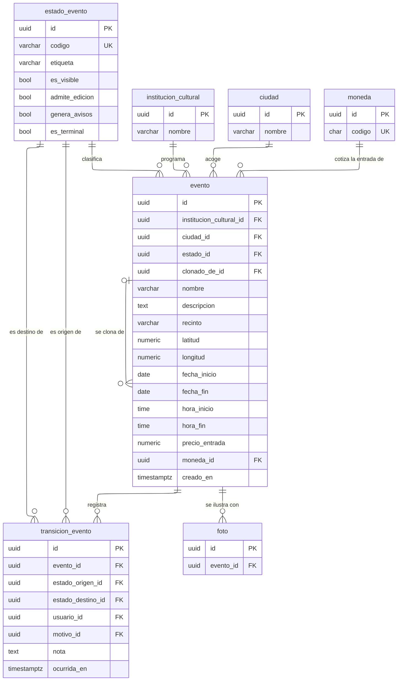

---
hide:
  - toc
icon: lucide/drama
---

# Agenda cultural

```mermaid
---
config:
  elk:
    mergeEdges: false
    nodePlacementStrategy: NETWORK_SIMPLEX
  fontFamily: monospace
  layout: elk
---
erDiagram
    evento {
        uuid id PK
        uuid institucion_cultural_id FK
        uuid ciudad_id FK
        uuid estado_id FK
        uuid clonado_de_id FK
        varchar nombre
        text descripcion
        varchar recinto
        numeric latitud
        numeric longitud
        date fecha_inicio
        date fecha_fin
        time hora_inicio
        time hora_fin
        numeric precio_entrada
        uuid moneda_id FK
        timestamptz creado_en
    }
    estado_evento {
        uuid id PK
        varchar codigo UK
        varchar etiqueta
        bool es_visible
        bool admite_edicion
        bool genera_avisos
        bool es_terminal
    }
    transicion_evento {
        uuid id PK
        uuid evento_id FK
        uuid estado_origen_id FK
        uuid estado_destino_id FK
        uuid usuario_id FK
        uuid motivo_id FK
        text nota
        timestamptz ocurrida_en
    }
    institucion_cultural {
        uuid id PK
        varchar nombre
    }
    ciudad {
        uuid id PK
        varchar nombre
    }
    moneda {
        uuid id PK
        char codigo UK
    }
    foto {
        uuid id PK
        uuid evento_id FK
    }
    institucion_cultural ||--o{ evento : "programa"
    ciudad ||--o{ evento : "acoge"
    moneda ||--o{ evento : "cotiza la entrada de"
    estado_evento ||--o{ evento : "clasifica"
    evento |o--o{ evento : "se clona de"
    evento ||--o{ transicion_evento : "registra"
    estado_evento ||--o{ transicion_evento : "es origen de"
    estado_evento ||--o{ transicion_evento : "es destino de"
    evento ||--o{ foto : "se ilustra con"
```

