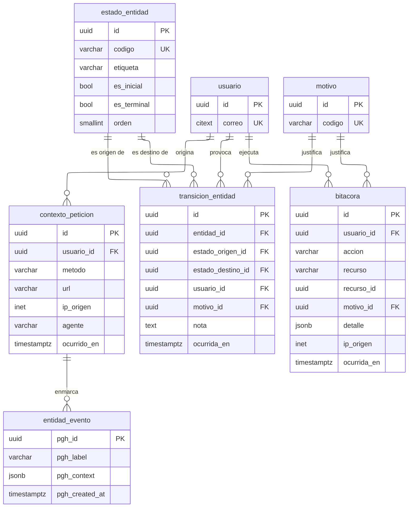

---
hide:
  - toc
icon: lucide/scroll-text
---

# Auditoría

```mermaid
---
config:
  elk:
    mergeEdges: false
    nodePlacementStrategy: NETWORK_SIMPLEX
  fontFamily: monospace
  layout: elk
---
erDiagram
    contexto_peticion {
        uuid id PK
        uuid usuario_id FK
        varchar metodo
        varchar url
        inet ip_origen
        varchar agente
        timestamptz ocurrido_en
    }
    entidad_evento {
        uuid pgh_id PK
        varchar pgh_label
        jsonb pgh_context
        timestamptz pgh_created_at
    }
    estado_entidad {
        uuid id PK
        varchar codigo UK
        varchar etiqueta
        bool es_inicial
        bool es_terminal
        smallint orden
    }
    transicion_entidad {
        uuid id PK
        uuid entidad_id FK
        uuid estado_origen_id FK
        uuid estado_destino_id FK
        uuid usuario_id FK
        uuid motivo_id FK
        text nota
        timestamptz ocurrida_en
    }
    bitacora {
        uuid id PK
        uuid usuario_id FK
        varchar accion
        varchar recurso
        uuid recurso_id
        uuid motivo_id FK
        jsonb detalle
        inet ip_origen
        timestamptz ocurrida_en
    }
    usuario {
        uuid id PK
        citext correo UK
    }
    motivo {
        uuid id PK
        varchar codigo UK
    }
    usuario ||--o{ contexto_peticion : "origina"
    contexto_peticion ||--o{ entidad_evento : "enmarca"
    usuario ||--o{ bitacora : "ejecuta"
    motivo ||--o{ bitacora : "justifica"
    estado_entidad ||--o{ transicion_entidad : "es origen de"
    estado_entidad ||--o{ transicion_entidad : "es destino de"
    usuario ||--o{ transicion_entidad : "provoca"
    motivo ||--o{ transicion_entidad : "justifica"
```

