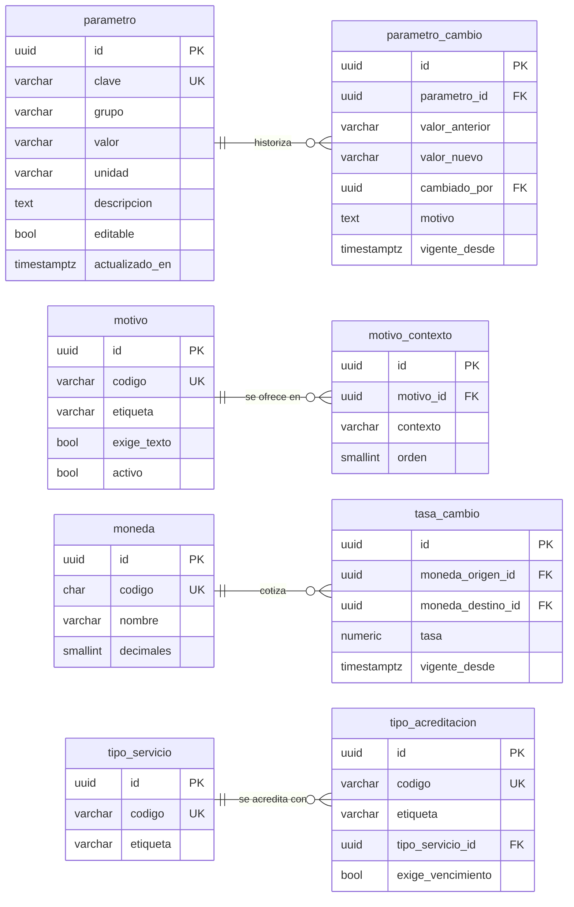

---
hide:
  - toc
icon: lucide/list-tree
---

# Catálogos y parámetros

`parametro` guarda el valor como texto con su `unidad` aparte, porque el conjunto
mezcla metros, minutos, días y porcentajes. Convertir al tipo correcto es
responsabilidad de quien lo lee, y `grupo` permite cargar de una vez todos los
umbrales de un mismo dominio.

En el diagrama van solo las cuatro tablas con estructura. Las listas cerradas
comparten una forma tan simple que dibujarlas ocuparía el triple de espacio sin
decir nada.

## Listas cerradas

Todas comparten `id`, `codigo` único y `etiqueta`. El código nunca cambia aunque
cambie el texto que se muestra: es lo que referencian las reglas del sistema.

| Tabla | Columnas propias |
| --- | --- |
| `idioma` | `char codigo UK`, `varchar nombre`, `bool activo` |
| `pais` | `char codigo UK`, `varchar nombre` |
| `tipo_negocio` | `varchar codigo UK`, `varchar etiqueta`, `bool activo` |
| `tipo_beneficio` | `varchar codigo UK`, `varchar etiqueta`, `bool exige_monto` |
| `tipo_aviso` | `varchar codigo UK`, `varchar etiqueta`, `bool desactivable` |
| `pilar_cultural` | `varchar codigo UK`, `varchar etiqueta`, `varchar icono`, `smallint orden` |

`tipo_aviso.desactivable` es lo que impide que un usuario apague los avisos
transaccionales. `tipo_beneficio.exige_monto` distingue el descuento porcentual,
que necesita una cifra, del producto gratis, que no.

## Reglas

| Restricción | Sobre | Por qué |
| --- | --- | --- |
| Solo inserción | `parametro_cambio` | Revertir un umbral es insertar el cambio inverso, no borrar la fila |
| Único | `motivo_contexto` por motivo y contexto | Un motivo no aparece dos veces en la misma lista |
| Verificación | `tasa_cambio.tasa` mayor que cero | Una tasa nula o negativa rompe todo cálculo de conversión |
| Verificación | `tasa_cambio` con monedas distintas | Convertir una moneda a sí misma no tiene sentido |
| Único parcial | `tasa_cambio` por par de monedas y `vigente_desde` | Una sola tasa por par y fecha |
| Disparador | `parametro` con `editable` falso no se actualiza | Las vigencias de sesión y el umbral de edad no se tocan desde el portal |
