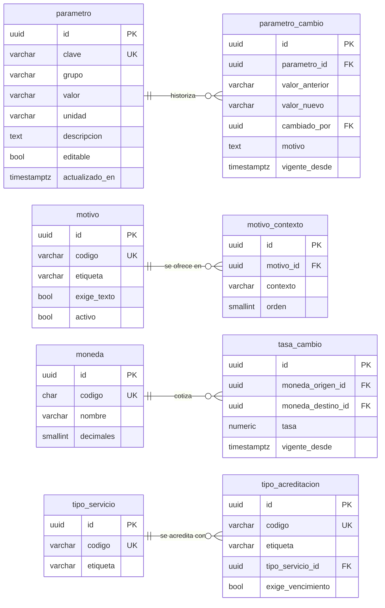

---
hide:
  - toc
icon: lucide/list-tree
---

# Catálogos y parámetros

```mermaid
---
config:
  elk:
    mergeEdges: false
    nodePlacementStrategy: NETWORK_SIMPLEX
  fontFamily: monospace
  layout: elk
---
erDiagram
    direction LR
    parametro {
        uuid id PK
        varchar clave UK
        varchar grupo
        varchar valor
        varchar unidad
        text descripcion
        bool editable
        timestamptz actualizado_en
    }
    parametro_cambio {
        uuid id PK
        uuid parametro_id FK
        varchar valor_anterior
        varchar valor_nuevo
        uuid cambiado_por FK
        text motivo
        timestamptz vigente_desde
    }
    motivo {
        uuid id PK
        varchar codigo UK
        varchar etiqueta
        bool exige_texto
        bool activo
    }
    motivo_contexto {
        uuid id PK
        uuid motivo_id FK
        varchar contexto
        smallint orden
    }
    moneda {
        uuid id PK
        char codigo UK
        varchar nombre
        smallint decimales
    }
    tasa_cambio {
        uuid id PK
        uuid moneda_origen_id FK
        uuid moneda_destino_id FK
        numeric tasa
        timestamptz vigente_desde
    }
    tipo_servicio {
        uuid id PK
        varchar codigo UK
        varchar etiqueta
    }
    tipo_acreditacion {
        uuid id PK
        varchar codigo UK
        varchar etiqueta
        uuid tipo_servicio_id FK
        bool exige_vencimiento
    }
    parametro ||--o{ parametro_cambio : "historiza"
    motivo ||--o{ motivo_contexto : "se ofrece en"
    moneda ||--o{ tasa_cambio : "cotiza"
    tipo_servicio ||--o{ tipo_acreditacion : "se acredita con"
```

