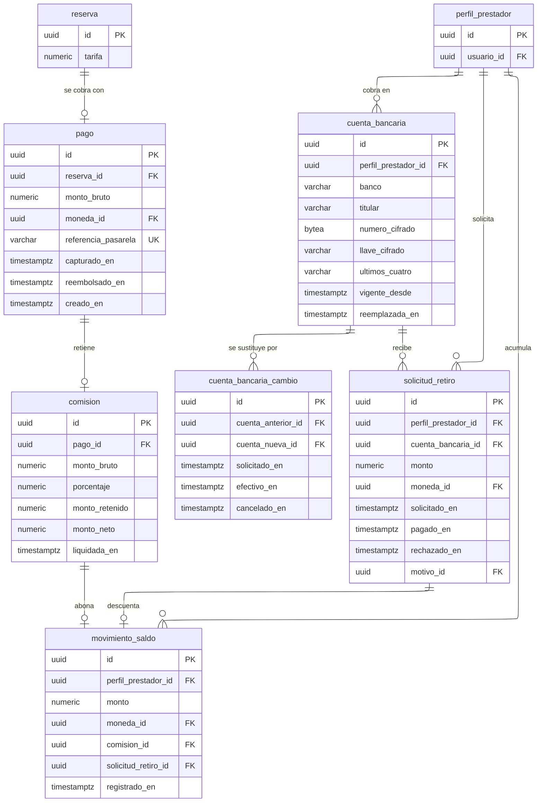

---
hide:
  - toc
icon: lucide/wallet
---

# Finanzas

```mermaid
---
config:
  elk:
    mergeEdges: false
    nodePlacementStrategy: NETWORK_SIMPLEX
  fontFamily: monospace
  layout: elk
---
erDiagram
    pago {
        uuid id PK
        uuid reserva_id FK
        numeric monto_bruto
        uuid moneda_id FK
        varchar referencia_pasarela UK
        timestamptz capturado_en
        timestamptz reembolsado_en
        timestamptz creado_en
    }
    comision {
        uuid id PK
        uuid pago_id FK
        numeric monto_bruto
        numeric porcentaje
        numeric monto_retenido
        numeric monto_neto
        timestamptz liquidada_en
    }
    movimiento_saldo {
        uuid id PK
        uuid perfil_prestador_id FK
        numeric monto
        uuid moneda_id FK
        uuid comision_id FK
        uuid solicitud_retiro_id FK
        timestamptz registrado_en
    }
    cuenta_bancaria {
        uuid id PK
        uuid perfil_prestador_id FK
        varchar banco
        varchar titular
        bytea numero_cifrado
        varchar llave_cifrado
        varchar ultimos_cuatro
        timestamptz vigente_desde
        timestamptz reemplazada_en
    }
    cuenta_bancaria_cambio {
        uuid id PK
        uuid cuenta_anterior_id FK
        uuid cuenta_nueva_id FK
        timestamptz solicitado_en
        timestamptz efectivo_en
        timestamptz cancelado_en
    }
    solicitud_retiro {
        uuid id PK
        uuid perfil_prestador_id FK
        uuid cuenta_bancaria_id FK
        numeric monto
        uuid moneda_id FK
        timestamptz solicitado_en
        timestamptz pagado_en
        timestamptz rechazado_en
        uuid motivo_id FK
    }
    reserva {
        uuid id PK
        numeric tarifa
    }
    perfil_prestador {
        uuid id PK
        uuid usuario_id FK
    }
    reserva ||--o| pago : "se cobra con"
    pago ||--o| comision : "retiene"
    comision ||--o| movimiento_saldo : "abona"
    perfil_prestador ||--o{ movimiento_saldo : "acumula"
    perfil_prestador ||--o{ cuenta_bancaria : "cobra en"
    cuenta_bancaria ||--o{ cuenta_bancaria_cambio : "se sustituye por"
    perfil_prestador ||--o{ solicitud_retiro : "solicita"
    cuenta_bancaria ||--o{ solicitud_retiro : "recibe"
    solicitud_retiro ||--o| movimiento_saldo : "descuenta"
```

