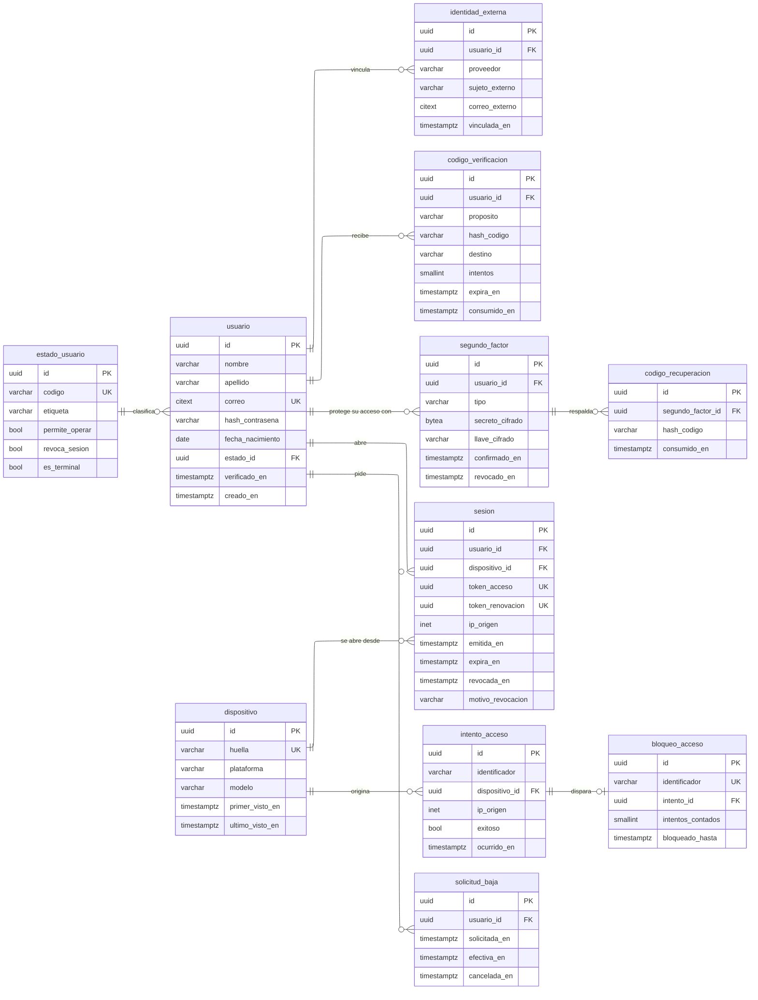

# Identidad y acceso

Once tablas. `usuario` es la de más referencias entrantes del esquema y `sesion`
la que más se escribe. Lo que aquí se decida mal se paga en producción: una
sesión que no se puede revocar deja dentro a un expulsado, y un intento fallido
atado al usuario delata qué correos existen.

<div align="center" markdown>



</div>

---

## `usuario`

La persona registrada, sea cual sea su papel. Sustituye al `ApiUser` del
andamiaje.

**Auditoría:** mutable rastreada · **Volumen:** decenas de miles en el piloto

| Columna | Tipo | Nulo | Por defecto | Significa |
| --- | --- | :-: | --- | --- |
| `id` | `uuid` | no | `uuidv7()` | Inmutable |
| `nombre` | `varchar` | no | — | Nombre de pila; es lo único que ven terceros |
| `apellido` | `varchar` | no | `''` | Vacío cuando el proveedor federado no lo entrega |
| `correo` | `citext` | no | — | Identificador de acceso; inmutable desde el perfil |
| `hash_contrasena` | `varchar` | no | `''` | Vacío cuando la cuenta es solo federada |
| `fecha_nacimiento` | `date` | no | — | Solo se usa para comprobar la mayoría de edad |
| `estado_id` | `uuid` | no | — | → `estado_usuario` |
| `verificado_en` | `timestamptz` | **sí** | — | Nulo mientras el correo no se confirma |
| `creado_en` | `timestamptz` | no | `now()` | Congelada por disparador |

| Llave foránea | Referencia | ON DELETE | Nota |
| --- | --- | --- | --- |
| `estado_id` | `estado_usuario` | `RESTRICT` | Un estado en uso no se borra |

```sql
CONSTRAINT chk_usuario_mayoredad
  CHECK (fecha_nacimiento <= CURRENT_DATE - INTERVAL '18 years');
```

| Disparador | Evento | Momento | Regla | Origen |
| --- | --- | --- | --- | --- |
| `trg_usuario_readonly_creadoen` | UPDATE | BEFORE | `creado_en` no se reescribe | Convención |
| `trg_usuario_credencial` | INSERT, UPDATE | AFTER, diferido | Tiene contraseña o identidad federada, nunca ninguna de las dos | [RF-S-05][rf-s-05] |
| `trg_usuario_unperfil` | INSERT en perfiles | BEFORE | No acumula perfil de turista y de prestador | [RF-S-26][rf-s-26] |
| `trg_usuario_revocasesion` | UPDATE de `estado_id` | AFTER | Si el estado nuevo revoca, marca todas sus sesiones vivas | [RF-S-10][rf-s-10] |

| Índice | Definición | Para qué |
| --- | --- | --- |
| `unq_usuario_correo` | `UNIQUE (correo)` | El correo identifica |
| `idx_usuario_estado` | `(estado_id)` | Listados del backoffice por estado |
| `gin_usuario_nombre` | `GIN` trigrama sobre nombre y apellido | Búsqueda por nombre parcial |

«Tiene contraseña o identidad federada» es disparador diferido y no `CHECK`
porque mira otra tabla: al insertar el usuario todavía no existe la fila de
`identidad_externa`, y la comprobación tiene que esperar al cierre de la
transacción.

---

## `estado_usuario`

Catálogo del ciclo de vida de la cuenta. Los booleanos son las preguntas que el
sistema hace sobre el estado, de modo que agregar uno nuevo sea insertar una fila
y no repartir condicionales por el código.

**Auditoría:** mutable rastreada · **Volumen:** 5 filas

| Código | `permite_operar` | `revoca_sesion` | `es_terminal` |
| --- | :-: | :-: | :-: |
| `pendiente` | no | no | no |
| `activa` | **sí** | no | no |
| `suspendida` | no | **sí** | no |
| `expulsada` | no | **sí** | **sí** |
| `en_baja` | no | **sí** | no |

---

## `sesion`

Una fila por par de credenciales emitido. Es a la vez el registro de sesión y la
lista de revocación: no hay tabla aparte.

**Auditoría:** mutable protegida · **Volumen:** cientos de miles al mes, se purga

| Columna | Tipo | Nulo | Por defecto | Significa |
| --- | --- | :-: | --- | --- |
| `id` | `uuid` | no | `uuidv7()` | |
| `usuario_id` | `uuid` | no | — | → `usuario` |
| `dispositivo_id` | `uuid` | no | — | → `dispositivo` |
| `token_acceso` | `uuid` | no | — | Identificador de la credencial de acceso |
| `token_renovacion` | `uuid` | no | — | Identificador de la de renovación |
| `ip_origen` | `inet` | no | — | Dirección desde la que se emitió |
| `emitida_en` | `timestamptz` | no | `now()` | |
| `expira_en` | `timestamptz` | no | — | Expiración natural de la renovación |
| `revocada_en` | `timestamptz` | **sí** | — | Nulo mientras la sesión sirve |
| `motivo_revocacion` | `varchar` | no | `''` | `cierre`, `rotacion`, `sancion` o `baja` |

| Llave foránea | Referencia | ON DELETE | Nota |
| --- | --- | --- | --- |
| `usuario_id` | `usuario` | `CASCADE` | Al destruir la cuenta no queda sesión huérfana |
| `dispositivo_id` | `dispositivo` | `RESTRICT` | El dispositivo sobrevive: sostiene el veto |

```sql
CONSTRAINT chk_sesion_expira   CHECK (expira_en > emitida_en);
CONSTRAINT chk_sesion_revocada CHECK (revocada_en IS NULL OR revocada_en >= emitida_en);
CONSTRAINT chk_sesion_motivo   CHECK ((revocada_en IS NULL) = (motivo_revocacion = ''));
```

| Disparador | Evento | Momento | Regla | Origen |
| --- | --- | --- | --- | --- |
| `trg_sesion_readonly_tokens` | UPDATE | BEFORE | Los dos identificadores no se reescriben | [RF-S-07][rf-s-07] |
| `trg_sesion_norevive` | UPDATE | BEFORE | `revocada_en` no vuelve a nulo | [RF-S-07][rf-s-07] |

| Índice | Definición | Para qué |
| --- | --- | --- |
| `unq_sesion_acceso` | `UNIQUE (token_acceso)` | Validar la credencial en cada petición |
| `unq_sesion_renovacion` | `UNIQUE (token_renovacion)` | Detectar el reuso al renovar |
| `idx_sesion_vivas` | `(usuario_id) WHERE revocada_en IS NULL` | Revocar de golpe las de una persona sancionada |
| `brin_sesion_expira` | `BRIN (expira_en)` | La purga recorre rangos, no filas sueltas |

La tercera restricción ata revocación y motivo: no existe una sesión revocada sin
causa ni un motivo escrito sobre una sesión viva.

**Renovar** consume la fila —escribe `revocada_en` con motivo `rotacion`— e
inserta otra. Presentar dos veces la misma credencial de renovación falla la
segunda, y eso convierte el robo en un incidente detectable.

---

## `intento_acceso`

Cada intento de autenticación, exitoso o no. **No referencia a `usuario`.**

**Auditoría:** de solo inserción · **Volumen:** millones al año

| Columna | Tipo | Nulo | Significa |
| --- | --- | :-: | --- |
| `id` | `uuid` | no | |
| `identificador` | `varchar` | no | El correo **tal como se tecleó**, exista o no |
| `dispositivo_id` | `uuid` | **sí** | Nulo si el cliente no declara huella |
| `ip_origen` | `inet` | no | |
| `exitoso` | `bool` | no | |
| `ocurrido_en` | `timestamptz` | no | |

| Índice | Definición | Para qué |
| --- | --- | --- |
| `idx_intento_identificador` | `(identificador, ocurrido_en DESC) WHERE NOT exitoso` | Contar los fallidos de los últimos quince minutos |
| `brin_intento_ocurrido` | `BRIN (ocurrido_en)` | La purga por antigüedad |

Si `identificador` fuera llave foránea, un correo inexistente no tendría dónde
registrarse: el bloqueo por cinco intentos solo funcionaría para cuentas reales y
eso **revelaría cuáles existen**, que es justo lo que [RF-S-06][rf-s-06] prohíbe.

---

## `segundo_factor` y `codigo_recuperacion`

**Auditoría:** mutable rastreada · **Volumen:** una o dos filas por cuenta con
factor

| Columna | Tipo | Nulo | Significa |
| --- | --- | :-: | --- |
| `tipo` | `varchar` | no | `totp`, `sms` o `correo` |
| `secreto_cifrado` | `bytea` | no | Cifrado en la aplicación, **nunca en claro** |
| `llave_cifrado` | `varchar` | no | Qué llave lo cifró, para poder rotarlas |
| `confirmado_en` | `timestamptz` | **sí** | Nulo mientras no se valida el primer código |
| `revocado_en` | `timestamptz` | **sí** | Nulo mientras está en uso |

| Índice | Definición | Para qué |
| --- | --- | --- |
| `unq_factor_activo` | `UNIQUE (usuario_id) WHERE confirmado_en IS NOT NULL AND revocado_en IS NULL` | Un solo factor activo, conservando los rotados |

`secreto_cifrado` es lo único reversible del módulo —hay que poder generar el
código de seis dígitos—. Por eso lleva `llave_cifrado`: un volcado de la base no
basta para suplantar el factor si la llave vive fuera.

`codigo_recuperacion` guarda **hash**, no el código. Se emiten diez de un solo
uso al confirmar el factor y son la única salida cuando el usuario pierde el
dispositivo.

---

## Resto del módulo

| Tabla | Propósito | Auditoría | Regla que la define |
| --- | --- | --- | --- |
| `identidad_externa` | Vínculo con el proveedor federado | Mutable rastreada | `UNIQUE (proveedor, sujeto_externo)`: una cuenta externa no se vincula a dos usuarios |
| `codigo_verificacion` | Códigos de un solo uso para correo y recuperación | De solo inserción | Guarda hash y `destino` congelado; `intentos` bloquea a los cinco |
| `dispositivo` | Aparato desde el que se opera | Mutable rastreada | `UNIQUE (huella)`; sobrevive al usuario porque sostiene el veto de [RF-B-08][rf-b-08] |
| `bloqueo_acceso` | Bloqueo vigente por identificador | Mutable protegida | `UNIQUE (identificador)`: un solo bloqueo por identificador tecleado |
| `solicitud_baja` | Los treinta días entre la petición y el borrado | Mutable rastreada | `efectiva_en = solicitada_en + 30 días`; se cancela escribiendo `cancelada_en` |

[rf-b-08]: ../../../requerimientos/funcionales/backoffice.md#rf-b-08
[rf-s-05]: ../../../requerimientos/funcionales/plataforma.md#rf-s-05
[rf-s-06]: ../../../requerimientos/funcionales/plataforma.md#rf-s-06
[rf-s-07]: ../../../requerimientos/funcionales/plataforma.md#rf-s-07
[rf-s-10]: ../../../requerimientos/funcionales/plataforma.md#rf-s-10
[rf-s-26]: ../../../requerimientos/funcionales/plataforma.md#rf-s-26
