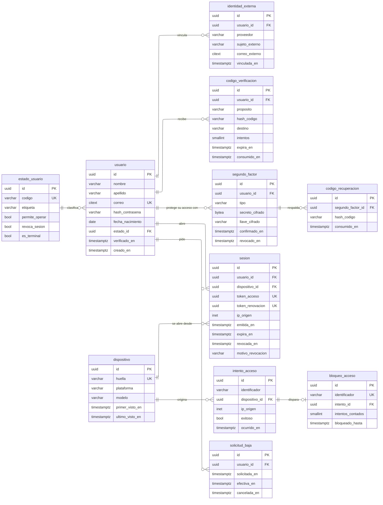

# Identidad y acceso

```mermaid
---
config:
  elk:
    mergeEdges: false
    nodePlacementStrategy: NETWORK_SIMPLEX
  fontFamily: monospace
  layout: elk
---
erDiagram
    direction LR
    usuario {
        uuid id PK
        varchar nombre
        varchar apellido
        citext correo UK
        varchar hash_contrasena
        date fecha_nacimiento
        uuid estado_id FK
        timestamptz verificado_en
        timestamptz creado_en
    }
    estado_usuario {
        uuid id PK
        varchar codigo UK
        varchar etiqueta
        bool permite_operar
        bool revoca_sesion
        bool es_terminal
    }
    identidad_externa {
        uuid id PK
        uuid usuario_id FK
        varchar proveedor
        varchar sujeto_externo
        citext correo_externo
        timestamptz vinculada_en
    }
    codigo_verificacion {
        uuid id PK
        uuid usuario_id FK
        varchar proposito
        varchar hash_codigo
        varchar destino
        smallint intentos
        timestamptz expira_en
        timestamptz consumido_en
    }
    segundo_factor {
        uuid id PK
        uuid usuario_id FK
        varchar tipo
        bytea secreto_cifrado
        varchar llave_cifrado
        timestamptz confirmado_en
        timestamptz revocado_en
    }
    codigo_recuperacion {
        uuid id PK
        uuid segundo_factor_id FK
        varchar hash_codigo
        timestamptz consumido_en
    }
    dispositivo {
        uuid id PK
        varchar huella UK
        varchar plataforma
        varchar modelo
        timestamptz primer_visto_en
        timestamptz ultimo_visto_en
    }
    sesion {
        uuid id PK
        uuid usuario_id FK
        uuid dispositivo_id FK
        uuid token_acceso UK
        uuid token_renovacion UK
        inet ip_origen
        timestamptz emitida_en
        timestamptz expira_en
        timestamptz revocada_en
        varchar motivo_revocacion
    }
    intento_acceso {
        uuid id PK
        varchar identificador
        uuid dispositivo_id FK
        inet ip_origen
        bool exitoso
        timestamptz ocurrido_en
    }
    bloqueo_acceso {
        uuid id PK
        varchar identificador UK
        uuid intento_id FK
        smallint intentos_contados
        timestamptz bloqueado_hasta
    }
    solicitud_baja {
        uuid id PK
        uuid usuario_id FK
        timestamptz solicitada_en
        timestamptz efectiva_en
        timestamptz cancelada_en
    }
    estado_usuario ||--o{ usuario : "clasifica"
    usuario ||--o{ identidad_externa : "vincula"
    usuario ||--o{ codigo_verificacion : "recibe"
    usuario ||--o{ segundo_factor : "protege su acceso con"
    usuario ||--o{ solicitud_baja : "pide"
    usuario ||--o{ sesion : "abre"
    segundo_factor ||--o{ codigo_recuperacion : "respalda"
    dispositivo ||--o{ sesion : "se abre desde"
    dispositivo ||--o{ intento_acceso : "origina"
    intento_acceso ||--o| bloqueo_acceso : "dispara"
```

