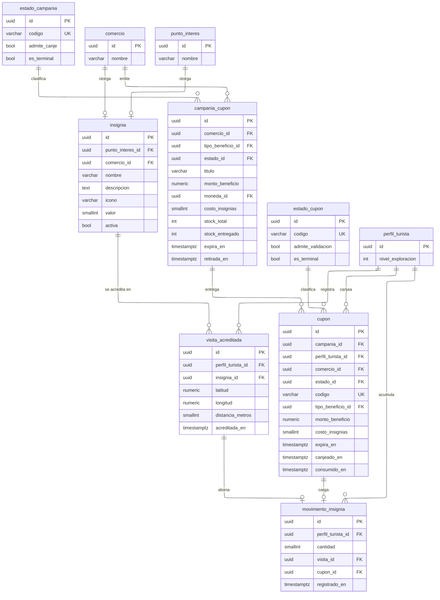

---
hide:
  - toc
icon: lucide/award
---

# Insignias y cupones

```mermaid
---
config:
  elk:
    mergeEdges: false
    nodePlacementStrategy: NETWORK_SIMPLEX
  fontFamily: monospace
  layout: elk
---
erDiagram
    insignia {
        uuid id PK
        uuid punto_interes_id FK
        uuid comercio_id FK
        varchar nombre
        text descripcion
        varchar icono
        smallint valor
        bool activa
    }
    visita_acreditada {
        uuid id PK
        uuid perfil_turista_id FK
        uuid insignia_id FK
        numeric latitud
        numeric longitud
        smallint distancia_metros
        timestamptz acreditada_en
    }
    movimiento_insignia {
        uuid id PK
        uuid perfil_turista_id FK
        smallint cantidad
        uuid visita_id FK
        uuid cupon_id FK
        timestamptz registrado_en
    }
    campania_cupon {
        uuid id PK
        uuid comercio_id FK
        uuid tipo_beneficio_id FK
        uuid estado_id FK
        varchar titulo
        numeric monto_beneficio
        uuid moneda_id FK
        smallint costo_insignias
        int stock_total
        int stock_entregado
        timestamptz expira_en
        timestamptz retirada_en
    }
    estado_campania {
        uuid id PK
        varchar codigo UK
        bool admite_canje
        bool es_terminal
    }
    cupon {
        uuid id PK
        uuid campania_id FK
        uuid perfil_turista_id FK
        uuid comercio_id FK
        uuid estado_id FK
        varchar codigo UK
        uuid tipo_beneficio_id FK
        numeric monto_beneficio
        smallint costo_insignias
        timestamptz expira_en
        timestamptz canjeado_en
        timestamptz consumido_en
    }
    estado_cupon {
        uuid id PK
        varchar codigo UK
        bool admite_validacion
        bool es_terminal
    }
    perfil_turista {
        uuid id PK
        int nivel_exploracion
    }
    comercio {
        uuid id PK
        varchar nombre
    }
    punto_interes {
        uuid id PK
        varchar nombre
    }
    punto_interes ||--o| insignia : "otorga"
    comercio ||--o| insignia : "otorga"
    insignia ||--o{ visita_acreditada : "se acredita en"
    perfil_turista ||--o{ visita_acreditada : "registra"
    visita_acreditada ||--o| movimiento_insignia : "abona"
    perfil_turista ||--o{ movimiento_insignia : "acumula"
    comercio ||--o{ campania_cupon : "emite"
    estado_campania ||--o{ campania_cupon : "clasifica"
    campania_cupon ||--o{ cupon : "entrega"
    perfil_turista ||--o{ cupon : "canjea"
    estado_cupon ||--o{ cupon : "clasifica"
    cupon ||--o| movimiento_insignia : "carga"
```

