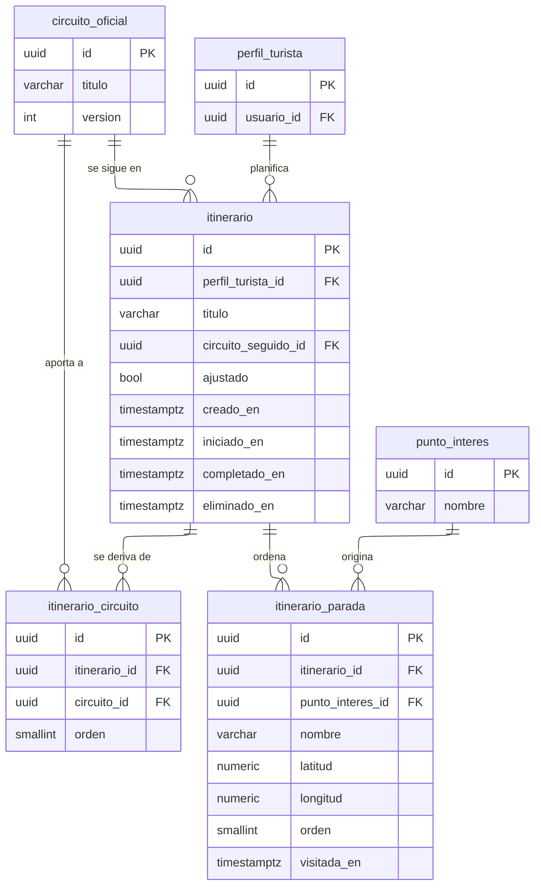

---
hide:
  - toc
icon: lucide/route
---

# Itinerarios

```mermaid
---
config:
  elk:
    mergeEdges: false
    nodePlacementStrategy: NETWORK_SIMPLEX
  fontFamily: monospace
  layout: elk
---
erDiagram
    itinerario {
        uuid id PK
        uuid perfil_turista_id FK
        varchar titulo
        uuid circuito_seguido_id FK
        bool ajustado
        timestamptz creado_en
        timestamptz iniciado_en
        timestamptz completado_en
        timestamptz eliminado_en
    }
    itinerario_circuito {
        uuid id PK
        uuid itinerario_id FK
        uuid circuito_id FK
        smallint orden
    }
    itinerario_parada {
        uuid id PK
        uuid itinerario_id FK
        uuid punto_interes_id FK
        varchar nombre
        numeric latitud
        numeric longitud
        smallint orden
        timestamptz visitada_en
    }
    circuito_oficial {
        uuid id PK
        varchar titulo
        int version
    }
    punto_interes {
        uuid id PK
        varchar nombre
    }
    perfil_turista {
        uuid id PK
        uuid usuario_id FK
    }
    perfil_turista ||--o{ itinerario : "planifica"
    circuito_oficial ||--o{ itinerario : "se sigue en"
    itinerario ||--o{ itinerario_circuito : "se deriva de"
    circuito_oficial ||--o{ itinerario_circuito : "aporta a"
    itinerario ||--o{ itinerario_parada : "ordena"
    punto_interes ||--o{ itinerario_parada : "origina"
```

