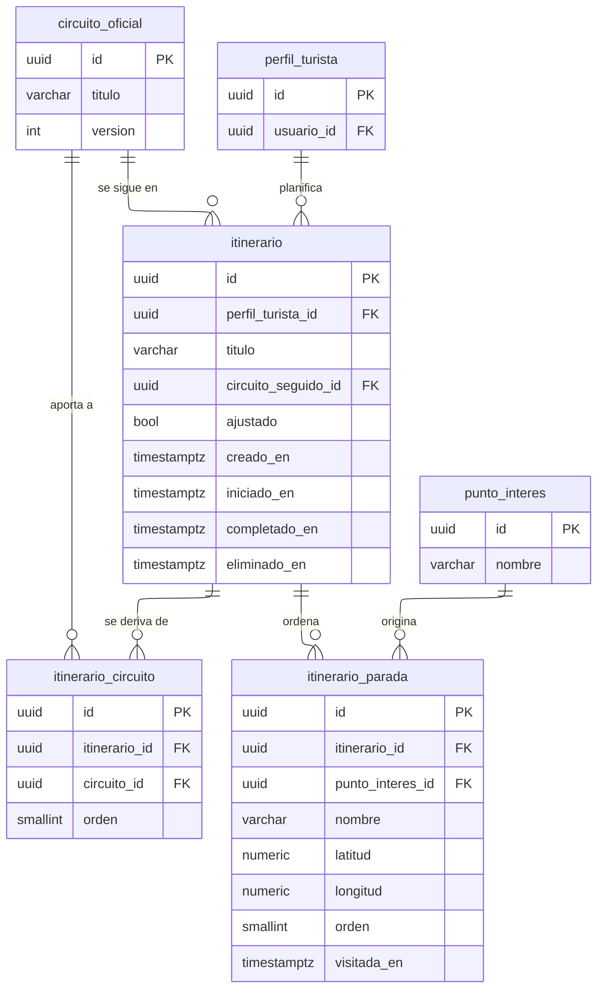

---
hide:
  - toc
icon: lucide/route
---

# Itinerarios

`circuito_seguido_id` y `ajustado` son las dos columnas que separan los cuatro
modos. Mientras `ajustado` es falso, el itinerario no tiene filas en
`itinerario_parada` y la aplicación lee las paradas del circuito referenciado. La
primera edición pone `ajustado` en verdadero, copia las paradas del circuito y
suelta la referencia viva: a partir de ahí el itinerario es independiente.

`itinerario_parada` guarda `nombre`, `latitud` y `longitud` propios, con
`punto_interes_id` nulable solo como rastro de dónde salió. Si esa referencia
fuera la única fuente, retirar un punto oficial dejaría un hueco en el itinerario
que alguien lleva abierto a mitad de recorrido.

| Restricción | Sobre | Por qué |
| --- | --- | --- |
| Verificación | `ajustado` falso exige `circuito_seguido_id` no nulo | Seguir tal cual necesita saber qué se sigue |
| Verificación | `ajustado` falso prohíbe filas en `itinerario_parada` | Las paradas se leen del circuito, no se duplican |
| Disparador | `ajustado` solo pasa de falso a verdadero | Una vez copiado, no se vuelve a la referencia viva |
| Disparador | Un itinerario ajustado conserva al menos dos paradas | Un recorrido de un punto no se puede trazar |
| Único | `itinerario_parada` por itinerario y orden, diferida | Reordenar intercambia posiciones en una transacción |
| Único | `itinerario_circuito` por itinerario y circuito | Un circuito no aporta dos veces al mismo itinerario |
| Verificación | `titulo` de al menos tres caracteres | La colección no acumula tarjetas indistinguibles |

`eliminado_en` existe porque borrar está bloqueado mientras haya una reserva viva
sobre el itinerario. La llave foránea desde `reserva` restringe, así que el
turista despeja su colección marcando la fila y el borrado físico ocurre cuando
el servicio concluye.

Las tres cifras que mide la alcaldía salen de aquí sin cálculos adicionales:
iniciaron son los itinerarios con `iniciado_en`, modificaron los que tienen
`ajustado` verdadero, y completaron los que tienen `completado_en`.
