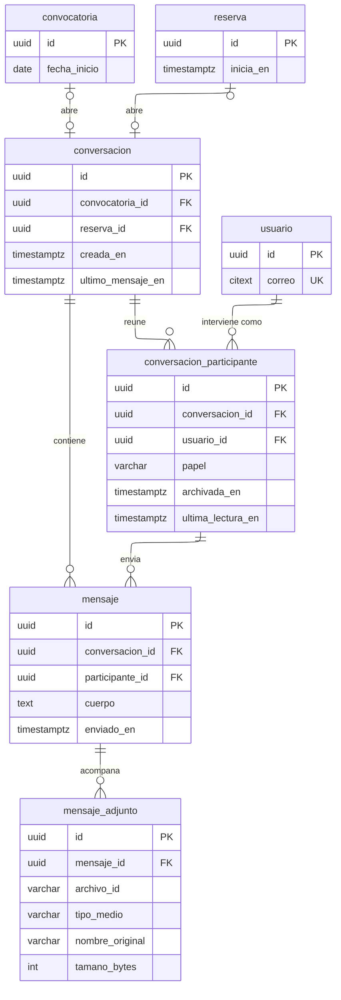

---
hide:
  - toc
icon: lucide/messages-square
---

# Mensajería

```mermaid
---
config:
  elk:
    mergeEdges: false
    nodePlacementStrategy: NETWORK_SIMPLEX
  fontFamily: monospace
  layout: elk
---
erDiagram
    conversacion {
        uuid id PK
        uuid convocatoria_id FK
        uuid reserva_id FK
        timestamptz creada_en
        timestamptz ultimo_mensaje_en
    }
    conversacion_participante {
        uuid id PK
        uuid conversacion_id FK
        uuid usuario_id FK
        varchar papel
        timestamptz archivada_en
        timestamptz ultima_lectura_en
    }
    mensaje {
        uuid id PK
        uuid conversacion_id FK
        uuid participante_id FK
        text cuerpo
        timestamptz enviado_en
    }
    mensaje_adjunto {
        uuid id PK
        uuid mensaje_id FK
        varchar archivo_id
        varchar tipo_medio
        varchar nombre_original
        int tamano_bytes
    }
    convocatoria {
        uuid id PK
        date fecha_inicio
    }
    reserva {
        uuid id PK
        timestamptz inicia_en
    }
    usuario {
        uuid id PK
        citext correo UK
    }
    convocatoria |o--o| conversacion : "abre"
    reserva |o--o| conversacion : "abre"
    conversacion ||--o{ conversacion_participante : "reune"
    usuario ||--o{ conversacion_participante : "interviene como"
    conversacion ||--o{ mensaje : "contiene"
    conversacion_participante ||--o{ mensaje : "envia"
    mensaje ||--o{ mensaje_adjunto : "acompana"
```

